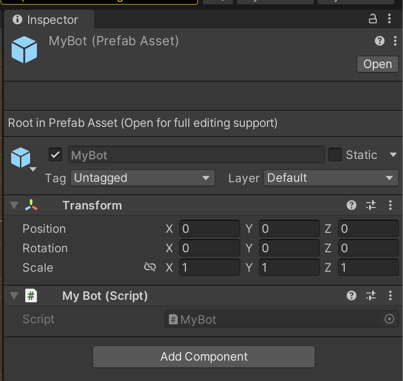
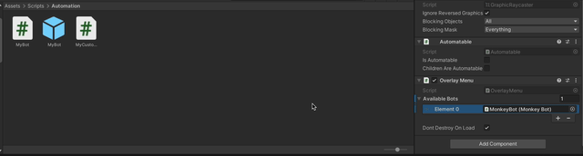

# Custom Bots and Discoverers

If the built in Bot and Discoverer components aren't sufficient for your testing needs, you can also create your own with just a few steps and some code.

## Building a Custom Discoverer

Entity Discoverers are used to find entities in the scene that should be made available to automation.
The built-in UI Element Discoverer is one example of an Entity Discoverer.
It scans the scene for certain UI Elements (Buttons, Canvas Groups, etc.) and makes them available as entities.
If your game has other entities you want to be able to automate, you can build an Entity Discoverer that will find them and provide information about their State and available Actions.

### What is an Entity?

An Entity represents a component in the scene that can be automated.
Usually, an Entity maps to a single GameObject, but there's no requirement that there be an underlying GameObject for every entity.
A single GameObject may be represented by multiple Entities, or an Entity may not be related to any GameObject at all.

Entities have a very simple structure.
They are represented by:

* An ID that must be unique across all entity instances in the game
* A name, usually derived from the GameObject name, that does not need to be unique.
* A type, which is usually derived from the .NET Type Name of the Component backing the entity.
* A description, which can be presented to users, **or** to Large Language Models (LLMs) to assist in understanding the purpose of the entity.
* A set of States representing relevant properties of the entity
* A set of Actions representing things the bot can _do_ with the entity.

A State is a simple key/value pair that represents some value that will be relevant to a bot.
For example, a Canvas Group exposes it's `interactable` property as a state value, to allow a bot to identify if the group is interactable.

An Action is a function that can be called on the Entity itself.
For example, a Button exposes a `click` action.
When this action is called, a synthetic "click" event will be raised on the button and the appropriate handlers will run as if a user clicked the button.

:::note
Currently, Actions cannot take parameters. This will change in the future!
:::

### Creating a Discoverer

To create a discoverer, create a new C# Script somewhere in your game (we recommend `Assets/Scripts/Automation`).
Change the script class to inherit from `RegressionGames.Unity.Discovery.EntityDiscoverer`

```csharp
using RegressionGames.Unity.Discovery;

namespace MyGame
{
    public class MyCustomDiscoverer : EntityDiscoverer
    {
    }
}
```

An Entity Discoverer is a Unity component like any other, so if you want, you can provide handlers for any of Unity's events (`Awake`, `Update`, etc.).
However, the base class provides a basic pattern we recommend following if you can.
Override the `DiscoverEntities` method, and have it return an `IEnumerable<AutomationEntity>` representing all the entities discovered in the current scene.
For example, this is the `DiscoverEntities` implementation used by the UI Element Discoverer:

```csharp
protected override IEnumerable<AutomationEntity> DiscoverEntities()
{
    m_Log.Verbose("Scanning for UI elements...");
    var uiBehaviours = FindAutomatableComponentsOfType<Selectable>();
    foreach (var uiBehaviour in uiBehaviours)
    {
        yield return new UISelectableEntity(uiBehaviour);
    }

    var canvasGroups = FindAutomatableComponentsOfType<CanvasGroup>();
    foreach (var canvasGroup in canvasGroups)
    {
        yield return new UIGroupEntity(canvasGroup);
    }
}
```

A few important pieces here:

* `FindAutomatableComponentsOfType<T>` is a method provided by the `EntityDiscoverer` base class. It searches the entire scene for objects of the specified type **but** excludes any objects or hierarchies which have disabled Automation using the `Automatable` component.
* We use C#'s `yield return` syntax, which allows us to build an `IEnumerable` by emitting the individual objects and letting the compiler do the work of creating the `IEnumerable` itself.
* `UISelectableEntity` and `UIGroupEntity` are custom classes inheriting from `RegressionGames.Unity.Automation.AutomationEntity`. In your custom discoverer, you'll want to provide your own implementations of that class.

This `DiscoverEntities` method will be called **automatically**:

* During the `Awake` event handler, unless you override it and don't call the base class method.
* Whenever the active scene changes, again unless you override `Awake` and don't call the base class method.

In addition to this, you can create new entities from any other event handler.
When you have a new entity to register, call the `RegisterEntity` method provided by the base class.
This method will register the entity **and** set up `OnDestroy` logic to unregister the entity when the discoverer is destroyed.
For example, if you want to discover entities in the `Update` handler, you could write something like this:

```csharp
void Update()
{
    var enemies = FindAutomatableComponentsOfType<Enemy>();
    foreach(var enemy in enemies)
    {
        var enemyEntity = new EnemyEntity(enemy);
        RegisterEntity(enemyEntity);
    }
}
```

:::note
If you are registering entities every frame, it's up to you to make sure you don't register the same entity twice!
Also, be aware of the performance impact of scanning the entire scene for entities on every frame
:::

### Adding the discoverer to the scene

To add your discoverer to a scene, create an empty GameObject **as a child of the Automation Controller**.
Attach your discoverer component to that GameObject.

## Building a Custom Bot

To create a custom bot, start in your game, with the Automated UI Testing package installed.
We recommend completing the [Getting Started Guide](./getting-started.mdx) first, so you have everything set up properly.

To create a bot, create a new C# Script somewhere in your game (we recommend `Assets/Scripts/Automation`).
Change the script class to inherit from `RegressionGames.Unity.Automation.Bot`.

```csharp
using RegressionGames.Unity.Automation;

namespace MyGame
{
    public class MyBot : Bot
    {
    }
}
```

As with discoverers, Bots are Components that exist in the standard Unity object hierarchy.
So, you can handle any of the Unity lifecycle events (`Awake`, `Update`, etc.).
Within your bot, the `AutomationController` property will be present and allows you to access all the discovered entities in the scene.
For example, here's a snippet from the Monkey Bot code that shows how it finds and selects a random entity, then executes a random action on that entity:

```csharp
void Update()
{
    // ...
    var availableActions = AutomationController.Entities
        .SelectMany(e => e.Actions.Values)
        .Where(a => a.CanActivateThisFrame())
        .ToList();

    if (availableActions.Count == 0)
    {
        m_Log.Verbose("No actions available this frame.");
        return;
    }

    // Select a random action and activate it.
    var action = availableActions[Random.Range(0, availableActions.Count)];
    action.Activate();
    // ...
}
```

:::warning
If you choose to handle the `Awake` event, make sure you do so by overriding the base class method and call it first.
For example:

```csharp
protected override void Awake()
{
    base.Awake();
    // Your custom awake logic here...
}
```

If you fail to do so, the `AutomationController` property will not be properly initialized!
:::

### Adding your Bot to the scene

Your bot is active whenever it's on an active GameObject in the scene.
So there are several ways to add it to your scene.
We recommend creating a Prefab and attaching the Bot component to that prefab:



Then, you can add that Prefab to the `availableBots` property on the RegressionGames UI Overlay,
which will add it to the dropdown of bots that can be spwaned in the UI overlay.

