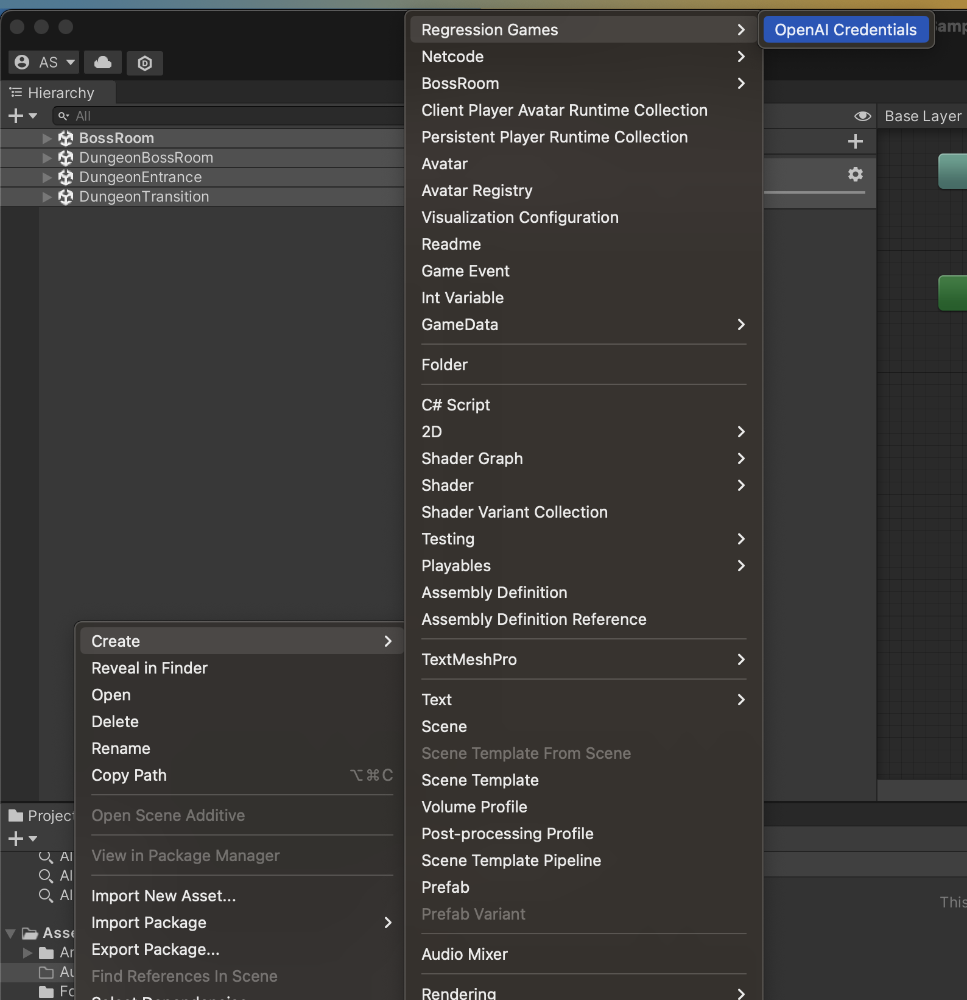
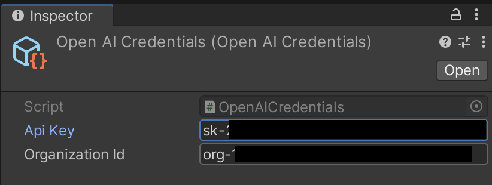
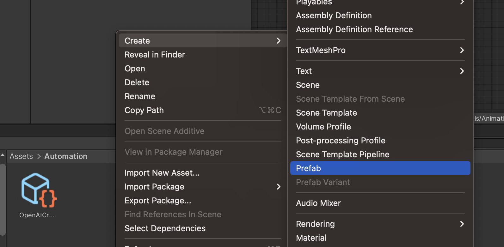
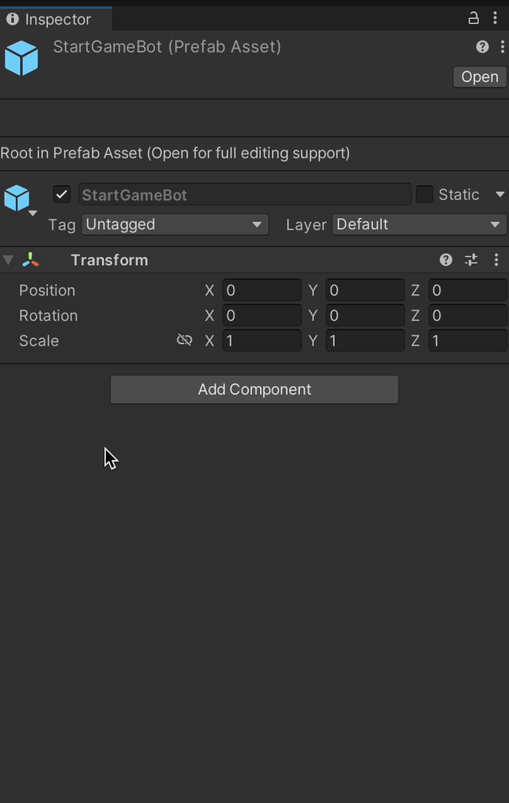
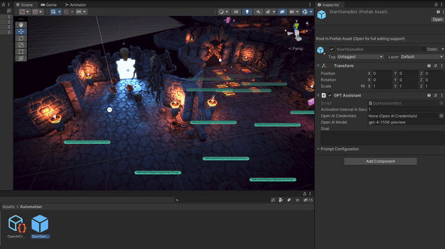
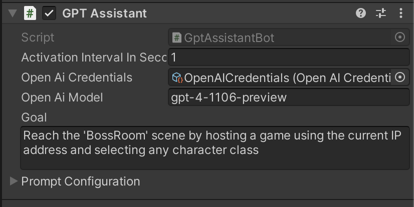
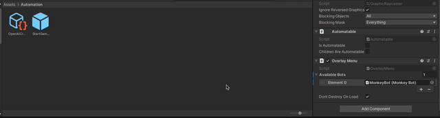

# Using the GPT Assistant Bot

In addition to the completely random "Monkey" Bot, the RegressionGames Automated UI Testing package includes a "GPT Assistant" Bot that uses [OpenAI's GPT-4 Large Language Model](https://openai.com/gpt-4) to drive a bot in your game.
This guide will show you how to set up the GPT Assistant Bot, how to connect it to OpenAI, and how to give the bot a goal to accomplish.

### Prerequisites

* You should have completed the [Getting Started Guide](./getting-started.mdx).
* You need an OpenAI account with access to the `gpt-4-1106-preview` model. This is the ideal model for the GPT Assistant bot at this time.
* You need to have the [OpenAI API Key](https://beta.openai.com/account/api-keys) and (optionally) Organization ID for your account.

### Adding OpenAI Credentials to your game

The GPT Assistant Bot requires an OpenAI API Key and (optionally) Organization ID to connect to OpenAI's API.
In order to provide these, you need to create an "OpenAI Credentials" Asset in your game.
We recommend doing this in an `Automation` folder within your `Assets` folder.
In the Unity Project window, right-click on the desired folder and select **Create > Regression Games > OpenAI Credentials**.

Open the Inspector for the newly-created Asset.
Fill in the "Api Key" and "Organization Id" values with the appropriate values from your OpenAI account.

:::warning
This asset will contain the plain-text API Key for your OpenAI account.
We recommend ignoring it in your version control system (e.g. Git) to avoid accidentally sharing it with others.
We're working on a system to store this value outside of your project in the future.
:::

### Adding the GPT Assistant Bot to your game

The GPT Assistant Bot works a little differently than the "Monkey" Bot we added in the [Getting Started Guide](./getting-started.mdx).
The Monkey Bot is provided entirely by our package, and is automatically available in the Regression Games UI Overlay.
However, for the GPT Assistant Bot, you need to create a Prefab of your own and configure the Bot on that Prefab.
This also allows you to have multiple different bots, with different Goals and configurations, in your game.

:::info
For this guide, we're using the [Boss Room Co-Op Sample Project](https://github.com/Unity-Technologies/com.unity.multiplayer.samples.coop) from Unity again.
:::

To create a new GPT Assistant Bot, right-click on the desired folder in the Unity Project window and select **Create > Prefab**.

Name the prefab something relevant to the bot you're creating.
For example, `StartGameBot` for the example we're building in this guide.

Then, open that prefab and add a new Component to it.
In the Add Component menu, select **Regression Games > Bots > GPT Assistant**.

Then, drag the OpenAI Credentials asset you created in the previous step on to the "Open Ai Credentials" field in the Inspector.

### Setting a Goal for the GPT Assistant Bot

In order for the bot to actually do anything, you need to give it a Goal to accomplish.
For this guide, we'll use the following goal:

> Reach the 'BossRoom' scene by hosting a game using the current IP address and selecting any character class

We'll discuss how to write a good goal [later on in this guide](#writing-a-good-goal).

Fill in the Goal field on the GPT Assistant component with the goal you want the bot to accomplish.

### Attach the bot to the UI Overlay

Now, we need to provide a way to spawn the bot we just created.
If you've been following this guide on the Boss Room sample, you'll want to open the `MainMenu` scene.
There should be a "RegressionGames UI Overlay" GameObject in the scene (if not, follow the [Getting Started Guide](./getting-started.mdx) to add it).
Open the inspector for this object and scroll to find the "Overlay Menu" component.
In that component, add a new entry to the "Available Bots" list.
Drag the Prefab we created in to that new entry.

### Run the bot

:::info
Make sure you save your scene before launching!
:::

Now, you can launch the game and open the Regression Games UI Overlay.
In the Bots dropdown, you should be able to select the bot you just created.
Select that bot and click "Start Bot"

Check the Console for logs that indicate the progress the bot is making.
If you want to stop the bot, you can click the "Stop Bot" button in the UI Overlay, or simply stop your game.

### Writing a good goal

Writing a good goal is important to an effective bot.
The GPT Assistant Bot is a very powerful tool, but it's not magic and it takes some work to get good results.
Here are some dos and don'ts for writing a good goal:

* **DO** reference a very specific end goal. For example "Reach the 'Foo' scene". The Bot knows the name of the active scene and can use that to determine if it has reached the goal.
* **DO** reference game objects by name where possible. For example "use the 'IP Start Button' button". The Bot is able to see any Game Object exposed by the Entity Discoverers you have registered in your game as children of the Automation Controller (see the [Getting Started Guide](./getting-started.mdx#adding-entity-discoverers-to-your-scene) for more information on Entity Discoverers).
* **DO** try to reference all the steps the bot will need to take, at a high level. The model will see all the interactables in the scene and needs to be able to determine which ones it should interact with. If you have multiple ways of completing a goal, you should specify which one to use.
* **DO** write a short goal. The Bot receives a LOT of context information from the game. The longer your Goal is, the more likely you are to hit context limits in the GPT-4 model.
* **DON'T** use this bot for highly timing-sensitive goals and gameplay (for example, jumping a gap in a platfomer). There is significant latency between when the bot sees the scene and when a response is returned from OpenAI. This latency is not consistent and can vary from a few seconds to a few minutes. This is a preview and we're working on ways to avoid the impact of this latency in the future (such as allowing the bot to plan ahead for future actions).
* **DON'T** expect perfection on the first try. You'll need to refine your goal a little bit to get the results.

Some examples of bad prompts and the "better" prompt we recommend:

> **Bad**: Start a new game on hard.
>
> **Good**: Reach the 'GameWorld' scene by creating a new character and selecting the 'Hard' difficulty level.

> **Bad**: Chop 10 trees
>
> **Good**: Select the 'Axe' tool, then chop 10 trees by locating each tree, walking to it, and hitting it until the tree is destroyed.

:::info
Please join our [Discord](https://discord.gg/Skafm6uF) to get help writing goals, and share your results!
:::