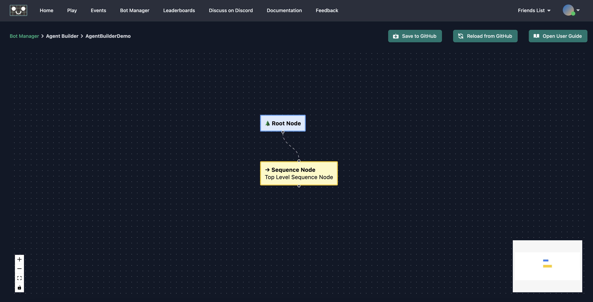
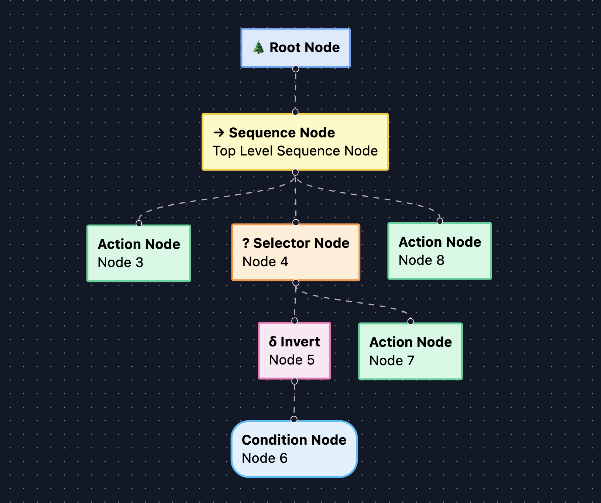
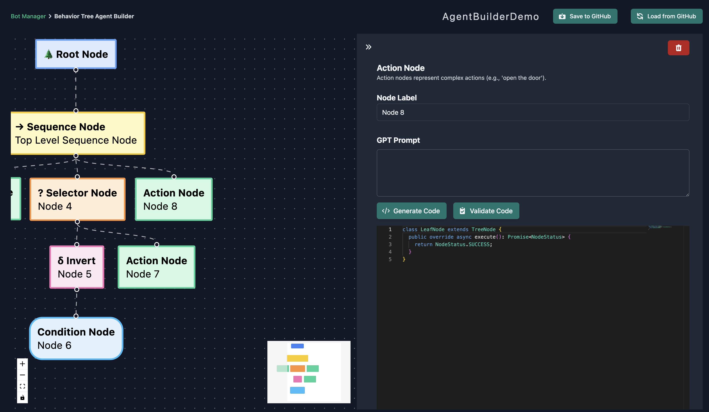

Whenever you create a fresh Agent Builder project for your AI, we'll start you out with a root node and a sequence node to form the basis of your tree.

To begin building your tree, click the connector at the bottom of the sequence node and drag.
When you release, you'll be presented with different types of nodes that can be added to this sequence.
For this demonstration, we'll create an action node.
You can repeat this process for any node that is allowed to have children.

Clicking on a node opens a panel to the right side of your screen.
This panel contains information about the selected node including a description of the node's type and a label, as well as a button to delete the node from the tree.
It's a good idea to set labels to keep track of what you want each node or branch to do.
If the selected node is a leaf node, such as an action or condition, then the panel will also contain fields used for defining the node's behavior via code.

