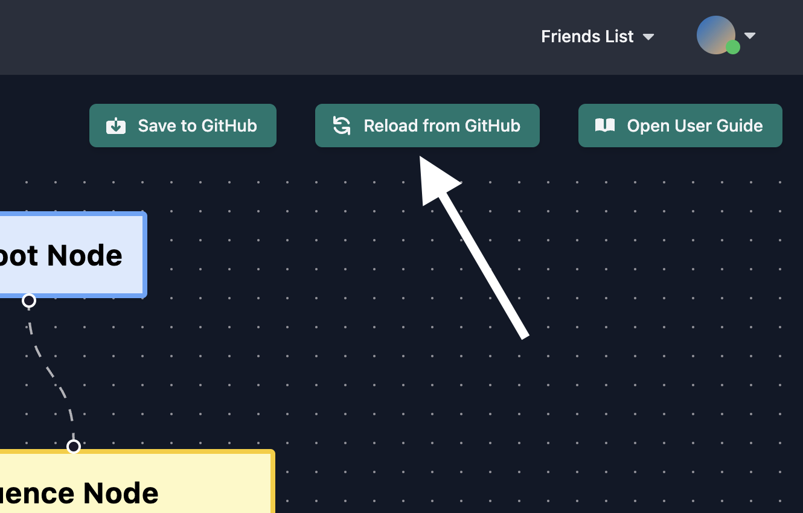

If you've used the Agent Builder to create a bot before, then you can locate that bot in the Bot Manager and open the Agent Builder interface.

At any time, you can click the "Reload from Server" button at the top of the page to revert to your most recently-saved version
(this will discard any unsaved changes). Don't forget to save when you're done!

