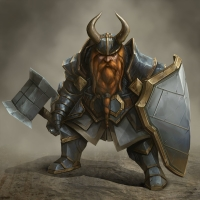

# Computer Vision

Our Computer Vision module provides powerful tools to interact with and validate visual elements in your application or game. This functionality is crucial for automated testing, user interface verification, and interactive simulations.

### What problems does it solve?

Our Computer Vision capabilities allow you to find the existence of visual elements on the screen and either click on them, or use them as end criteria.

We offer three methods:

1. **Image Match**: Find where the specific image exists on the screen. This method uses a pixel matching based algorithm and is useful when we have the image of the exact asset we are looking for.

2. **Text Match**: Find where the specific text exists on the screen. This method uses a optical character recognition based algorithm and is useful when we have the exact text string we are looking for.

3. **Object Detection [Experimental]**:  Find where the given object exists on the screen. This method uses a deep learning based algorithm and is useful when we know what we are looking for, say a tree, but we don't have the exact pixel match image of the asset we are looking for. This can be because the orientation of the tree in the camera view is dynamic, or we have different types of trees in the scene, rendering a direct pixel match impossible.

### Example Sequence

Here is an example sequence that utilizes all three methods. 

In this example we want to test the flow seen above. More specifically we want our test to validate the following steps:
- Select the tank class.
- Verify that the correct model is loaded.
- Select the archer class.
- Verify that the model is loaded.
- Press Ready.

We can accomplish this with the following Computer Vision sequence:
1. Click on the tank class using the [Image Match](computer-vision/image-match.mdx) method, with this tank icon as the image query. *This will look for the pixel match of the tank icon.*

2. Verify that the correct model is loaded by using the [Object Detection](computer-vision/object-detection.mdx) method, with this dwarf warrior concept art as the image query. *This will first identify the concept art as a `Dwarf Warrior`, and then it will look for the existence of a `Dwarf Warrior` on the screen.*

3. Click on the archer class using the [Image Match](computer-vision/image-match.mdx) method, with this archer icon as the image query. *This will look for the pixel match of the archer icon.*

4. Verify that the correct model is loaded using the [Object Detection](computer-vision/object-detection.mdx) method, with the string `Toon Archer` as the text query. *This will look for the existence of a `Toon Archer` on the screen.*

5. Click on the Ready button using the [Text Match](computer-vision/text-match.mdx) method, with the string `READY` as the text query. *This will identify all the text on the screen, and then find the text `READY`*

### See this sequence in action!

<iframe src="https://www.loom.com/embed/391d9aba528a4bc18a9b0fae43850177?sid=1abb5f48-cbd3-41ea-bacc-75f686aef115" frameborder="0" webkitallowfullscreen mozallowfullscreen allowfullscreen style={{position: "absolute", top: 0, left: 0, width: "100%", height: "100%"}}></iframe>
