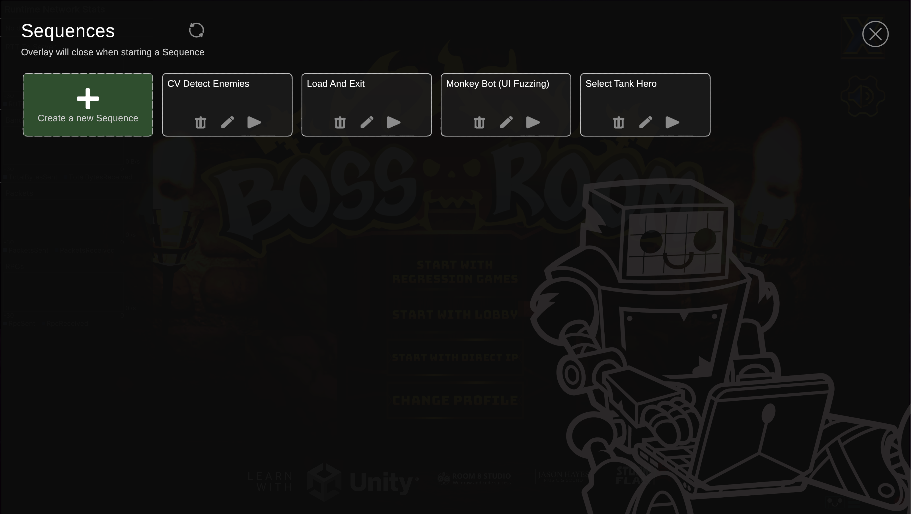
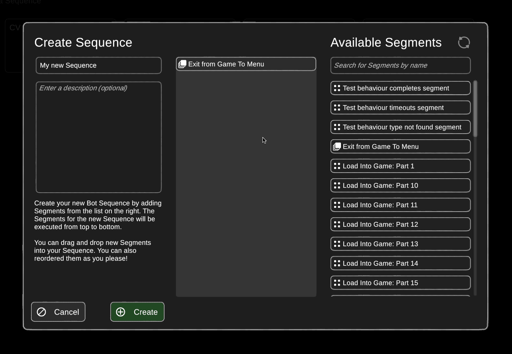

import SequenceCard from './img/sequence_card.png';
import SequenceDeleteDialog from './img/sequence_delete.png';
import CreateSequenceButton from './img/create_sequence_button.png';
import ReloadIcon from './img/reload.png';

# Getting Started With Bot Sequences and Segments

A **Bot Sequence** is a series of automated actions that can be used to assert certain behaviours or outcomes within your game. Sequences are composed of individual actions, called Segments, which are executed in order.

## Starting A Bot Sequence

After [adding the RGOverlayCanvas prefab to your scene](../the-in-game-overlay.mdx), click on the small Williward face icon to open the overlay. With the overlay opened, you can see the list of Bot Sequences that are available to you. Each Sequence is represented by a card, with three possible actions:
- **Play**: Start the Bot Sequence, beginning with its first Segment
- **Edit**: Open the Bot Sequence in the Sequence Editor (see the next section)
- **Delete**: Delete the Bot Sequence file from your project (see the next section)

## Creating and Modifying Bot Sequences

### Within Unity

Click the "Create a new Sequence" button, with the overlay open, to create a new Bot Sequence in our Sequence Editor.

 

Within the Sequence Editor, you can add, remove, and reorder Segments. The available Segments can be searched for by text, and are added to the Sequence by dragging them from the list on the right to the Sequence in the middle of the editor. When a Sequence is played, it will execute its Segments from top to bottom.

You can also delete a Sequence by clicking the trash icon on the Sequence card in the overlay. A confirmation dialog will appear to ensure you don't delete a Sequence by accident.

### Outside of Unity

Bot Sequences and Segments are saved as **json** files in your Unity project. You can edit these files directly in a text editor. See the next sections for more information on the structure of these files.

If you have created or modified any Sequences or Segments outside of Unity, you can click the refresh button in the overlay to reload them from disk. Bot Sequences can be reloaded from the Sequence list, and Segments can be reloaded from within the Sequence Editor.

Keep your eye our for this icon to reload!

