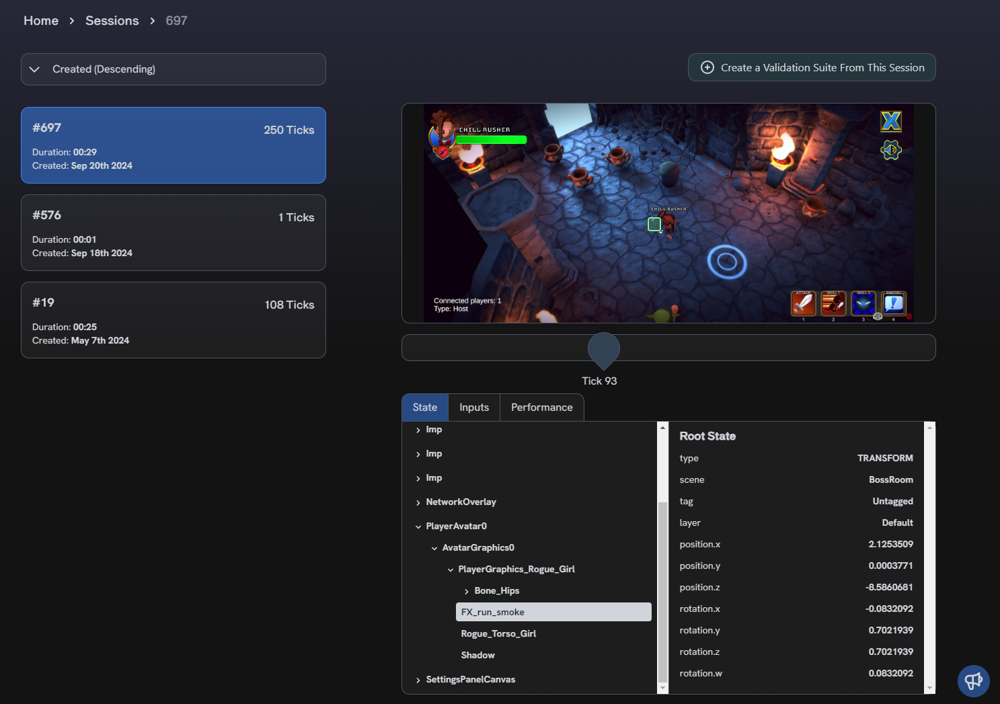

# Gameplay Sessions

A **Gameplay Session** is automatically saved to your Regression Games account whenever you
manually [record gameplay](recording-gameplay),
[replay a recording](recording-gameplay#replaying-recordings), or use a feature that records its
own gameplay such as running a [Bot Sequence](bot-sequences/getting-started-with-bot-sequences-and-segments).

Learn more about the data we capture through our SDK in the
[Recording Gameplay](recording-gameplay#recorded-data-formats) section.

## Viewing Gameplay Sessions

You can view a list of your saved Gameplay Sessions through the
[Gameplay Sessions dashboard](https://play.regression.gg/sessions) in the Regression Games web interface.

At a glance, each Session displays a summary including the date and time it was recorded,
duration of its gameplay, and the number of ticks captured in total.
Selecting a Session reveals more details through a tick scrubber that allows you to view
a timeline of the game's state, user inputs, and performance data alongside a screenshot of the game
at a specific tick.

## Using Gameplay Sessions to Create Validation Suites

A Gameplay Session is the foundation for creating a [Validation Suite](validation-suites).
Data from the Session is used to determine which entities and components from your game are available to
use in Validation Steps defined through the [Scenario Builder](validation-suites#validation-scenarios).

To create a Validation Suite from a Session, select the Session from the list and click the
**Create a Validation Suite From This Session** button.
This will present a dialog where you'll give the Suite a name and optional description.
Once you create your Suite, you will be redirected to the Suite's details page in the
[Validation Suites dashboard](https://play.regression.gg/validations).

Alternatively, you can create a new Validation Suite from the [Validation Suites dashboard](https://play.regression.gg/validations)
by clicking the **Create Suite** button and selecting the Session you wish to use from a dropdown in the creation dialog.
