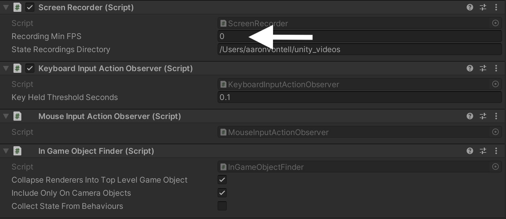
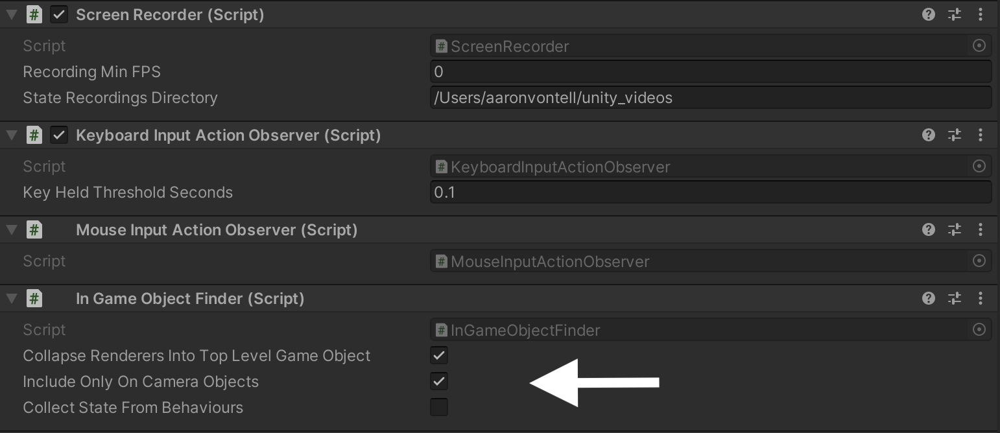

# Using Gameplay Sessions

## Advanced Options

### Choosing an FPS for recording

The `Recording Min FPS` field under `RGOverlayCanvas` > `ScreenRecorder` allows you to configure
how often the SDK scrapes the game for state data.
Its default value is 0, which instructs the SDK to only record state data when it detects a
[**key frame**](./gameplay-sessions-reference#key-frames). In most cases, this should be set to 0, as most games will only require state collection on key frames.
Setting `Recording Min FPS` to a value greater than 0 will cause the SDK to record data at that frequency,
in addition to recording any key frame that was detected.
For instance, a setting of `5` will result in the SDK scraping the game for state data 5 times per second.

### Changing your recording location

By default, recorded data is stored in your home directory under `/unity_videos`.
This directory can be overridden by changing the `State Recordings Directory` field under `RGOverlayCanvas` > `ScreenRecorder`.

### Input threshold options

Some devices might recognize holding down a key as spamming key presses for that key instead.
The `Key Held Threshold Seconds` field under `RGOverlayCanvas` > `Keyboard Input Action Observer`
allows you to configure the threshold for how long a key must be released
between presses before each press is considered a distinct event.
This setting defaults to 0.1 seconds, and on Windows should not have to be changed. This setting is primarily used on
Mac and other platforms that handle key repeats in a non-standard way.  If you do experience key click spamming,
increase the value.

### Configuring game-state collection

The Regression Games SDK scrapes the game for state data by traversing the game's GameObject hierarchy
and recording any data it considers relevant to playing back recordings or running tests.

#### Excluding objects from recordings

Adding the `RGExcludeFromState` component to a GameObject will prevent its state data from being recorded.
This can be useful for ignoring irrelevant regions of a level
or other objects that are not relevant to your playback or testing.
Children of an excluded GameObject are also excluded from the recording, effectively ignoring the entire hierarchy.

#### Including objects from your scene in the state

By default, the system records game objects visible in the scene with a renderer. Other game objects can be included in
the state by attaching the `RGIncludeInState` MonoBehaviour to them.

#### Collapsing renderers

By default, the SDK collapses a child GameObject's data into its respective top-level GameObject.
If a GameObject hierarchy has colliders/renderers/animators/etc. at multiple levels,
they will be represented together as a single "entity" in the recorded state.
This is generally desirable, as it allows you to treat each player (for example) as a complete entity in the state
rather than visualizing individual child components as their own entities.

However, it can also be useful to disable this behaviour in cases where you'd like to validate
render bounds on individual armatures, weapons, or other components that are children in the hierarchy.

The `Collapse Renderers into Top Level Game Object` checkbox under `RGOverlayCanvas` > `In Game Object Finder`
controls this behaviour, where checking the box forces collapsing and unchecking the box disables collapsing.

#### Include off-camera objects

By default, the SDK only records state data for GameObjects that are within the main camera's viewport.
In many cases, this is desirable because off-camera GameObjects are not relevant to playback or applicable test scenarios.
Off-camera objects can be included in recordings by toggling the
`Include Only On Camera Objects` checkbox under `RGOverlayCanvas` > `In Game Object Finder`.
Checking this box limits state collection to on-camera objects and unchecking the box enables state collection for
off-camera objects.

:::info Note

Recording objects outside of the camera viewport may increase the size of recordings and impact performance.

:::

#### Collect state from behaviours

By default, the SDK only records state data from GameObjects themselves, and does not record
fields or property values from attached Behaviours.
These are generally not needed for playing back recordings, but can be extremely useful for test scenarios.

The `Collect State from Behaviours` checkbox under `RGOverlayCanvas` > `In Game Object Finder`
dictates whether recordings include data from Behaviours attached to a GameObject.
Checking this box will include all fields and properties from all Behaviours attached to a GameObject in the recorded state,
and unchecking the box will exclude them.

:::info Note

Recording state from Behaviours may incur an impact on performance.

:::

To learn more about the data format and intricacies of this tool, visit the next page for a technical reference.
