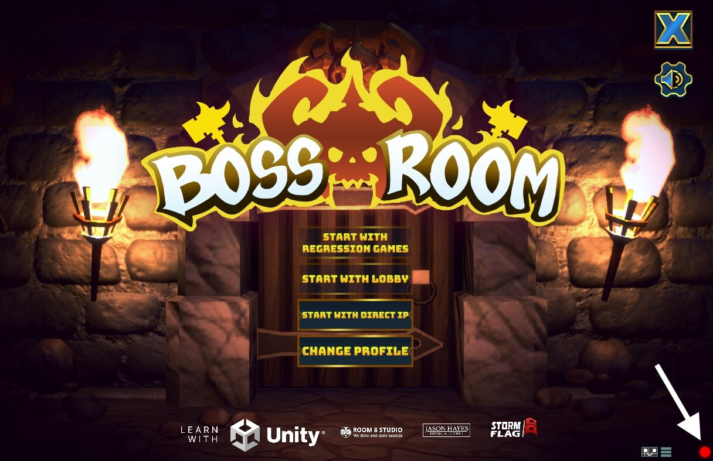
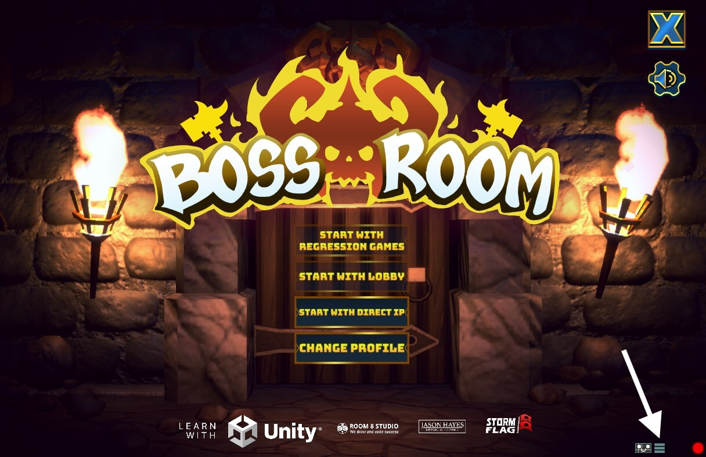

import Accordion from "../../src/components/Accordion"

import ReplayOptions from "./img/recording-gameplay/replay-options.png"
import PauseOrStop from "./img/recording-gameplay/pause-or-stop.png"
import SuccessfulReplay from "./img/recording-gameplay/successful-replay.png"
import LoopCounter from "./img/recording-gameplay/loop-counter.png"

import TestAssemblyRefs from "./img/recording-gameplay/test_assembly_refs.png"

import ReplayError from "./img/recording-gameplay/replay-error.png"

import BotSegmentsZipPartial from "../partials/recording-gameplay/_bot-segments-zip-partial"
import DataZipPartial from "../partials/recording-gameplay/_data-zip-partial"
import GameMetadataPartial from "../partials/recording-gameplay/_game-metadata-json-partial"
import LogsZipPartial from "../partials/recording-gameplay/_logs-zip-partial"
import ScreenshotsZipPartial from "../partials/recording-gameplay/_screenshots-zip-partial"
import ThumbnailJpgPartial from "../partials/recording-gameplay/_thumbnail-jpg-partial"

import AdvancedConfiguration from "./img/recording-gameplay/advanced-configuration.png"

# Recording Gameplay

The [RGOverlayCanvas](../getting-started/installing-regression-games#add-the-regression-games-overlay-to-your-scene)
allows you to record game state and user inputs as you play through your game.
This information can be used to [automatically replay the scenario](#replaying-recordings),
validate game behaviour with [Validation Suites](./validation-suites),
and form the basis of complex [Bot Sequences](./bot-sequences/getting-started-with-bot-sequences-and-segments).

At a high level, the SDK captures the following information during gameplay:
* Entities and their state (e.g. position, behaviours, colliders)
* Performance information (e.g. frame rate, memory usage)
* User input (e.g. keyboard, mouse, gamepad)
* Screenshots

The SDK captures this information once every **tick**.
A tick is a snapshot of the game state at a given point in time.
One or more frames may elapse between two ticks, depending on the configured [tick interval](#tick-interval).
Ticks are important to understand when working with the SDK, as they are used to visualize changes in the game state over time.

## Creating a Recording

:::info
Recording requires the [RGOverlayCanvas](../getting-started/installing-regression-games#add-the-regression-games-overlay-to-your-scene)
to be present in your scene.
:::

Press the **Record** icon in the RG Toolbar while in "Play" mode to start recording gameplay.
The icon will pulse to signal that a recording is in progress, and our SDK will begin capturing game state and user inputs.



Click the **Record** icon again to stop the recording and save captured data to your local device.
If you have provided a valid [API Key in the RG Settings](../getting-started/installing-regression-games#configure-your-api-key),
then a copy of the captured data will also be uploaded to your Regression Games account as a [Gameplay Session](gameplay-sessions).
Gameplay Sessions unlock access to more features through the Regression Games web interface such as [Validation Suites](validation-suites).

### Recorded Data Formats

The SDK saves recordings to your user's home directory under `unity_videos` on your local device.
Beneath the root directory, the SDK gives each Unity project its own subdirectory matching the project's `Application.productName`.
Recordings are saved under these project subdirectories as a folders named `recording_{MM-dd-yyyy_HH.mm}_{sessionId}`.

Here is an example of a recording's location for a project named "MyGame":
```bash
# macOS & Linux
~/unity_videos/MyGame/recording_08-30-2024_14.34_0b8551

# Windows
C:\Users\{MyUser}\unity_videos\MyGame\recording_08-30-2024_14.34_0b8551
```

A recording folder contains multiple files that provide important context about the game's state.
This data is also saved to the [Gameplay Session](gameplay-sessions) that is uploaded
to your Regression Games account at the end of a recording.
Expand the sections below to learn more about our raw data formats.

<Accordion
    title="#### **bot_segments.zip**"
    content={BotSegmentsZipPartial}
/>

<Accordion
    title="#### **data.zip**"
    content={DataZipPartial}
/>

<Accordion
    title="#### **game_metadata.json**"
    content={GameMetadataPartial}
/>

<Accordion
    title="#### **logs.zip**"
    content={LogsZipPartial}
/>

<Accordion
    title="#### **screenshots.zip**"
    content={ScreenshotsZipPartial}
/>

<Accordion
    title="#### **thumbnail.jpg**"
    content={ThumbnailJpgPartial}
/>

## Replaying Recordings

Replaying a recording reproduces each tick in the original recording in order.
This involves simulating inputs from the original recording and waiting for key values in the game state to match
expectations set by the recorded tick before continuing to the next set of inputs.
The SDK records the state of the game while a replay is in progress, and saves the replay data as a new recording and
[Gameplay Session](gameplay-sessions).

Replay, and recording the replay, can be useful for identifying areas of your game that behave inconsistently
given the same inputs, reproducing transient bugs and collecting debug information for them,
or ensuring that changes to your game don't break gameplay.

:::tip
Replaying a recording file works best in deterministic or mostly-deterministic scenarios.
For example, navigating menus tends to be deterministic, while the locations and movements of NPCs may not be.
The replay tool attempts to account for some inconsistencies, but it is not perfect.
For games with a high degree of randomness or non-determinism, we recommend using recordings as a basis to
create your own customized [Bot Sequences](bot-sequences/getting-started-with-bot-sequences-and-segments)
rather than relying on raw recordings themselves.
:::

### Starting a Replay

There are two ways to initiate replay of an existing recording:
manually select a recording via the overlay, or programmatically start a recording using utilities from our SDK.

#### Manual Replay

Press the **Menu** icon in the RG Toolbar while in "Play" mode to select a recording to replay.
This will launch a file explorer at the location of the [recordings directory](#recorded-data-formats) on your device.
Navigate into the folder of the recording you'd like to replay, select its `bot_segments.zip` file, and then click **Load Replay**.



<div className="container row text--center">
<div className="row">
<figure className="col">
    
    <figcaption>
        <b>Play</b> a loaded recording once or <b>Loop</b> it to play continuously.
        The SDK will automatically save the replay as a new recording.
        Loop iterations are saved together in the same recording.
    </figcaption>
</figure>

<figure className="col">
    
    <figcaption>
        <b>Pause</b> by pressing the Pause icon or hitting <code>Ctrl+Shift+F9</code>.
        Use the same shortcut to resume.
        <br/>
        <b>Stop</b> by pressing the Stop icon or using the shortcut <code>Ctrl+Shift+F10</code>.
        Stopping a recording will save the replay up to that point.
    </figcaption>
</figure>
</div>

<div className="row">
<figure className="col">
    
    <figcaption>
        Successful playback results in a green indicator surrounding the <b>Play</b> icon.
        The recording can be played again or unloaded.
    </figcaption>
</figure>

<figure className="col">
    
    <figcaption>
        Looping the recording displays a counter for the current loop iteration.
        Looping works best when the recording returns itself to a known start state
        to set up the next loop iteration.
    </figcaption>
</figure>
</div>

</div>

#### Programmatic Replay

The `RGTestUtils` class provides methods for replaying recordings programmatically.
This is intended for use in
[Play Mode tests for the Unity Test Runner](https://docs.unity3d.com/Packages/com.unity.test-framework@1.4/manual/index.html).

:::info
The `RegressionGames` and `RegressionGames.TestFramework` assemblies must be listed as
references in your test assembly to use the `RGTestUtils` class.


:::

:::tip
By default, [recordings are saved outside your project](#recorded-data-formats).
Make sure you copy the recordings you'd like to replay into your project
to ensure they'll be available on other machines that run these automated tests.
:::

Create a `UnityTest` that invokes the `RGTestUtils.StartPlaybackFromZipFile` method.
Pass the path to your recording's `bot_segments.zip` file.
This will replay the recording, wait until playback is complete, and then save the replay as a new recording.
You can add additional logic to your test to validate the game state at the end of playback,
or use a recording to reach a known state in your game for further testing.
The `PlaybackResult` object contains the path to the new recording, but may be null if playback fails.

```csharp
using System.Collections;
using RegressionGames;
using RegressionGames.Types;
using UnityEngine.Assertions;
using UnityEngine.SceneManagement;
using UnityEngine.TestTools;

public class RecordingTest
{

    [UnityTest]
    public IEnumerator TestRecording()
    {

        // Unity has a macOS bug that prints errors when taking screenshots during recording.
        // This line prevents the test from failing when these errors are logged.
#if UNITY_EDITOR_OSX || UNITY_RUNTIME_OSX
        LogAssert.ignoreFailingMessages = true;
#endif

        // Define which recording to use
        string recordingPath = System.IO.Path.Combine(System.IO.Directory.GetCurrentDirectory(), "Assets/Tests/Runtime/Recordings/MainMenuRecording.zip");

        // Wait for the scene to load
        SceneManager.LoadSceneAsync("Startup", LoadSceneMode.Single);
        yield return RGTestUtils.WaitForScene("MainMenu");

        // Start playback
        // This will automatically create a new recording of the replay
        PlaybackResult playbackResult = null;
        yield return RGTestUtils.StartPlaybackFromZipFile(recordingPath, result => playbackResult = result);

        // Print out the recording path for viewing later
        Assert.IsNotNull(playbackResult);
        Assert.IsNotNull(playbackResult.saveLocation);
        RGDebug.LogInfo("Successfully replayed the recording and saved new recording to " + playbackResult.saveLocation);
    }
}
```

### Game State Errors During Replay

The replay tool reproduces user inputs from the original recording and waits for key values in the game state to match those in the recording.
If the game state does not meet expectations set by the original recording after a certain timeout,
then the SDK will pause replay and display a warning above the RG Toolbar with the list of unmet expectations.
Replay will continue from where it left off if the warning is resolved.


## Advanced Configuration

### Adjusting the Recording Interval

The **Recording Min FPS** value controls how often the SDK scrapes the game state and captures that data as a tick.
This option can be found under the `ScreenRecorder` component attached to the `RGOverlayCanvas` GameObject in your scene.


&nbsp;

The default value for this setting is `0`, which means the SDK will capture a tick whenever it detects an important change in the game state.
Allowing the SDK to determine key state changes is sufficient for most games,
but you can set a regular interval for capturing ticks instead by adjusting the `Recording Min FPS` value on the `ScreenRecorder` component.
Setting the value above `0` will cause the SDK to record that many ticks each second.

### Including and Excluding GameObjects from Data Capture

The SDK captures data for all GameObjects in the scene hierarchy that are visible to the camera.
This can result in a lot of data being captured every tick, depending on the complexity of your scene.

You can **exclude** a GameObject from being captured by attaching the `RGExcludeFromState` component to it.
Excluding a GameObject will also exclude its children from data capture.
This can be useful for ignoring entire regions of a level or individual objects that are not relevant to your testing scenarios.

You can **include** GameObjects that are not visible to the camera or otherwise not rendered by adding the `RGIncludeInState` component to them.
This can be useful for always capturing data for important objects, regardless of whether they appear on-screen.