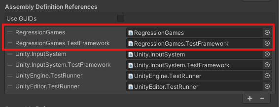

import Accordion from "../../src/components/Accordion"

# Recording Gameplay

The [RGOverlayCanvas](../getting-started/installing-regression-games#add-the-regression-games-overlay-to-your-scene)
allows you to record game state and user inputs as you play through your game.
This information can be used to [automatically replay the scenario](#replaying-recordings),
validate game behaviour with [Validation Suites](./validation-suites),
and form the basis of complex [Bot Sequences](./bot-sequences/getting-started-with-bot-sequences-and-segments).

At a high level, the SDK captures the following information during gameplay:
* Entities and their state (e.g. position, behaviours, colliders)
* Performance information (e.g. frame rate, memory usage)
* User input (e.g. keyboard, mouse, gamepad)
* Screenshots

The SDK captures this information once every **tick**.
A tick is a snapshot of the game state at a given point in time.
One or more frames may elapse between two ticks, depending on the configured [tick interval](#tick-interval).
Ticks are important to understand when working with the SDK, as they are used to visualize changes in the game state over time.

## Creating a Recording

:::info
Recording requires the [RGOverlayCanvas](../getting-started/installing-regression-games#add-the-regression-games-overlay-to-your-scene)
to be present in your scene.
:::

Press the **Record** icon in the RG Toolbar while in "Play" mode to start recording gameplay.
The icon will pulse to signal that a recording is in progress, and our SDK will begin capturing game state and user inputs.


Click the **Record** icon again to stop the recording and save captured data to your local device.
If you have provided a valid [API Key in the RG Settings](../getting-started/installing-regression-games#configure-your-api-key),
then a copy of the captured data will also be uploaded to your Regression Games account as a [Gameplay Session](gameplay-sessions).
Gameplay Sessions unlock access to more features through the Regression Games web interface such as [Validation Suites](validation-suites).

## Replaying Recordings

Replaying a recording reproduces its inputs in your game and captures new game state information during the replay.
The replay data is saved as a new recording and Gameplay Session.
Replay, and recording the replay, can be useful for identifying areas of your game that behave inconsistently
given the same inputs, reproducing transient bugs and collecting information for debugging them,
or ensuring that changes to your game don't affect unintended behaviours.

:::tip
Replaying a recording file works best in deterministic or mostly-deterministic scenarios.
For example, navigating menus tends to be deterministic, while the locations and movements of NPCs may not be.
The replay tool attempts to account for some inconsistencies, but it is not perfect.
For games with a high degree of randomness or non-determinism, we recommend using recordings as a basis to
create your own customized [Bot Sequences](bot-sequences/getting-started-with-bot-sequences-and-segments)
rather than relying on raw recordings themselves.
:::

There are two ways to initiate a replay of an existing recording:
manually select a recording via the overlay, or programmatically start a recording using utilities from our SDK.

### Manual Replay

import ReplayOptions from "./img/recording-gameplay/replay-options.png"
import SuccessfulReplay from "./img/recording-gameplay/successful-replay.png"
import LoopCounter from "./img/recording-gameplay/loop-counter.png"

Press the **Menu** icon in the RG Toolbar while in "Play" mode to select a recording to replay.
This will launch a file explorer at the location of the [recordings directory](#recording-directory) on your device.
Navigate into the folder of the recording you'd like to replay, select its `bot_segments.zip` file, and then click **Load Replay**.


<div className="container row text--center">
<figure className="col">
    
    <figcaption>
        You can <b>Play</b> the recording once or <b>Loop</b> it to play continuously.
        The <b>Stop</b> button stops and unloads the current recording
    </figcaption>
</figure>

<figure className="col">
    
    <figcaption>Successful playback results in a green indicator surrounding the <b>Play</b> button</figcaption>
</figure>

<figure className="col">
    
    <figcaption>Looping the recording displays a counter for the current loop iteration</figcaption>
</figure>
</div>

### Programmatic Replay

The `RGTestUtils` class provides methods for replaying recordings programmatically.
This is intended for use in
[Play Mode tests for the Unity Test Runner](https://docs.unity3d.com/Packages/com.unity.test-framework@1.4/manual/index.html).

:::info
The `RegressionGames` and `RegressionGames.TestFramework` assemblies must be listed as
references in your test assembly to use the `RGTestUtils` class.


:::

:::tip
By default, [recordings are saved outside your project](#recorded-data-formats).
Make sure you copy the recordings you'd like to replay into your project
to ensure they'll be available on other machines that run these automated tests.
:::

Create a `UnityTest` that invokes the `RGTestUtils.StartPlaybackFromZipFile` method.
Pass the path to your recording's `bot_segments.zip` file.
This will replay the recording, wait until playback is complete, and then save the replay as a new recording.
You can add additional logic to your test to validate the game state at the end of playback,
or use a recording to reach a known state in your game for further testing.

```csharp
using System.Collections;
using RegressionGames;
using RegressionGames.Types;
using UnityEngine.Assertions;
using UnityEngine.SceneManagement;
using UnityEngine.TestTools;

public class RecordingTest
{

    [UnityTest]
    public IEnumerator TestRecording()
    {

        // Unity has a macOS bug that prints errors when taking screenshots during recording.
        // This line prevents the test from failing when these errors are logged.
#if UNITY_EDITOR_OSX || UNITY_RUNTIME_OSX
        LogAssert.ignoreFailingMessages = true;
#endif

        // Define which recording to use
        string recordingPath = System.IO.Path.Combine(System.IO.Directory.GetCurrentDirectory(), "Assets/Tests/Runtime/Recordings/MainMenuRecording.zip");

        // Wait for the scene to load
        SceneManager.LoadSceneAsync("Startup", LoadSceneMode.Single);
        yield return RGTestUtils.WaitForScene("MainMenu");

        // Start playback
        // This will automatically create a new recording of the replay
        PlaybackResult playbackResult = null;
        yield return RGTestUtils.StartPlaybackFromZipFile(recordingPath, result => playbackResult = result);

        // Print out the recording path for viewing later
        RGDebug.LogInfo("Played back and recorded the test run - saved to " + playbackResult.saveLocation);
        Assert.IsNotNull(playbackResult.saveLocation);

    }
}
```

## Recorded Data Formats

By default, the SDK saves recordings to your user's home directory under `unity_videos`.
[This directory is configurable](#recording-directory).
The SDK gives each Unity project its own directory matching the project's `Application.productName`.
A recording is saved under its project directory as a folder named `recording_{MM-dd-yyyy_HH.mm}_{sessionId}`.

For example, a recording for a project named "MyGame" may be located at:
```bash
# macOS & Linux
~/unity_videos/MyGame/recording_08-30-2024_14.34_0b8551

# Windows
C:\Users\{MyUser}\unity_videos\MyGame\recording_08-30-2024_14.34_0b8551
```

A recording folder contains multiple files that provide important context about the game's state.
Expand the sections below to learn more about each file type.
:::info
All of this same data is saved to the [Gameplay Session](gameplay-sessions) when data is uploaded
to your Regression Games account at the end of a recording.
:::

import BotSegmentsZipPartial from "../partials/recording-gameplay/_bot-segments-zip-partial"
import DataZipPartial from "../partials/recording-gameplay/_data-zip-partial"


<Accordion
    title="#### **bot_segments.zip**"
    content={BotSegmentsZipPartial}
/>

<Accordion
    title="#### **data.zip**"
    content={DataZipPartial}
/>


### `logs.zip`

This .zip contains numbered JSONL files, each containing any runtime logs at a specific tick.
Logs produced between ticks will be recorded in the next tick's log file.
The file may be empty if no logs were produced since the previous tick.

### `screenshots.zip`

This .zip contains numbered JPG files, each representing a screenshot taken at a specific tick.
These are used in the Regression Games web interface to visualize the in-game graphics alongside the game state at a moment in time.

### `thumbnail.jpg`

A single screenshot taken from the middle of the recording.
This is used to help give Gameplay Sessions that are uploaded to RG a visual representation in the web interface.

## Advanced Configuration

### Recording Directory

### Tick Interval

### Excluding GameObjects from Data Capture
