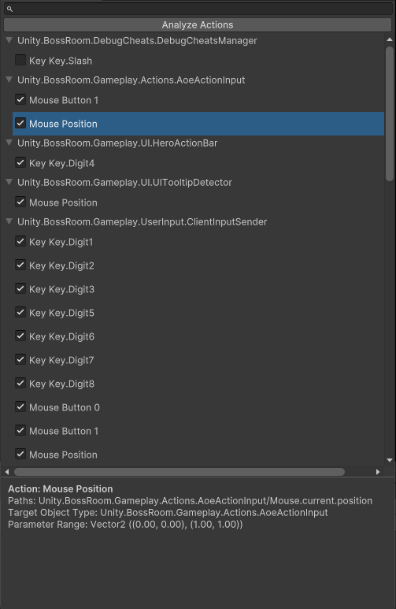

# Stability and Exploratory Testing

Regression Games permits more than just predefined testing scenarios. Stability and exploratory testing uses bots can be used to find bugs when you may not have a specific test case in mind.

## Monkey Bots

<div style={{position: "relative", paddingBottom: "50.40485829959515%", height: 0}}><iframe src="https://www.loom.com/embed/8cde5bbe454c497aa74bd3afacca23cc?sid=745912d2-c555-4ef3-8a24-b2befd49c808" frameborder="0" webkitallowfullscreen mozallowfullscreen allowfullscreen style={{position: "absolute", top: 0, left: 0, width: "100%", height: "100%"}}></iframe></div>
<br />

`MonkeyBot` is a type of `botAction` in Bot Segments can be used to randomly perform actions for exploratory and stability testing. This action type is a great choice for stress testing your game in an attempt to find random crashes and bugs.

The `MonkeyBot` action is smarter than random input generation. It **automatically determines the applicable keyboard and mouse inputs** for the game being tested using static code analysis, and randomly performs those actions as the game is running. The SDK allows you to select which actions are enabled in order to control/limit the functionality that is exercised by the bot.

There are three steps to get a `MonkeyBot` up and running:

1. Analyze all possible inputs that the game can receive using the Action Manager panel.
2. Create a Bot Segment that uses the `MonkeyBot` action type.
3. (Optional) Configure the frequency and actions that the bot can take.

### Preparing the Bot Actions

Open the Action Manager panel by navigating to **Regression Games > Configure Bot Actions**. You can dock the panel to make it easier to access.


In the panel, press the **Analyze Actions** button. The SDK will automatically analyze the game code and assets to identify all the device inputs that are applicable to the game.


:::info Note
The automated analysis supports commonly used device input APIs from the Legacy Input Manager, Input System, and Unity UI systems. However, the use of non-standard input handling libraries is not supported. The analysis will normally emit a warning when it is unable to resolve an input.
:::

After the analysis completes, you will see each device input associated with the type of component that listens for it. You can select an action to view more details about it. The checkbox next to each action can be unchecked to exclude the action from consideration by the bot. For example, you may want to exclude "Quit", "Pause", or "Exit" keys or buttons that may interfere with the bot's ability to progress through the game.



### Example Segment JSON

Now that you've configured the actions that the bot can perform, you can create a bot segment that uses the `MonkeyBot` action type.

Create a new file at the location `Assets/RegressionGames/Resources/BotSegments/RGMonkeyBot.json` and copy the following JSON into the file. This
will be the Bot Segment for the monkey bot behavior.

```json
{
    "name": "Monkey Bot",
    "keyFrameCriteria": [
        {
            "type": "ActionComplete",
            "transient": true,
            "data": {}
        }
    ],
    "botAction": {
        "type": "MonkeyBot",
        "data": {
            "actionInterval": 0.25,
            "actionSettings": {
                "DisabledActionPaths": [],
                "ActionProperties": {}
            }
        }
    }
}
```

Then, create a new file at the location `Assets/RegressionGames/Resources/BotSequences/StabilityTest.json` and copy the following JSON into the file. This
will be the Bot Sequence that will consist of just one segment - the Monkey Bot segment we created above.

```json
{
    "name": "Stability Test",
    "description": "Finds random bugs using a Monkey Bot",
    "segments": [
        {
            "type": "Segment",
            "path": "BotSegments/RGMonkeyBot.json"
        }
    ]
}
```

### JSON Fields

There are two primary fields for the `MonkeyBot` action type

- `actionInterval`: The interval at which actions are selected and performed.
- `actionSettings.DisabledActionPaths`: A list of action paths that should be excluded from the bot's behavior. In the Action Manager panel, you can select an action to see its path.
- `actionSettings.ActionProperties`: A dictionary of properties that can be used to control the bot's behavior.

Instead of setting the `actionSettings` directly, you can edit these directly in the Action Manager panel, and then copy the created settings from the `Assets/Resources/RGActionManagerSettings.txt` file.

```json
// example Assets/Resources/RGActionManagerSettings.txt file
{
"ApiVersion":1,
"DisabledActionPaths":[
"Unity UI/Button/RoomNameBox.CopyToClipboard"
],
"ActionProperties":{
"Unity UI/Input Field/Text Submit/IP Input Field":[{"propertyName":"ParameterRange","propertyValue":"{\"type\":\"RANGE_BOOL\",\"minValue\":0,\"maxValue\":0}"}]
}
}
```