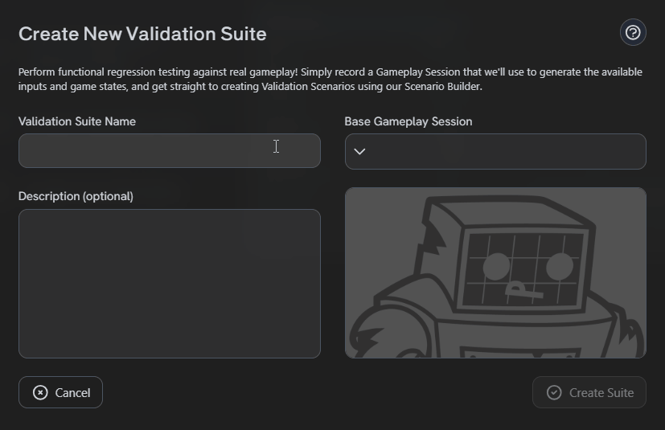
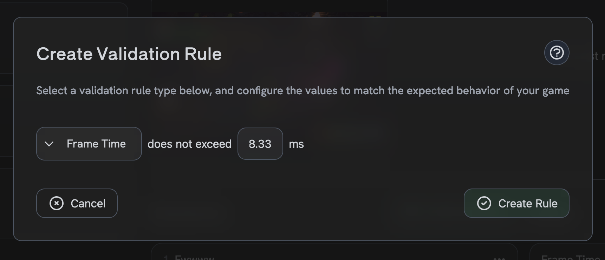
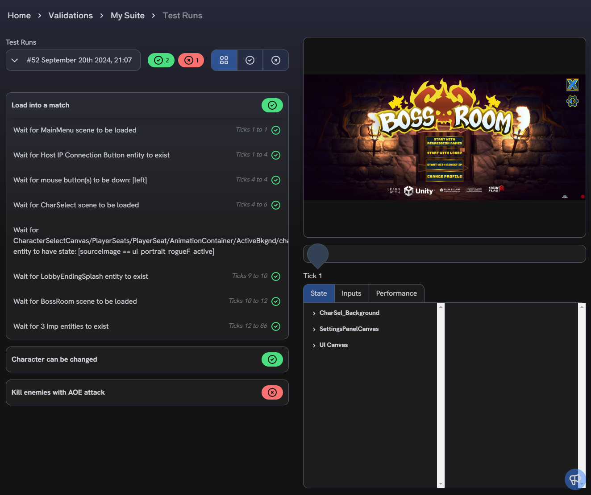
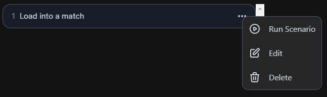
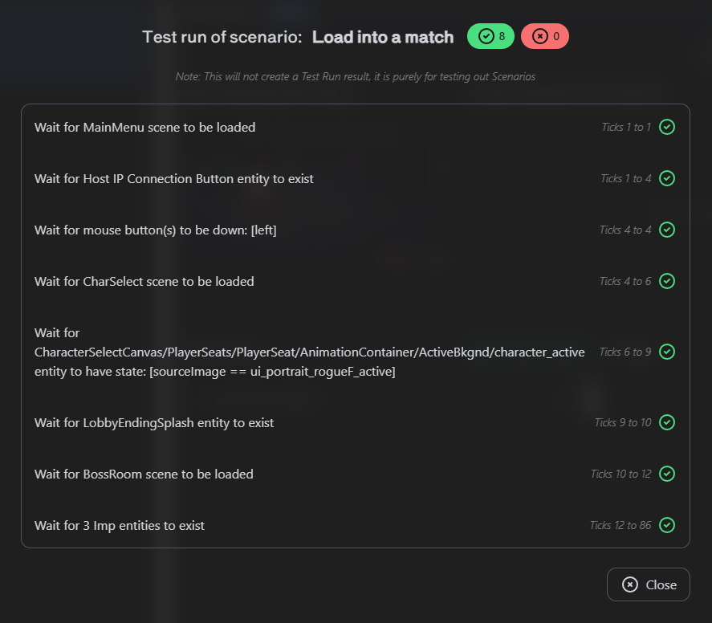
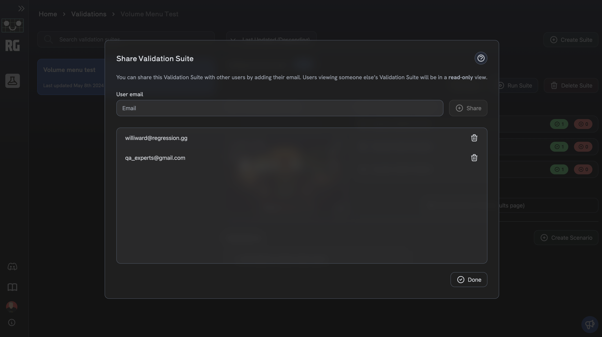

# Validation Suites

**Validation Suites** help ensure your game is functioning as intended by verifying that specific criteria are met
over the course of a [Gameplay Session](gameplay-sessions/gameplay-sessions-getting-started).
A Validation Suite is composed of a collection of [Scenarios](#validation-scenarios)
and [Rules](#validation-rules). Validation Suites are managed through a dashboard in the
[Regression Games web interface](https://play.regression.gg/validations).

## Creating a Validation Suite

Create a Validation Suite from the [Validation Suites dashboard](https://play.regression.gg/validations)
by clicking the **Create Suite** button at the top of the page.
Enter a name and optional description for your Suite, and choose a Base Gameplay Session.
This Gameplay Session will be used to create your Scenarios,
which can then be run against other Gameplay Sessions in the future for regression testing.

## Validation Scenarios

A **Validation Scenario** defines a functional test case by asserting that specific actions are taken during
a Gameplay Session and that they produce expected changes in the game state.
Steps can assert that a game scene is loaded, wait for mouse and keyboard inputs, check for the existence
of specific game objects, and much more.

Multiple Validation Scenarios can belong to a single Validation Suite.
Validation Scenarios in a Suite execute in the same order as they appear in the Validation Suite dashboard.
They run independently of each other, meaning the contents of one Scenario do not affect others at runtime.
Each Scenario starts at the first tick of the Gameplay Session, and the Suite continues to run remaining Scenarios when one fails.

### Creating a Validation Scenario

Open your Suite in the [Validation Suites dashboard](https://play.regression.gg/validations) and click the **Create Scenario** button.
This opens the **Scenario Builder**, where you can view game state data and a screenshot for each tick in the Gameplay Session,
and use this information to build steps for your Scenario.

import ScenarioExample from "./img/validation-suites/scenario-example.png"

<figure>
    
    <figcaption>
        This example Scenario waits for the player to be in the Main Menu and have a match hosting dialog open.
        Waiting for a left mouse-click event signifies that the player has clicked the "Host Match" button
        to create a lobby and that the character selection screen should load.
        The Scenario then waits for the Rogue character class to be selected and for a splash screen representing
        the end of character selection to be present.
        Finally, the Scenario asserts that the player is in the game scene with 3 Imp enemies spawned.
    </figcaption>
</figure>

### Validation Steps

Validation Steps execute in the same order as they are defined in the Scenario Builder, from the top down.
When a step fails, the Scenario fails and ceases execution.

Many steps progress through the Gameplay Session until a tick satisfies their criteria.
These steps are prefixed with the words **Wait for**, and they tell the next step in the Scenario to execute from that tick.
In this way, steps run sequentially through the Session and can be used to establish cause-and-effect relationships between game state changes.
If a "Wait for" step reaches the end of the Gameplay Session without encountering a tick that satisfies its criteria, then that step will fail.

Other steps evaluate a single tick and pass or fail based on that tick rather than walking through the Gameplay Session.
These steps are _not_ prefixed with "Wait for".

| Step Name          | Description                                                                                                                                                                                                                                                                              |
|--------------------|------------------------------------------------------------------------------------------------------------------------------------------------------------------------------------------------------------------------------------------------------------------------------------------|
| Wait for Scene     | Wait for a specific scene to be loaded or unloaded                                                                                                                                                                                                                                       |
| Wait for Key       | Wait for one keyboard key, or a combination of keys to be pressed or released                                                                                                                                                                                                            |
| Wait for Mouse     | Wait for a mouse button to be pressed or released                                                                                                                                                                                                                                        |
| Wait for Existence | Wait for a game object of the specified type to exist or not exist. You can optionally specify whether an exact number of objects must exist in order for this step to pass                                                                                                              |
| Wait for State     | Wait for a game object with specific state values to exist using comparators. Comparators can use either literal values or a stored value from a previous step. You can optionally specify an exact number of game objects that must satisfy the criteria in order for this step to pass |
| Store Value        | Store a value from a game object's state to be used in later steps. Note that the entity and target value must be present when this step is executed, so be sure to place this after a step that asserts the existence of that entity.                                                   |

:::info
Many steps provide dropdowns for selecting configuration values such as game object types, state fields, and comparators.
The available options for these dropdowns are drawn from the Base Gameplay Session associated with the Suite.
:::

## Validation Rules

A **Validation Rule** applies metric thresholds to the entirety of a Gameplay Session.
This is useful for detecting issues that result in performance degradation.
A violated rule will be presented as a warning in the run results.

| Rule Type                 | Description                                                                                                                                                                                                                                           |
|---------------------------|-------------------------------------------------------------------------------------------------------------------------------------------------------------------------------------------------------------------------------------------------------|
| Frames Per Second         | Specify the percentage of frames in a Gameplay Session that should remain at or above a certain FPS value. This rule is violated if less than that percentage meets the FPS threshold.                                                                |
| Average Frames Per Second | Specify the minimum allowable average FPS value for the Gameplay Session. The average is computed across all frames in the Session. This rule is violated if the average FPS across the Session falls below the specified threshold.                  |
| Maximum Frame Time        | Specify the maximum allowable frame time value for the Gameplay Session. Frame time is the amount of time spent calculating and rendering a frame, measured in milliseconds. This rule is violated if a single frame exceeds the specified threshold. |

### Creating a Validation Rule

Open your Suite in the [Validation Suites dashboard](https://play.regression.gg/validations) and click the **Create Rule** button.
You can then select the Rule type you want to add and configure the Rule's parameters.
You can edit the Rule at any time.

## Running Validations and Viewing Results

You can either run a Suite in its entirety (including all Rules and Scenarios), or trial run an individual Scenario.
The latter is helpful for debugging and iterating on a Scenario.

### Running a Validation Suite

Open your Suite in the [Validation Suites dashboard](https://play.regression.gg/validations), click the **Run Suite** button,
and select a Gameplay Session to run it against.
Results will be available once the Suite has finished running.

Recent result summaries are displayed on the Suite's page in the dashboard.
Clicking on a result summary will take you to the detailed results for that run where
you can see the results of each Rule, each Scenario and its steps, and the state of the game at each tick during the Session.

### Running a Validation Scenario

To trial run an individual Scenario, open the Scenario's menu and click **Run Scenario**.

The Scenario's results will be shown in a dialog, but will not be persisted to your account.
Closing the dialog will discard the results.

## Sharing Validation Suites

Validation Suites can be shared with other users in a read-only mode by clicking the **Share** button on the Suite's page.
When a Suite is shared with you, you can view the Suite, its Rules, and its Scenarios, but you cannot edit them.
A user does not need to have a Regression Games account at the time you share the Suite with them,
but users must create an account and be logged in to view the Suite and its contents.
Users can be removed from the Suite at any time.

