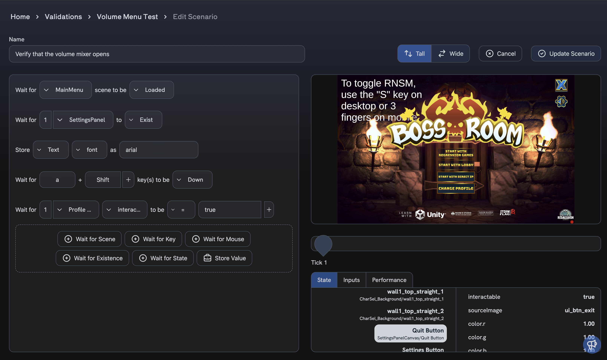
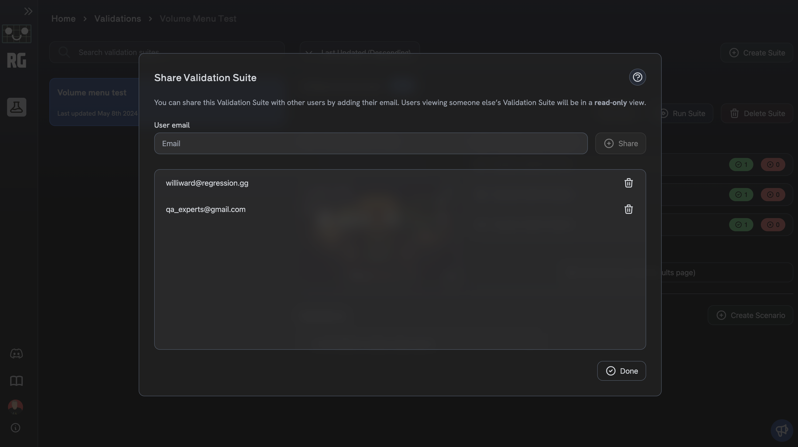
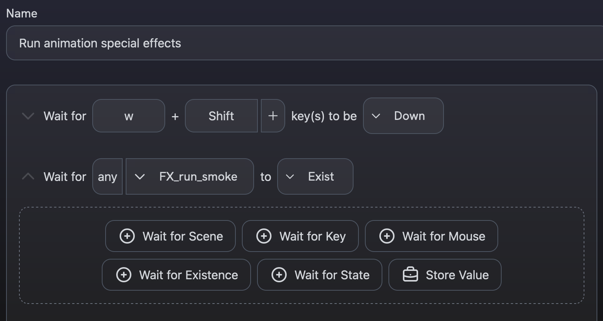
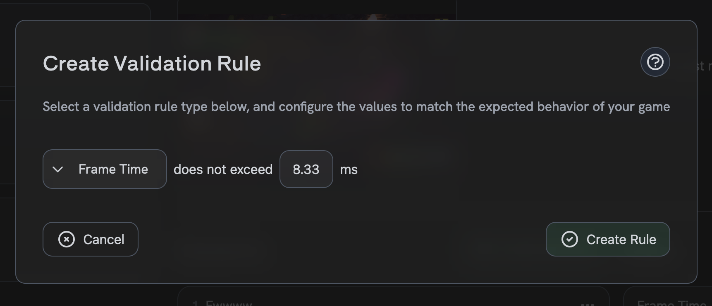
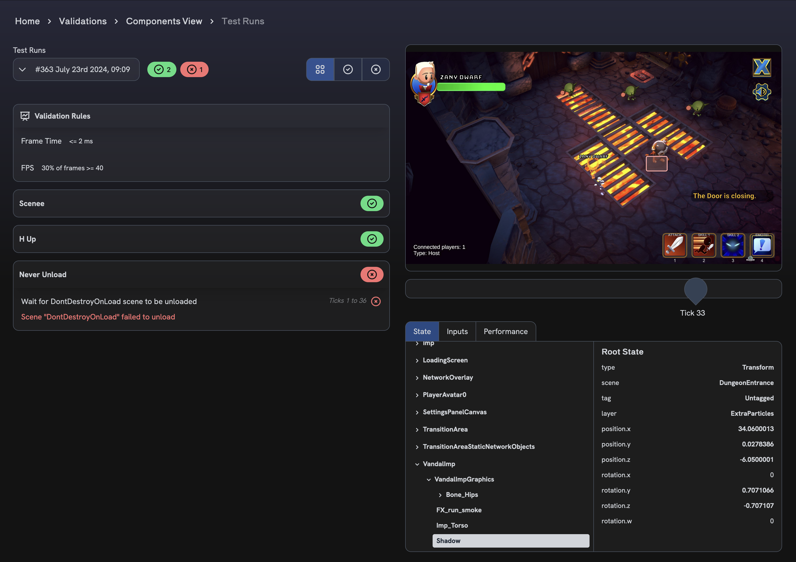

# Validation Suites

**Validations** are used to assert states within your game. You can create Validation Scenarios using our Scenario Builder, and then run them against a gameplay recording to ensure that your game is behaving as expected. You can also create Validation Rules to assert specific criteria about your game, such as the average frames per second during a gameplay recording.

**Validation Suites** are a collection of Scenarios and Rules that you want to run together. You can create a Suite starting with a name and description. At the core of a Suite is its Base Gameplay Recording. This recording is a gameplay session recording used to create the Scenarios and Rules that will be run, and the inputs used during the recording will be used when running the scenarios.

### Sharing Suites

Validation Suites can be shared with other Regression Games users, in a read-only mode. If a Suite is shared with you, you can view the Suite and its Scenarios, but you cannot edit the Suite, its Scenarios, or its Rules.

## Scenario Builder

**Scenarios** are composed of steps that can be asserted throughout a gameplay recording. You can wait for specific mouse or keyboard events, check for specific game objects, or even check for specific values in the game state. The available options when creating Scenarios are drawn from the Base Gameplay Recording associated with a Suite.

Along with Scenario steps, you can also view the state, and view a screenshot, at each tick during the recording. This can help you understand the state of the game at each point in time, and can also help create the Scenarios you want to run.

Check out the [full Scenario Builder reference](./validation-scenario-builder-reference) for more details

## Rules

**Rules** are used to assert that the gameplay recording meets specific criteria, such as the average frames per second during the recording. When viewing a specific Validation Suite, you can add Rules to the Suite that will be asserted each time the Suite is run.

Rules can be added to a Suite by clicking the "Create Rule" button on the Suite's page. You can then select the Rule type you want to add, and configure the Rule's parameters. After adding a Rule to a Suite, you can always edit it later.

Check out the [full Rules reference](./validation-rules-reference) for more details

## Running Validations

You can either run **all** of the Scenarios within a Suite, or trial run an individual Scenario. To run a Suite, click the "Run Suite" button, and select a Gameplay Session to test against. When the Suite is finished running, you can view the results of each Scenario and Rule within the Suite on the Test Runs page.

To trial run an individual Scenario, click the "Run Scenario" button within the Scenario's menu. The Scenario's results will be shown in a dialog, and will not be persisted.

## Viewing Results

To access the results of your Suite, navigate to the Test Runs page. Here you can see the results of each Scenario and Rule within a Suite. You can also view the results of a Scenario's steps, and the state of the game at each tick during the Scenario.

