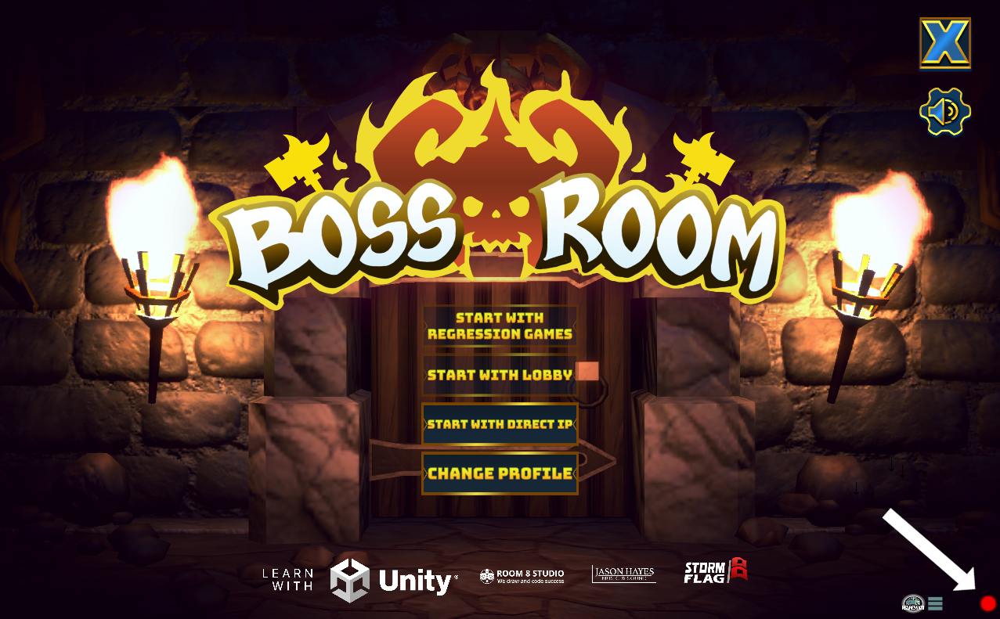
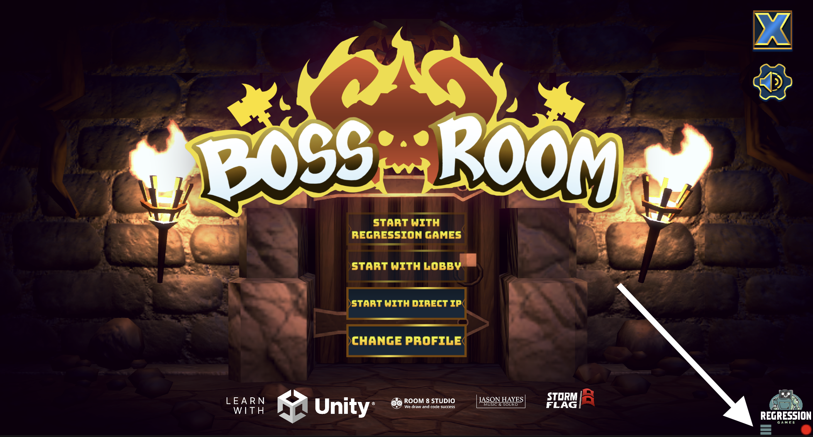
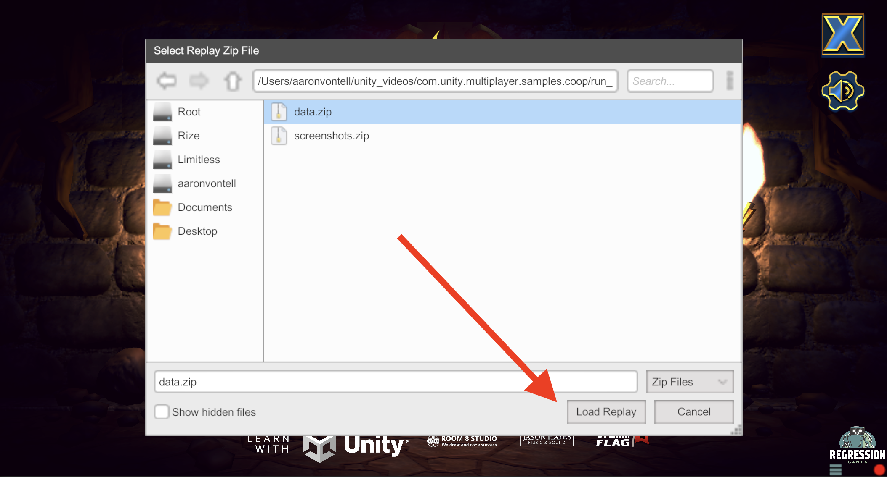
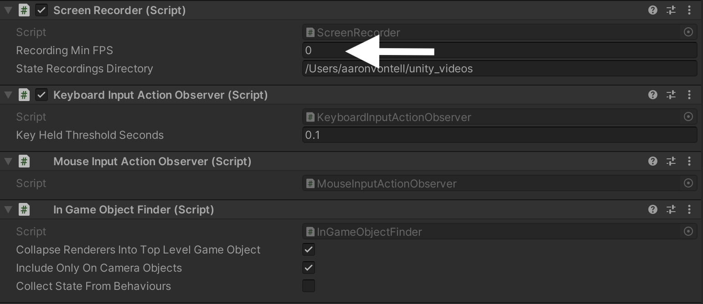
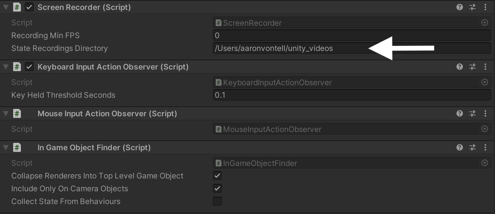
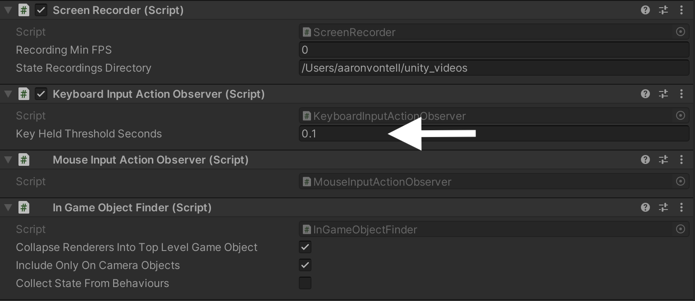
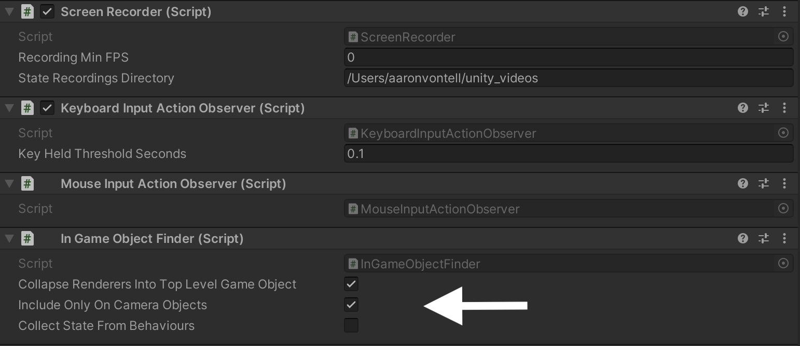

# Using Gameplay Sessions

## Preparing the Overlay

First, add the RGOverlayCanvas perfab to your scene (follow these instructions (INSERT LINK) if you have not done this already).

## Recording Gameplay

Recording can be started by clicking the red record button in the overlay under the Regression Games icon.
Once clicked, the SDK will begin recording your gameplay. Click the pulsing red record button again to stop the
recording, at which point all data collected will be saved to your device and uploaded to your Regression Games account.

## Playing Back a Recording

A recording can be played back by selecting the menu button underneath the Regression Games icon in the overlay. A file
selector will appear, with a default location of the recordings folder on your device. Navigate into the folder of the
run you'd like to use, select the `data.zip` file, and click "Load Replay".

After the replay is selected, click the Play button underneath the Regression Games icon to begin the playback.

## Advanced Options

### Ignoring objects in your Scene

In certain scenarios, you may want to ignore certain objects in your recordings, such as regions of a level that are
not relevant to the test or behavior of your recording. To ignore these game objects, follow these steps:

1. Click "Add Component"
1. Search for and add the `RG Ignore From State` component

This will ignore all state from this game object as well as all children of this game object.

### Choosing an FPS for recording

The **Recording Min FPS** option tells the SDK the frequency at which it should record information from the game. For
instance, if the FPS is set to `5`, then 5 times a second the SDK will scrape the game information.

If the FPS is set `0`, then the SDK will only record information when a **key frame** (INSERT LINK) is detected.

### Changing your recording location

By default, all data is stored to a `unity_videos` directory within your home directory. This can be changed within the
**State Recordings Directory** field.

TO DISCUSS IN PR COMMENTS: How does this work when multiple people are using the project on different machines?

### Input threshold options

In some cases, different devices may report spammy key clicks when a key is actually being held down. This threshold
defines a maximum amount of time that must exist between key clicks to be considered clicks rather than a key being
held. This defaults to 0.1 seconds, and often should not have to be changed. If you do experience key click spamming,
you can change this value to a higher number within the **Key Held Threshold Seconds** field.

### Game object finder configurations

The SDK traverses the game object tree of a game to collect state relevant for both recording playback and testing.
In addition to ignore certain objects as described above, there are also a few other ways that this can be configured.

#### Collapsing Renderers

The **Collapse Renderers into Top Level Game Object** checkbox dictates how renderer game objects are collected as part
of the game state. If true, all renderers are collapsed into their top level gameObject. If a gameObject hierarchy
exists that has colliders/renderers/animators/etc at multiple levels, they will all be represented by a single entry in
the state. This defaults to checked as it is normally desired to see each player, car, building, etc as a single entry
in the state. However, it can be useful to set this to false in cases where you want to validate individual render
bounds, colliders, rigibodies, etc on individual armatures, weapons, or other components that are children in the
hierarchy.

#### Include Only On Camera Objects

The **Include Only On Camera Objects** checkbox dictates whether or not the recorder should collect all objects in the
scene as part of the game state, or only those that appear in the viewport of the camera. This defaults to checked, as
in many cases, objects that are not on camera are not relevant to the test or playback. If you do need to see all
objects in the scene, uncheck this field.

#### Collect State from Behaviours

The **Collect State from Behaviours** checkbox dictates whether or not the recorder should collect fields and property
values from Behaviours attached to the game objects. For recording playback, this is not always needed, but for testing
specific states within your game objects, this is extremely useful. This is unchecked by default, and note that
enabling this can introduce a performance impact.

