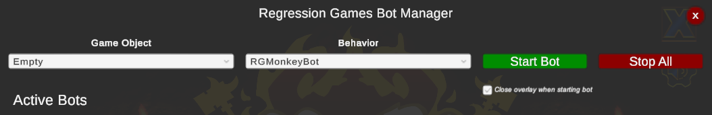
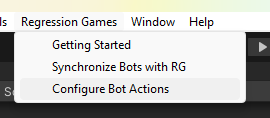
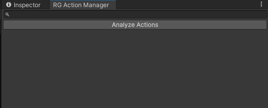
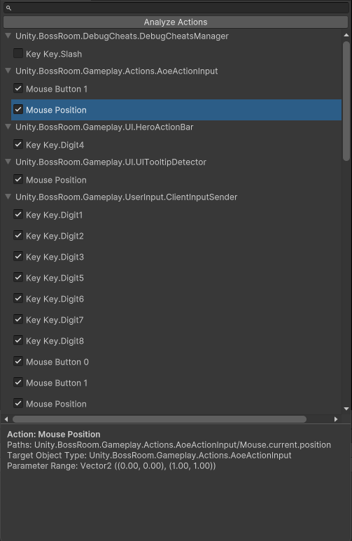
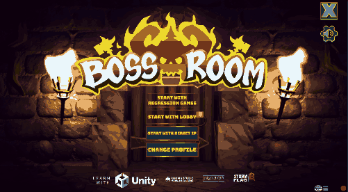

# Monkey Bot

The Regression Games SDK has a built-in **Monkey Bot** that automatically determines the applicable keyboard and mouse inputs for the game under test and randomly performs them as the game is running. The SDK also offers the capability to configure the actions taken by the bot to control the functionality that is exercised by the bot.

## Usage

For most games, the Monkey Bot can be quickly configured and deployed. First, the bot actions are configured through the Action Manager panel. Then, the monkey bot is started through the Regression Games Bot Manager.

### Configuring Bot Actions

Open the Action Manager panel by navigating to **Regression Games > Configure Bot Actions**. You can dock the panel to make it easier to access.

In the panel, press the **Analyze Actions** button. The SDK will now automatically analyze the game code and assets to identify all the device inputs that are applicable to the game.

:::info Note
The automated analysis supports commonly used device input APIs from the Legacy Input Manager, Input System, and Unity UI systems. However, the use of non-standard input handling libraries is not supported. Where possible, the analysis will emit a warning if it is unable to resolve an input.
:::

After the analysis completes, you will see each device input associated with the type of component that listens for it. You can select an action to view more details about it. The checkbox next to each action can be unchecked to exclude the action from consideration by the bot. For example, you may want to exclude "Quit", "Pause", or "Exit" keys or buttons that may interfere with the bot's ability to progress through the game.

### Running The Monkey Bot

Once you've decided on the actions to include, start the game and navigate to the point where you want the random test to begin. Press the Regression Games logo at the bottom right to open the Regression Games Bot Manager. From here, select the **RGMonkeyBot** behavior and press **Start Bot**. The monkey testing bot will now begin to automatically exercise a variety of game functionality. The bot can be stopped at any time by opening the overlay again and pressing the **Delete** or **Stop All** button.

## Feedback

We are constantly iterating on and improving our tools!
If you'd like to report any limitations, bugs, or if you'd like to request a feature,
please fill out [this feedback form.](https://d7y6yysps34.typeform.com/to/MYieIsHV)
