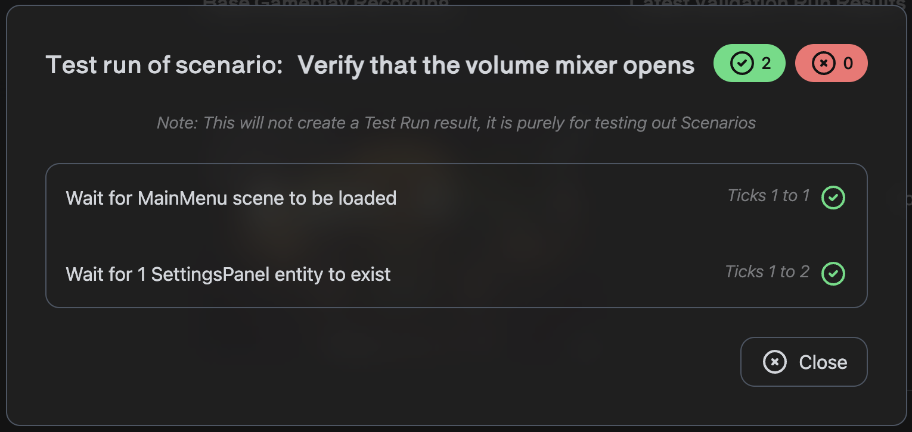

# Creating Your First Automated Test

In this tutorial, we will get a simple automated test working in Unity using Regression Games.
We will show you how to record gameplay, upload a [Gameplay Session](../core-concepts/gameplay-sessions),
and use it to create a [Validation Suite](../core-concepts/validation-suites) for regression testing.

## (Optional) Download a Sample Game

Feel free to follow this tutorial within your own game,
but we recommend starting with a sample game if you do not have a game available.
Our team often uses BossRoom, a simple multiplayer game created by Unity, to develop and test features.
However, you can start with any game of your choosing!

Download the BossRoom sample from the [official GitHub repository.](https://github.com/Unity-Technologies/com.unity.multiplayer.samples.coop)
and open it within Unity version 2022.3 (visit the [Unity archive](https://unity.com/releases/editor/whats-new/2022.3.27) if
you can't find that version from Unity Hub).
Once the project is loaded, open the `MainMenu` scene in `Assets` > `Scenes`.

## Import the Regression Games Unity Bots Package

Follow our [installation instructions](installing-regression-games) to add our package to your game.
If you're using one of our recommended samples, you can ignore sections on extension packages.

## Record Gameplay

The first step in automating a test is to [record some gameplay](../core-concepts/recording-gameplay)
and allow the SDK to upload a [Gameplay Session](../core-concepts/gameplay-sessions) to your Regression Games account.
This feature allows you to record real gameplay and play it back later to run regression tests against. Regression Games does
offer other utilities for dynamic bots, but to get started with a simple example, we will record a click-through that
verifies the functionality of the UI in BossRoom.
More specifically, we will test the following simple scenario (feel free to come up with your own if you are not using Boss Room):

* The game loads into the main menu
* We use the mouse to click the Volume Settings button
* We verify that the Volume Settings panel is displayed
* Finally, we close the volume settings panel

These actions are **recorded** and can be **played back** later. As the Session is replayed, data from the
game is collected, which can then be validated against using Validation Suites.

As shown in the short video below, follow these steps:

1. Click the play button in the editor to start the game.
1. Click the red record button in the bottom right to start recording.
1. Click the Volume Settings button near the top right of the main menu.
1. Click the close button on the Volume Settings panel.
1. Click the rec recording button in the bottom right to stop recording.
1. When finished recording, click the hamburger menu next to the record button to open up a dialog for loading your
recording. You can find the recordings within [the recordings directory](../core-concepts/recording-gameplay#overriding-the-recording-directory).
Select the `bot_segments.zip` file and click **Load Replay**.
1. Click the play button under the Regression Games logo to see your recording play back!

<iframe src="https://www.loom.com/embed/1a88ffcad1ff49d6940473d5637e35ed?sid=336eaf3b-208c-4ea3-a0b3-c6ad3d2d2cee" frameborder="0" webkitallowfullscreen mozallowfullscreen allowfullscreen style={{position: "absolute", top: 0, left: 0, width: "100%", height: "100%"}}></iframe>

## Create a Validation Suite

With your first Gameplay Session saved, we can now write a functional test that validates the behaviour of this
scenario! Visit https://play.regression.gg/validations to begin creating a new
[Validation Suite](../core-concepts/validation-suites) using this Session.

### Creating a Validation Scenario

Click **Create Suite**, enter a name for your Validation Suite, and select the Gameplay Session you just recorded (if
you don't see it, try refreshing the page). You may notice that there are two or more Sessions; these include both
the original Session you recorded manually, and Sessions created through automated playback. Make sure to select the one
lowest in the list, which is the first one you created. Click **Create Suite** in the bottom right.

Once the Suite is created, you'll be able to select it within the Validation Suites Dashboard. Select your Suite, and
click **Create Scenario** in the bottom right to start creating your first functional test.

The editor you see here is the `Scenario Editor`. It features a screenshot scrubber to see your game in action, as well
as a state panel to see in-depth information scraped from your game. This information includes not only positional data,
but also MonoBehaviour properties and fields, as well as keyboard and mouse inputs. For example, for a user interface, you can
see information such as image sources and text values.

Enter a name for your scenario (we named ours `Verify that the volume mixer opens`), and hover over the pane on the left to
see a list of options for validation. For this scenario, we will verify that:

1. The scene loads properly
2. The volume settings panel appears

This tool allows a wide variety of test scenarios, including mouse and key press detection, state assertions, and
storing values for comparison (learn more in the [documentation for validations](../../core-concepts/validation-suites#creating-a-validation-scenario)).
For now, we will keep it simple with the two steps listed above. See the screenshot above and the video below to see
how to add these steps (the search feature can be helpful for finding relevant elements in your scene).

<iframe src="https://www.loom.com/embed/3575d3ef72ae4ebc87dc4eab668d3284?sid=336eaf3b-208c-4ea3-a0b3-c6ad3d2d2cee" frameborder="0" webkitallowfullscreen mozallowfullscreen allowfullscreen style={{position: "absolute", top: 0, left: 0, width: "100%", height: "100%"}}></iframe>

Once you are done creating these steps, click **Create Scenario** to save it. Back on the Validation Suite page, you
can click the options menu next to the scenario you just created to run it, by selecting the **Run Scenario** option.
This will immediately run this scenario on the original gameplay session and provide you with the results.

### Run the Validation Suite on New Automated Run

Now that this Validation Suite exists, we can run it against other Sessions recorded during automated playback of your original Session! In the top
right of the Validation Suite, click the **Run Suite** button, and select a more recent Gameplay Session to validate.
Once the test is run, you can click the result within the list of runs to see a detailed view of passed and failed
scenarios.

## Next Steps

We now have a repeatable automated Gameplay Session that can be verified using the validation tool! If you got stuck
during this tutorial, or want to brainstorm how to get the most of this tool, please
[join our active Discord community](https://discord.com/invite/925SYVse2H). We are excited to make the best automation
tools for game QA, and would love your feedback!
