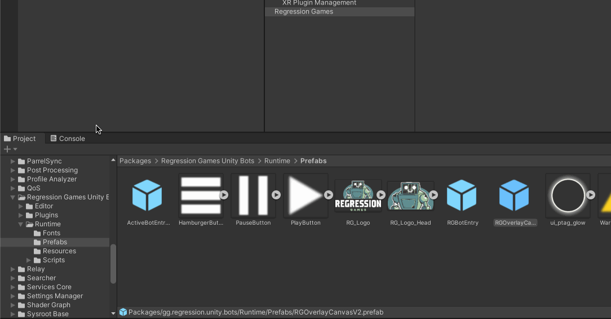

import CreateAPIKey from "../partials/_create-api-key-partial.mdx"
import SetAPIKeyInUnity from "../partials/_set-api-key-in-unity-partial.mdx"

# Installing Regression Games

This guide covers everything you need to add the Regression Games SDK to your Unity project and start exploring its features.

## Add the Regression Games SDK to Your Project

Our core package is [publicly available on GitHub](https://github.com/Regression-Games/RGUnityBots).
Open your Unity project and navigate to `Window` > `Package Manager`. From here, find the `Add package from git URL` option and paste the following URL:

```
https://github.com/Regression-Games/RGUnityBots.git?path=src/gg.regression.unity.bots#v0.0.27
```

:::info
- This package utilizes TextMeshPro. If you are prompted by Unity to add TextMeshPro assets to your project, please add them.
- This package installs the [Newtonsoft Json](https://docs.unity3d.com/Packages/com.unity.nuget.newtonsoft-json@3.1/manual/index.html) dependency for serializing/deserializing Json message payloads.
- If you get a note about Unity's new input system, click **Yes** and allow the editor to restart.
:::


## Add Extension Packages to Your Project

We provide the following extensions for our core SDK to support common project dependencies.
Each of these can be added to your project using a git url, similar to core package installation.

### Animation Rigging Extension

Adds support for Unity Animation Rigging.

```
https://github.com/Regression-Games/RGUnityBots?path=src/gg.regression.unity.bots.animation.rigging#v0.0.27
```

### Entity Component System (ECS) Extension

This extension is only recommended for projects that use Unity ECS.

This enables game state collection of Unity ECS Entities and their Components for projects using Unity ECS.
Without this extension, the core SDK can still capture GameObject data but will have no access to ECS Entities.
Depending on your project and its needs, this extension may not be necessary, but we highly recommend including it
for full visibility of your game's internal state.

Capturing Entities and their Component data may negatively impact runtime performance.
The amount of data to capture, or whether this process runs at all, can be adjusted
through the Project Settings to manage performance impact.

```
https://github.com/Regression-Games/RGUnityBots?path=src/gg.regression.unity.bots.ecs#v0.0.27
```

## Set an API Key

:::info
To learn more about our API keys, see the [Authenticating with API Keys](../core-concepts/authenticating-with-api-keys) section.
:::

Create a personal account through [the Regression Games website](https://play.regression.gg/signup).
This step is simple, and will give you access to many
features such as saving [Gameplay Sessions](../core-concepts/gameplay-sessions/gameplay-sessions-getting-started)
and creating powerful [Validation Suites](../core-concepts/validation-suites/validation-suites-getting-started).
Once you are logged in, you can find the **API Keys** section near the bottom of your [account settings](https://play.regression.gg/account).

<CreateAPIKey />

<SetAPIKeyInUnity />

## Restart Unity

Now is a good time to restart Unity and any code editor you may have open (e.g. Rider or Visual Studio).
Without this step, Unity and your code editor may not properly resolve your new packages even after Unity recompiles the scripts.

## Add the Regression Games Overlay to Your Scene

Our core package provides an in-game overlay that acts as a UI for features such as performing
[input recording and playback](../core-concepts/gameplay-sessions/gameplay-sessions-getting-started)
and constructing and running [Bot Sequences](../core-concepts/bot-sequences/getting-started-with-bot-sequences-and-segments),
but it also drives our data collection behind-the-scenes.
This means the overlay prefab **must** be present in each scene where you want to use any Regression Games features.
However, you can hide the visibility of the overlay through the project settings under
`Edit` > `Project Settings` > `Regression Games` if needed.

Find the `RGOverlayCanvas` prefab by navigating to
`Packages` > `Regression Games Unity Bots` > `Runtime` > `Prefabs` and dragging it into your scene's object hierarchy.
Make sure that the canvas is at the top of the hierarchy, so that it is always visible and interactable.
Repeat this for each scene that must have access to Regression Games features.



:::info
Your scene must have an EventSystem to make interaction with the overlay possible.
You can add one by right-clicking in your scene's Hierarchy and selecting `GameObject` > `UI` > `Event System`.
If you are using any of the sample scenes we provide in our guides, this is already included.
:::


## Next Steps

The Regression Games SDK is now set up and ready to be explored.
Continue reading our quick-start guide on [Creating You First Automated Test](creating-your-first-automated-test) or
head over to the [Guides](../guides/writing-advanced-validations) section for more in-depth walkthroughs and examples of real-world applications.