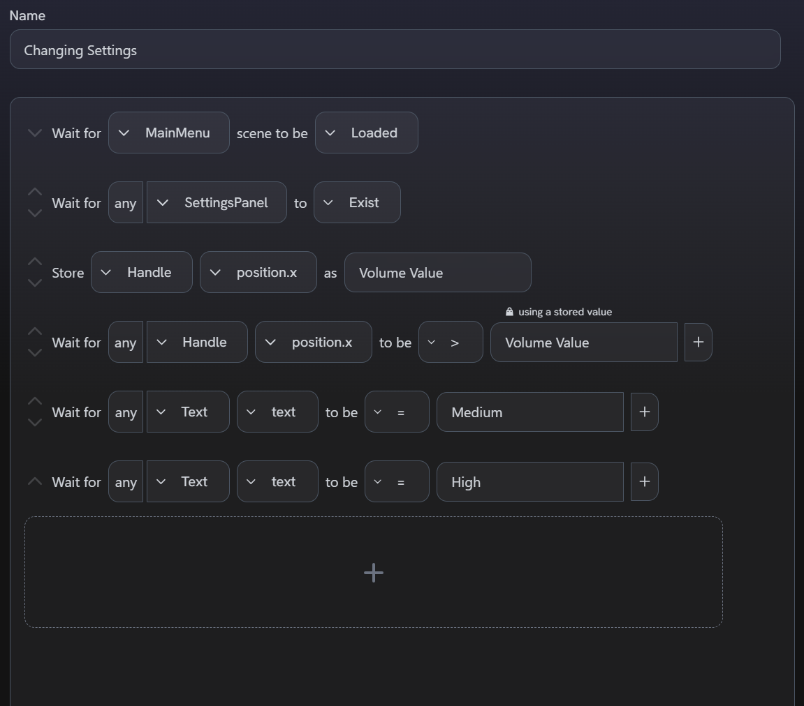

# Writing Advanced Validations

This guide provides in-depth examples for validating gameplay using [Validation Suites](../core-concepts/validation-suites).

:::note You will learn:
✓ how to build validations for common scenarios such as navigating menus and exercising core gameplay mechanics 
✓ how to establish potential cause-and-effect relationships between actions and their effects on the game state 
✓ how to build validations around non-deterministic behaviours
:::

This guide uses gameplay from [Unity's Boss Room sample project](https://github.com/Unity-Technologies/com.unity.multiplayer.samples.coop).
You can follow along by downloading Boss Room and [installing our core SDK](../getting-started/installing-regression-games),
or you can apply the concepts covered throughout this guide to your own project.
You can also try out our validations tools from our [Website Demo](https://play.regression.gg/validations-demo),
although the demo lacks some gameplay from this guide.

Each example describes how to recreate the gameplay it validates.
If you're following along, see our **Core Concepts** section for instructions on
capturing a [Gameplay Session](../core-concepts/gameplay-sessions)
and creating a [Validation Suite](../core-concepts/validation-suites) from that Session
to start building [Validation Scenarios](../core-concepts/validation-suites#validation-scenarios).

## Changing In-Game Settings

Let's start with a simple Validation Scenario.

**For this Gameplay Session**: we open the settings menu then increase the music volume and toggle graphics quality from "Medium" to "High".

**In the Scenario Builder**: we'll validate that the settings were changed successfully.

:::info Before Recording
Set the [recording interval](../core-concepts/recording-gameplay#adjusting-the-recording-interval) to `1`. This is necessary for capturing changes in some of the menus.
:::

We'll start building the Scenario by waiting until the `MainMenu` scene is loaded.
Many games use startup scenes to initialize data, so it's good practice to make sure the Scenario is at the correct scene
before running other steps.
Then, we'll wait for the settings menu to be open.
We can do this by adding a "Wait for Existence" step and selecting `SettingsPanel` from the dropdown.

import SettingsMenuExistsStep from "./img/writing-advanced-validations/changing-in-game-settings/settings-menu-exists-step.png"
import SettingsMenuExistsSupplement from "./img/writing-advanced-validations/changing-in-game-settings/settings-menu-exists-supplement.gif"

    

        
    

    

        
    

Waiting for the settings menu to exist in the game state is very important for the next step: capturing the initial music volume.
We can use the "Store Value" step to save a value and reference it later in the same Scenario.
"Store Value" always runs on the tick that the previous step left off - this means that
if we attempt to capture the initial volume before the settings menu exists,
then the step won't be able to find the slider and will fail.

The actual volume value that the slider's position should translate to isn't present in our collected game state data,
but we can check that the UI handle's position changes over time to validate that the user adjusted the slider.
Store the `Handle`'s `position.x` value as "Volume Value".

import StoreInitialVolumeStep from "./img/writing-advanced-validations/changing-in-game-settings/store-initial-volume-step.png"
import StoreInitialVolumeSupplement from "./img/writing-advanced-validations/changing-in-game-settings/store-initial-volume-supplement.gif"

    

        <figure className="margin--none text--center">
            
            <figcaption><i>Make sure you select the <code>Handle</code> entity for the correct volume slider</i></figcaption>
        </figure>
    

    

        
    

Now, we need to validate that the volume increases.
Add a "Wait for State" step and select the same `Handle` entity and its `position.x` field from the first two dropdowns.
Select "greater than" (`>`) as your comparator.
Clicking on the last field will reveal a dropdown with your available stored values.
Select "Volume Value".

import VolumeChangeStep from "./img/writing-advanced-validations/changing-in-game-settings/volume-change-step.png"

The last task in building our Scenario is validating that the user changed the graphics quality from "Medium" to "High".
Start by validating that the initial state is "Medium".
Add a "Wait for State" step and find the `Text` component that belongs to the `Settings Button` entity,
then select its `text` field. Type "Medium" into the comparison field.

import GraphicsMediumStep from "./img/writing-advanced-validations/changing-in-game-settings/graphics-medium-step.png"
import GraphicsSupplement from "./img/writing-advanced-validations/changing-in-game-settings/graphics-supplement.png"

    

        <figure className="margin--none text--center">
            
            <figcaption>
                <i>
                    Commonly-used components such as Text may appear frequently in the list.
                    Type "Settings Button" into the dropdown to search for the one we want.
                </i>
            </figcaption>
        </figure>
    

    

        
    

Finish the Scenario by repeating this process for the text "High" instead of "Medium".

### Final Scenario

## Selecting a Character and Starting a Match

This next example will validate user inputs in addition to interactions with UI components.

**For this Gameplay Session**: we create a profile by clicking the "Change Profile" button and submitting the name "RG".
This will allow us to create a lobby and select a character class through the "Start with Direct IP" menu option.
We preview the Male Tank character class before locking in the Female Archer -
this allows our Scenario to show examples of UI components changing over time to reflect the highlighted class.
We end the recording once the dungeon map loads with our character.

**In the Scenario Builder**: we'll validate that the profile name is entered correctly, that UI components behave as expected as we
click through each menu, that class-specific elements are represented correctly in the state, and finally that locking in a
character class gets us to the core gameplay.

Like in the previous Scenario, we'll start by making sure we're at the Main Menu.
Wait for the left mouse button to be pressed to indicate that we've clicked the "Change Profile" button.
Then, confirm that the `ProfilePopup` entity is visible.
You'll see that we insert a step to make sure the "Change Profile" button is interactable before waiting for the mouse click.
This isn't required for the Scenario to work, but sanity checks like this will help you diagnose
the root cause of failed Scenarios.

import OpenProfileSelector from "./img/writing-advanced-validations/starting-a-match/open-profile-selector.png"

With the `ProfilePopup` open, we'll validate that the text field reflects the profile name we want to type into it.
We'll need two steps to validate the keyboard input that produces the text "RG".
The first step waits for the `shift` key and the `r` key to be pressed together to produce a capitalized "R",
and the second step waits for `shift` + `g` for "G".
Then, we can validate that the `ProfilePopup`'s `InputText` component contains the text "RG".

:::info Key Combinations
Why can't we wait for `shift` + `r` + `g` in one "Wait for Key" step?

This type of step validates that every key in the list is simultaneously held or not held.
When users type, they tap keys such that they release one key before tapping the next -
this is different from using key combinations during actively gameplay
(for example, `ctrl` + `shift` + `1` to cast a spell from your 20th hot-bar in your favorite MMO).
When you use the "Wait for Key" step, consider what the player's intentions are for producing
those keyboard inputs.
:::

import TypeProfileNameStep from "./img/writing-advanced-validations/starting-a-match/type-profile-name-step.png"
import TypeProfileNameSupplement from "./img/writing-advanced-validations/starting-a-match/type-profile-name-supplement.png"

    
    

Creating a new profile in Boss Room will automatically close the `ProfilePopup` dialog and activate that profile.
Validate that the popup is dismissed, and then wait for another mouse click which indicates
we've clicked the "Host with Direct IP" button in the main menu.
This will launch a new dialog, `IPPopup`.
The next left mouse click we wait for indicates we've clicked the "Host" button in this dialog,
which brings us to character selection, where we can inspect the available character classes and select one to play as.

import OpenHostingDialogStep from "./img/writing-advanced-validations/starting-a-match/create-lobby-step.png"
import OpenHostingDialogSupplement from "./img/writing-advanced-validations/starting-a-match/create-lobby-supplement.png"

    

        
    

    

        
    

Wait for the Session to click the Male Tank character, then validate that the UI updates accordingly.
Boss Room displays a panel in the top-right corner of this scene with information about
the selected class, including its name and a preview of its available abilities.

import SelectMaleTankClass from "./img/writing-advanced-validations/starting-a-match/select-male-tank-class.png"
import SelectFemaleArcherClass from "./img/writing-advanced-validations/starting-a-match/select-female-archer-class.png"
import SelectCharactersSupplement from "./img/writing-advanced-validations/starting-a-match/select-characters-supplement.gif"

        

            <figure className="margin--none margin-bottom--md">
                
                <figcaption>
                    The Tank class has two abilities: a basic attack and a defensive shield.
                </figcaption>
            </figure>
            <figure className="margin--none">
                
                <figcaption>
                    The Archer class has three abilities: a basic attack, a charge arrow, and an AOE.
                </figcaption>
            </figure>
        

        

            
        

The last piece left in our Scenario is locking in the Archer class and entering the dungeon.
Wait for one last mouse click to indicate we've pressed the "Ready" button.
We can validate that the game registers our selection by asserting the `LobbyEndingSplash` entity appears in the scene.
Finally, we wait for the `BossRoom` (main dungeon) scene to load, and validate that our character object is instantiated.
In this case, we check for the `PlayerGraphics_Archer_Girl` entity to explicitly validate that the correct class is loaded
based on our character selection from the previous steps.

import MatchStartingStep from "./img/writing-advanced-validations/starting-a-match/match-starting-step.png"
import MatchStartingSupplement from "./img/writing-advanced-validations/starting-a-match/match-starting-supplement.png"

    

        
    

    

        
    

### Final Scenario

import FinalScenario1 from "./img/writing-advanced-validations/starting-a-match/final-scenario-1.png"
import FinalScenario2 from "./img/writing-advanced-validations/starting-a-match/final-scenario-2.png"
import FinalScenario3 from "./img/writing-advanced-validations/starting-a-match/final-scenario-3.png"

    
    
    

## Using Character Skills

Now that we've seen some examples of UI validation, let's address gameplay mechanics.

**For this Gameplay Session**: We start in the dungeon as a Female Archer character.
First, we press the `1` key to use her basic ability on a small pot to smash it.
Then, we make lift a heavy pot above her head and walk it to the opposite end of the corridor before setting it down.
Once the character's hands are free, we'll make her walk towards the nearest group of Imp enemies
and attack all of them at once using her AOE.
Pressing the `3` key will allow her to target the ground; click the right mouse button to confirm the target and unleash
a rain of arrows.
Once the enemies die in a puff of smoke, we end the recording.

**In the Scenario Builder**: we'll validate that destroying pots causes them to break into fragments,
that contextual abilities change depending on whether the target is environmental or an NPC, and that
enemies in an area can be damaged with AOE effects and die as a result of combat.

## Validating Player Death

Letting enemies kill the player
Multiple ways to validate

