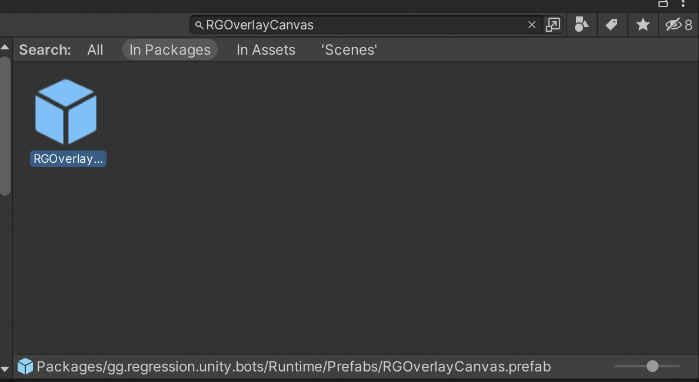
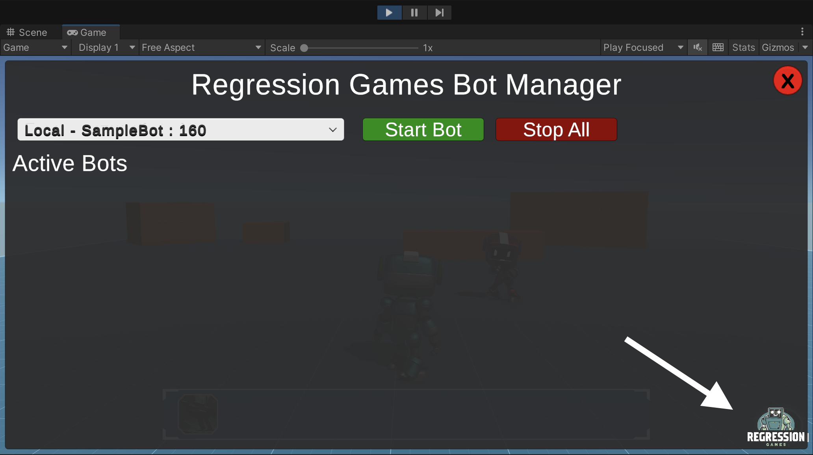

:::caution

Note that this overlay **must be present in your scene** for Regression Games to function. The visibility
of the overlay can be hidden through the Regression Games settings pane under **Edit** > **Project Settings** >
**Regression Games**. If you have multiple scenes where a bot will be used, place this into each scene.

:::

Find the `RGOverlayCanvasV2` prefab by navigating to **Packages** > **Regression Games Unity Bots** > **Runtime** > **Prefabs** and
drag it into your scene's object hierarchy. Make sure that the canvas is at the top of the hierarchy, so that it is always
visible and interactable.

Once you have this overlay available, you can click play to see it in action! The
Regression Games logo will appear at the bottom of your Scene View. Click this logo to see a dropdown for your bots.

:::info

Your scene must have an EventSystem to make interaction with the overlay possible. You can add one by
right-clicking in your scene's Hierarchy and selecting **GameObject** > **UI** > **Event System**.
If you are using the sample scene we provide, this is already included.

:::

