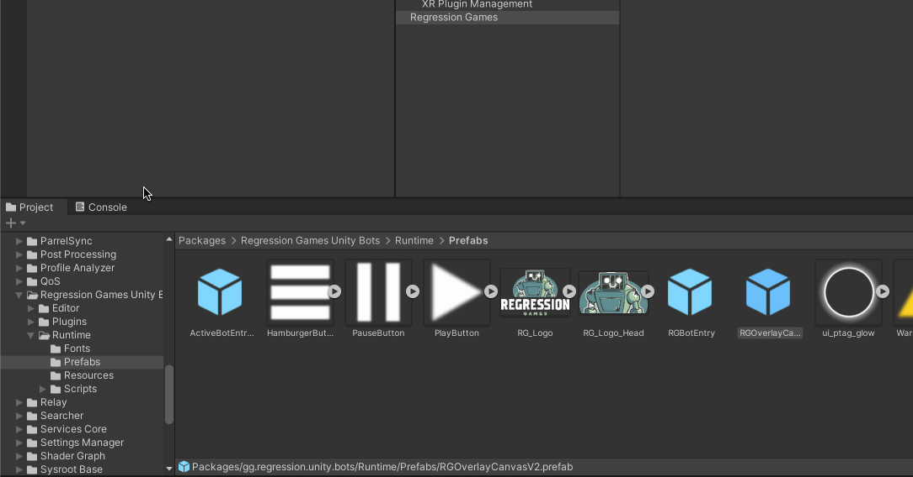

Find the `RGOverlayCanvas` prefab by navigating to **Packages** > **Regression Games Unity Bots** > **Runtime** > **Prefabs** and
drag it into your scene's object hierarchy. Make sure that the canvas is at the top of the hierarchy, so that it is always
visible and interactable.

:::caution

Note that this overlay **must be present in your scene** for Regression Games to function. The visibility
of the overlay can be hidden through the Regression Games settings pane under **Edit** > **Project Settings** >
**Regression Games**. Place this component into each scene that must be able to use Regression Games SDK features.

:::

