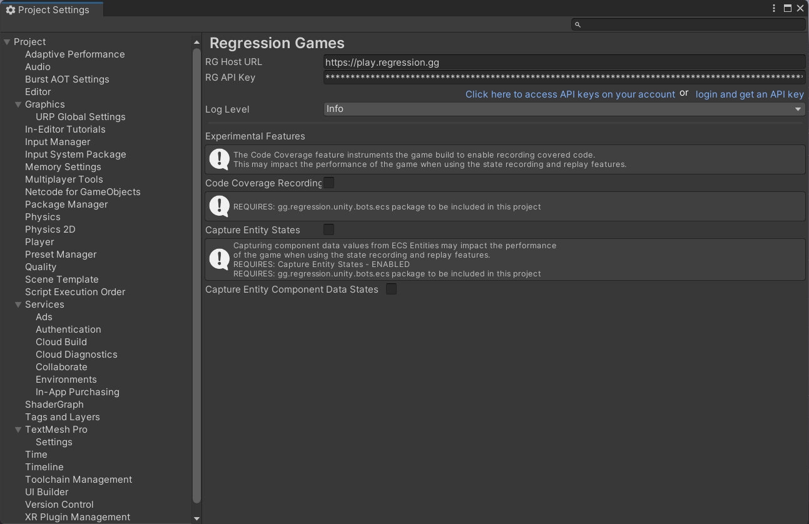

If you just installed our core SDK, or have just opened your project with the SDK already installed,
then you may be greeted by a welcome prompt. Click the **Set API Key** button near the bottom of the prompt
to open the Regression Games settings window. If the welcome prompt isn't visible,
then access the settings window by navigating to `Regression Games` > `Open Settings`.

Paste your key into the **RG API Key** field, then close the project settings.

