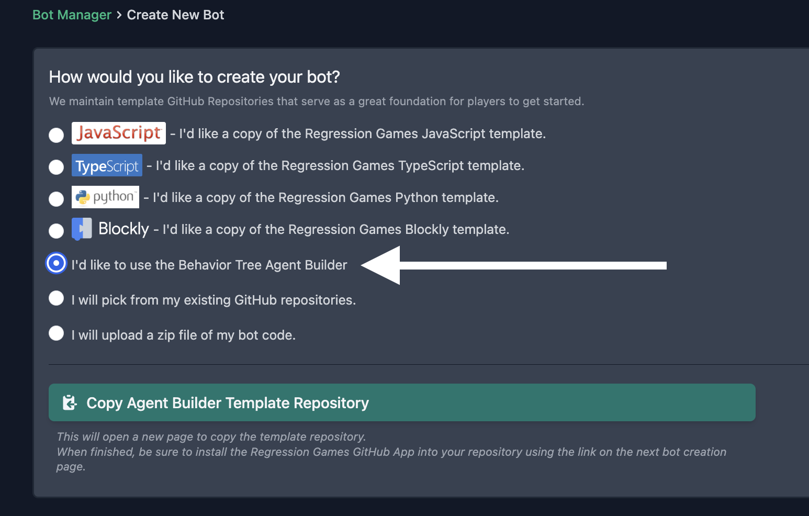

# Creating AIs Using the Agent-Builder

Regression Games' Agent-Builder is an easy-to-use visual editor for constructing AI behavior trees.
Our editor utilizes large language models like [OpenAI's GPT-4](https://openai.com/blog/chatgpt) to write code for you.
This makes our Agent-Builder an excellent tool for beginner programmers and users who are unfamiliar with our code libraries.

## What Are Behavior Trees?

TODO how to explain this very briefly. Then just link to another resource?

## Getting Started with Agent-Builder

Create a new AI from the Bot Manager and select Agent-Builder from the list of creation options
(see this section's [overview](./overview.md) for a walkthrough of AI creation).

### Creating Nodes

Once you've created your AI, you'll be redirected to the Agent-Builder interface.

// IMAGE

### Generating Code

## Deleting Nodes

## Loading a Tree
