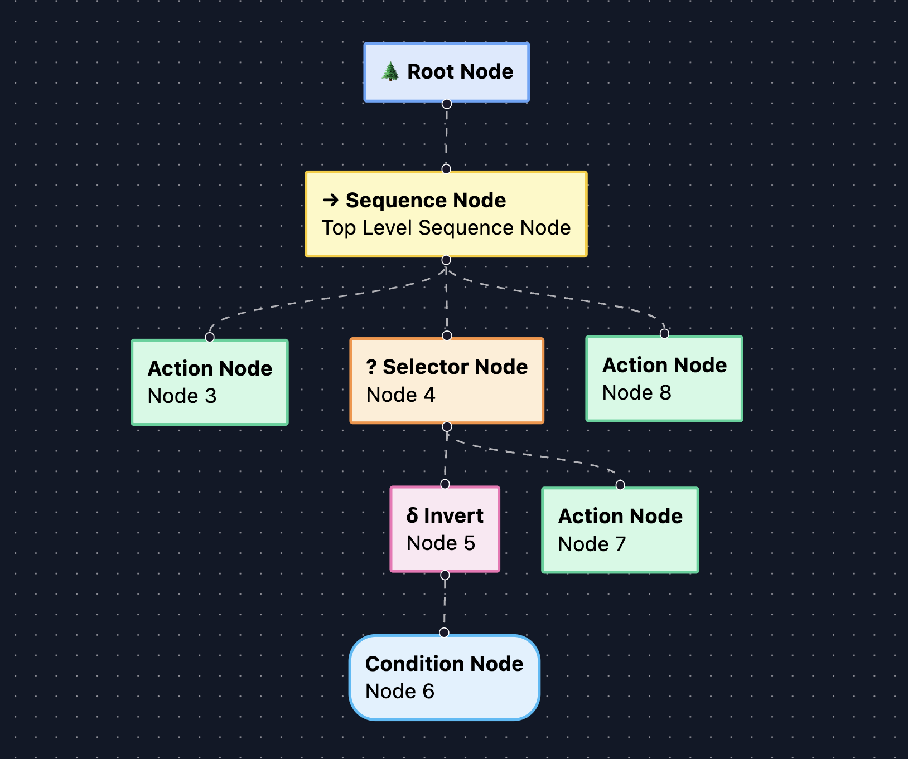
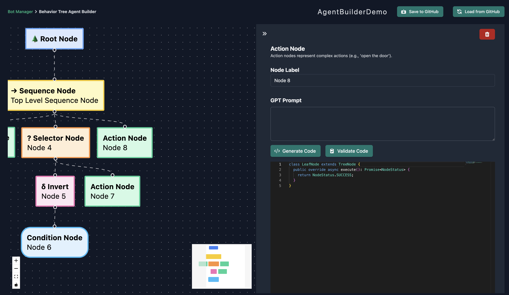

# Creating AIs Using the Agent-Builder

Regression Games' Agent-Builder is an easy-to-use visual editor for constructing AI behavior trees.
Our editor utilizes large language models like [OpenAI's GPT-4](https://openai.com/blog/chatgpt) to write code for you.
This makes our Agent-Builder an excellent tool for those new to Regression Games' libraries, or even programming itself!

*Please note that this tool is early in development and is likely to contain bugs.*

## What Are Behavior Trees?

TODO how to explain this very briefly. Then just link to another resource?

## Getting Started with Agent-Builder

Create a new AI from the Bot Manager and select Agent-Builder from the list of creation options
(see this section's [overview](./overview.md) for a walkthrough of AI creation).


### Creating Nodes

Once you've created your AI, you'll be redirected to the Agent-Builder interface.
We'll start you out with a root node and a sequence node to form the basis of your tree.


To start building your tree, click the connector at the bottom of the sequence node and drag.
When you release, you'll be presented with different types of nodes that can be added to the sequence.
For this demonstration, we'll create an action node.
You can repeat this process for any node that is allowed to have children.




Clicking on a node opens a panel to the right side of your screen.
This panel contains information about the selected node including a description of the node's type and a label, as well as a button to delete the node from the tree.
It's a good idea to set labels on your nodes to keep track of what you want each node or branch to do.
If the selected node is a leaf node, such as an action or condition, the panel will also contain fields used for code generation.



### Generating Code

The nodes in your tree won't be useful until you give them some logic to execute.
Click on a leaf node to open the side-panel and describe what you want this node to do in the "GPT Prompt" field.
When you're satisfied with your prompt, click the "Generate Code" button to watch code appear in the editor.

We provide additional context to GPT so that it can use our APIs but it may produce output that doesn't follow our expected format,
or code that functions differently in-game than your prompt intends.
If this happens, you can make changes to your prompt and re-submit it for new output, or you can manually edit the output yourself in the editor.

#### Typescript

Agent-Builder currently only supports Typescript. If you'd like to see support for other languages, let us know [here](https://regression-games.sleekplan.app/feedback).

The below sample uses the [rg-bot library for Minecraft](TODO-REG-1026) to make the AI wander in a random direction.
This is a good example of well-formatted output.
The output must only contain valid code and must implement a method with the signature `public override async execute(): Promise<NodeStatus>` which acts as our entrypoint into the node.
The `getData` and `setData` methods can be used to easily share data between nodes.


### Saving Your Tree

Save your tree early and often! Any changes made to your AI will be lost if you leave the Agent-Builder without saving.


## Editing an AI using Agent-Builder

If you've used the Agent-Builder to create an AI before, you can locate that AI in the Bot Manager and open the Agent-Builder interface.
Once the interface is visible, tell Regression Games to load your tree from GitHub. You should now see your tree and make edits to its nodes.
Don't forget to save when you're done!


## Editing an AI's source code

Whenever you save your tree, multiple files are pushed to GitHub - a config file named `agentBuilderWorkspace.json` which defines the nodes in your tree,
and a series of typescript files generated from the config that are used to run your AI in-game.

```
├── lib
│   ├── BaseClasses
│   │   ├── **/*.ts
│   ├── **/*.ts
├── agentBuilderWorkspace.json
├── index.ts
├── package.json
├── tsconfig.json
└── .gitignore
```

You can modify these files in your favorite IDE for more control over the AI's behaviors and dependencies.
However, changes made to files other than the `agentBuilderWorkspace.json` **will be overwritten the next time you save this tree from the Agent-Builder interface.**
See the [Writing Your Own Code section](TODO-REG-1023) for more information.
