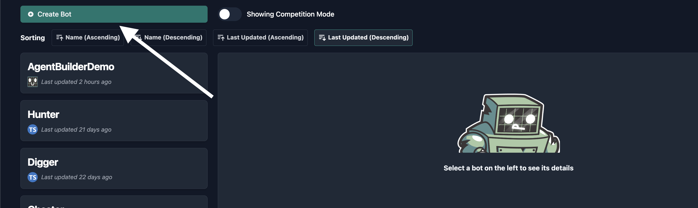
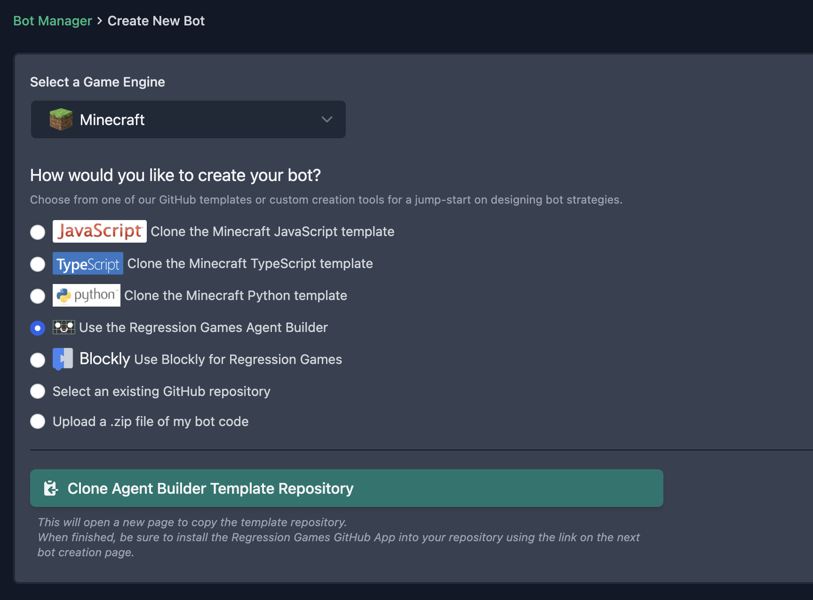
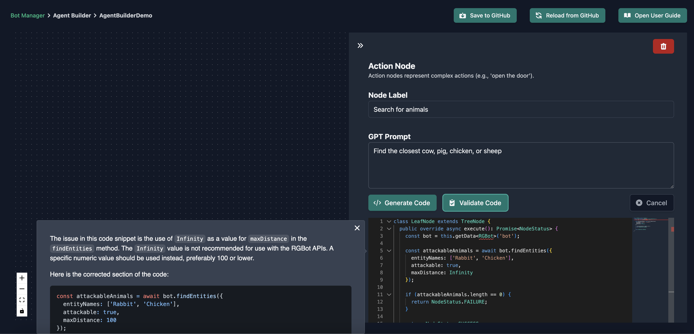

import BehaviorTree from '../../common/agent-builder/_behavior-trees.md'
import LoadingYourTree from '../../common/agent-builder/_loading-your-tree.mdx'
import AddingNodes from '../../common/agent-builder/_adding-nodes.mdx'
import SavingYourTree from '../../common/agent-builder/_saving-your-tree.mdx'

# Creating AIs Using the Agent Builder

Regression Games' Agent Builder is an easy-to-use visual editor for constructing AI behavior trees.
Our editor utilizes large language models like [OpenAI's GPT-4](https://openai.com/blog/chatgpt) to write code for you.
This makes our Agent Builder an excellent tool for those new to our AI libraries, or even to programming itself!

:::note
This tool is early in development - it is prone to change and may contain bugs.
Please report issues and feature requests for the Agent Builder [here](https://regression-games.sleekplan.app/feedback).
:::

## What Is a Behavior Tree?

<BehaviorTree />

## Getting Started with Agent Builder

Create a new AI from the Bot Manager and select `Agent Builder` from the list of creation options
(see the section on [Cloning a Starter Template](../../common/starter-templates) to complete this step).




## Loading Your Tree

<LoadingYourTree />

## Adding Nodes

<AddingNodes />

### Adding Code

:::note
All samples in this section are written in Typescript, which is the only language currently supported by the Agent Builder.
If you'd like to see support for other languages, let us know [here](https://regression-games.sleekplan.app/feedback).
:::

The nodes in your tree won't be useful until you give them some logic to execute.
Click on a leaf node to open the side-panel. You'll see the following stub provided in the code editor:

```javascript
class LeafNode extends TreeNode {
  public override async execute(): Promise<NodeStatus> {
    return NodeStatus.SUCCESS;
  }
}
```

:::info
All of your node's code must be defined within the `LeafNode` class, and the `execute` method must be defined as your entrypoint into the node.
You may encounter errors loading your AI into a game if these are not properly defined when you save your tree.
:::

You can either manually type code into the editor (see the [rg-bot API](../supported-games/minecraft/apis/rg-bot-api)), or you can have GPT do the heavy lifting for you.
To generate code using GPT, describe what you want this node to do in the "GPT Prompt" field then click the "Generate Code" button.
The editor will be disabled as code appears, and you can modify the output once it's finished.

There are a lot of different decision-making points and available actions for our supported games,
so let's start with something simple - getting the AI to walk around.
This example will have GPT use the [rg-bot library for Minecraft](https://github.com/Regression-Games/RegressionBot).

:::caution
Generating Code will overwrite anything currently in the editor. It's a good idea to save your tree before trying out new prompts.
:::

If you enter the following prompt:
```text
If "wanderDistance" is not defined, then set it to 5. Then wander up to the defined "wanderDistance".
```

then GPT should output code similar to this:
```typescript
class LeafNode extends TreeNode {
  public override async execute(): Promise<NodeStatus> {
    const bot = this.getData<RGBot>("bot");
    if (!bot) {
      return NodeStatus.FAILURE;
    }

    let wanderDistance = this.getData<number>("wanderDistance");
    if (!wanderDistance) {
      wanderDistance = 5;
      this.setData("wanderDistance", wanderDistance);
    }

    const wanderResult = await bot.wander(0, wanderDistance);
    if (wanderResult) {
      return NodeStatus.SUCCESS;
    } else {
      return NodeStatus.FAILURE;
    }
  }
}
```
The above output is a good example of how properly-formatted code should look when you're generating or writing it.

You may notice that this code calls the `getData` and `setData` methods.
These can be used to share data between nodes, and it's a good practice to specify a data type for `getData` to take advantage of the editor's Intellisense.
For instance:

```typescript
// "bot" is available to you by default
const bot = this.getData<RGBot>("bot");

// you can also define and retrieve your own key-value pairs
this.setData("myString", "Hello World");
const myString = this.getData<string>("myString");

this.setData("myBool", true);
const myBool = this.getData<boolean>("myBool");
```

Using these methods, we could add a node to our tree that increases the "wanderDistance" whenever the AI has nothing important to do in the nearby area.
This effectively encourages the AI to move further and further from its current location if it repeatedly fails to perform any meaningful actions.
The prompt for this could be worded as:
```text
If "wanderDistance" is undefined, then set it to 5. Otherwise increase it by 2. Then succeed.
```

which should produce code similar to this:
```typescript
class LeafNode extends TreeNode {
  public override async execute(): Promise<NodeStatus> {
    let wanderDistance = this.getData<number>("wanderDistance");
    if (wanderDistance === undefined) {
      this.setData("wanderDistance", 5);
    } else {
      this.setData("wanderDistance", wanderDistance + 2);
    }
      return NodeStatus.SUCCESS;
    }
}
```

Whenever you submit a prompt, we provide additional context about our APIs and proper usages to GPT,
but it may still output code that doesn't follow our expected format, or code that functions differently in-game than your prompt intends.
If this happens, you may need to alter your prompt and re-submit it for new output, or fix the output manually.
For the above prompt, note that we explicitly tell GPT to succeed after incrementing "wanderDistance".
If we omit this instruction, then GPT assumes that we want to perform the wander action after updating the distance, even though we haven't told it to do so.
This is a good example of how GPT sometimes needs additional coaching to reach your intended result.

### Validating Code

The embedded code editor offers standard syntax highlighting and Intellisense features for Regressions Games APIs.
To take this a step further, GPT can analyze code from the editor and provide suggestions for fixing syntax errors, bugs, and inefficiencies.
Clicking the "Validate Code" button will cause a text box to appear with GPT's analysis results.

Let's give this a try with some code that we know is inefficient.
The following code attempts to find all the rabbits and chickens nearby, but it searches an unnecessarily large area.
Copy and paste it into your node:

```typescript
class LeafNode extends TreeNode {
  public override async execute(): Promise<NodeStatus> {
    const bot = this.getData<RGBot>('bot');

    const attackableAnimals = await bot.findEntities({
      entityNames: ['Rabbit', 'Chicken'],
      attackable: true,
      maxDistance: Infinity
    });

    if (attackableAnimals.length == 0) {
      return NodeStatus.FAILURE;
    }

    return NodeStatus.SUCCESS;
  }
}
```

When you click the "Validate Code" button,
GPT should warn you that `maxDistance` should be set to `100` or less, rather than `Infinity`.



You can close validation results at any time and reopen them by clicking the clipboard icon.


## Saving Your Tree

<SavingYourTree />

## Editing an AI's source code

Whenever you save your tree, multiple files are pushed to GitHub - a config file named `agentBuilderWorkspace.json` which defines the nodes in your tree,
and a series of typescript files generated from the config that are used to run your AI in-game.

```
├── lib
│   ├── BaseClasses
│   │   ├── **/*.ts
│   ├── **/*.ts
├── agentBuilderWorkspace.json
├── index.ts
├── package.json
├── tsconfig.json
└── .gitignore
```

You can modify these files in your favorite IDE for more control over the AI's behaviors and dependencies.
See the [Writing Your Own Code section](./coding/dev-requirements) for more information.

:::danger
Changes made to files other than the `agentBuilderWorkspace.json` will be overwritten when you save the tree from the Agent Builder interface.
If you plan to modify files manually, it's a good idea to create a new GitHub repository to prevent losing your work.
:::
