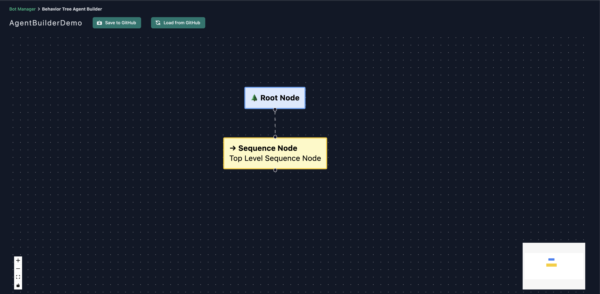
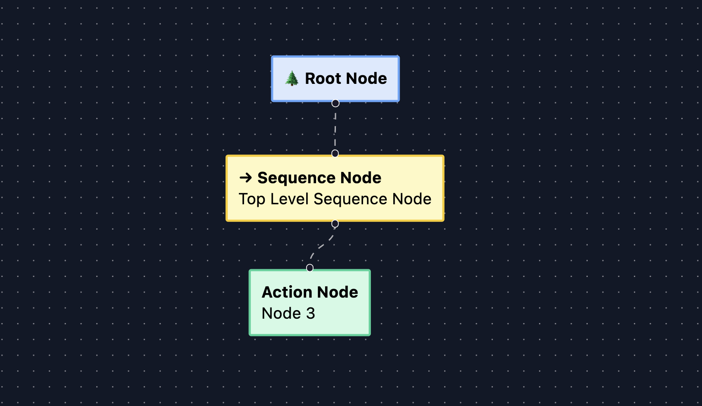
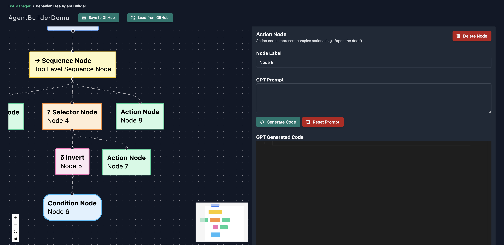
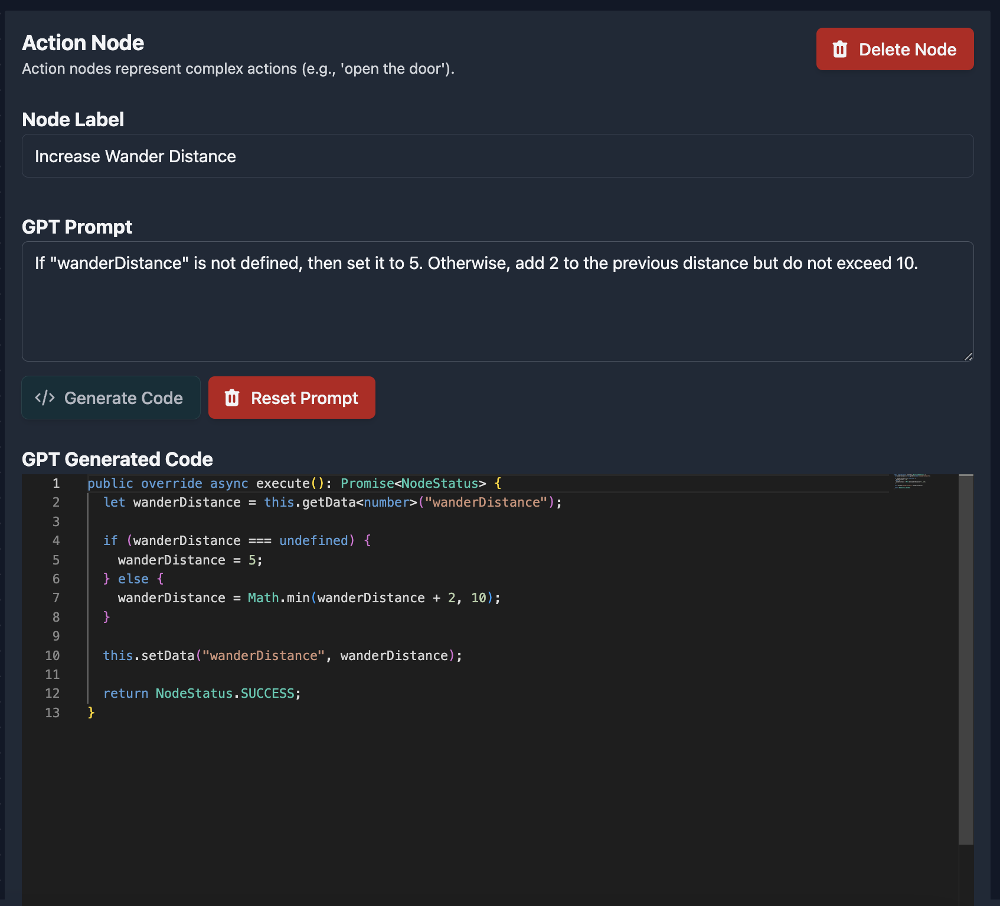
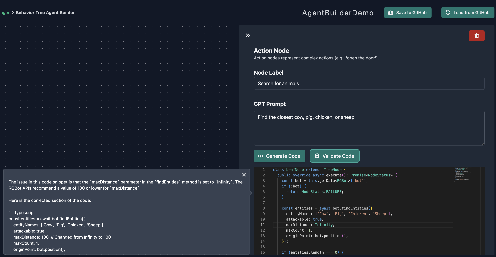
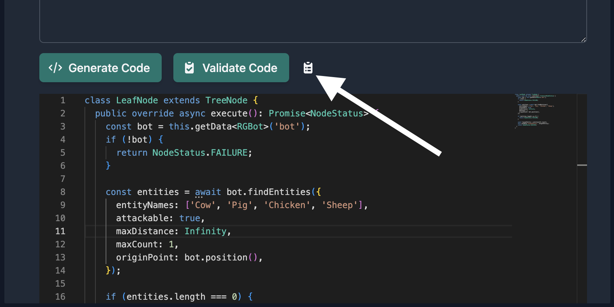
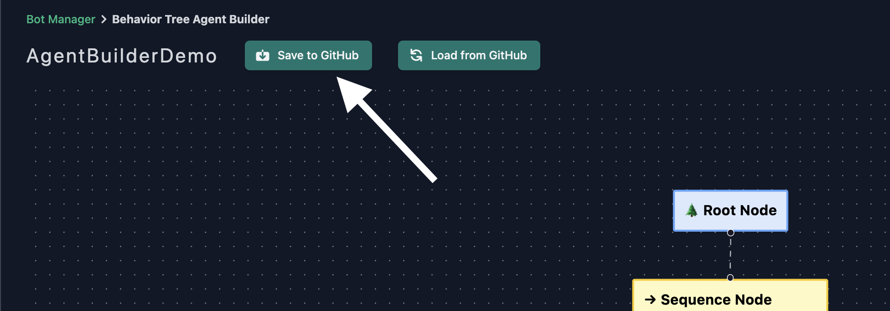
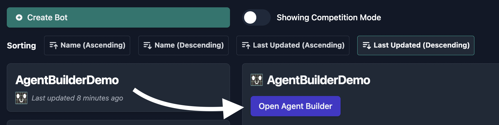
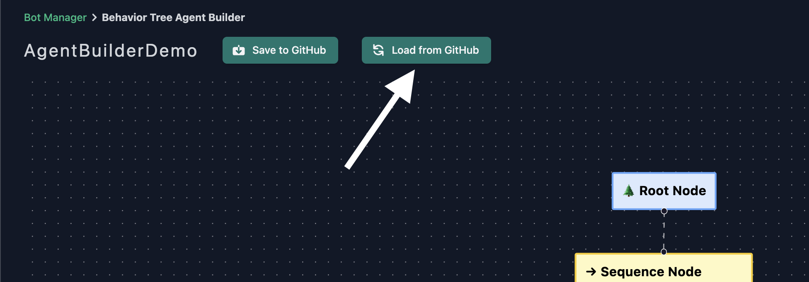

import CreateBotImages from './_create_bot_images.md'

# Creating AIs Using the Agent Builder

Regression Games' Agent Builder is an easy-to-use visual editor for constructing AI behavior trees.
Our editor utilizes large language models like [OpenAI's GPT-4](https://openai.com/blog/chatgpt) to write code for you.
This makes our Agent Builder an excellent tool for those new to our AI libraries, or even to programming itself!

:::note
This tool is early in development - it is prone to change and may contain bugs.
Please report issues and feature requests for the Agent Builder [here](https://regression-games.sleekplan.app/feedback).
:::

## What Is a Behavior Tree?

A behavior tree is a decision-making model used to determine which actions an agent (such as a character in a video game) should take in different situations.
You can think of it as a flow chart that the AI thinks through, choosing appropriate actions based on what it knows about itself and its environment.
Behavior trees are composed of nodes organized in a hierarchical structure that start at a root node and branch out to form different paths.
Each path represents a line of decision-making that results in one or more actions for the AI to take.

Each node in the tree executes logic and returns one of the following states as a result:

- **Running** -> The node is currently being executed and hasn't completed yet.
- **Success** -> The node has completed successfully.
- **Failure** -> The node has failed. This doesn't necessarily mean an error occurred. For example, a heal action might fail if the character doesn't have any potions.

Different types of nodes have different responsibilities and react differently to the states of other nodes.

- **Root Node**: The beginning of the tree, where the AI starts its decision-making.
Its job is simply to execute whatever node is below it in the tree and return its state.
- **Sequence Node**: This node has one or more children and acts as a logical AND.
It executes its child nodes one at a time, and if any of them fail then the Sequence Node immediately fails.
- **Selector Node**: This node also has one or more children, but acts as an OR.
It executes each of its children and if one of them succeeds, then the Selector Node immediately succeeds.
- **Action Node**: This node is a leaf node, meaning it cannot have any children of its own.
Instead, it represents an action for the AI to take such as moving in a certain direction or interacting with an object in its environment.
- **Condition Node**: This node is also a leaf node. It evaluates whether certain conditions have been satisfied.
- **Decorator Node**: There are several kinds of Decorator Nodes, each of which can have only one child. This node modifies its child's state in some way.
For example, an "Inverter" Decorator will succeed if its child fails, and vice versa.

For a deeper dive into behavior trees, their nodes, and practical examples of their usage in video games, [follow this link](https://www.gamedeveloper.com/programming/behavior-trees-for-ai-how-they-work).

## Getting Started with Agent Builder

Create a new AI from the Bot Manager and select Agent Builder from the list of creation options
(see the section on [Cloning a Starter Template](./starter-templates) to complete this step).

<CreateBotImages />

### Creating Nodes

Once you've created a project for your AI, you'll be redirected to the Agent Builder interface.
We'll start you out with a root node and a sequence node to form the basis of your tree.



To begin building your tree, click the connector at the bottom of the sequence node and drag.
When you release, you'll be presented with different types of nodes that can be added to this sequence.
For this demonstration, we'll create an action node.
You can repeat this process for any node that is allowed to have children.





Clicking on a node opens a panel to the right side of your screen.
This panel contains information about the selected node including a description of the node's type and a label, as well as a button to delete the node from the tree.
It's a good idea to set labels to keep track of what you want each node or branch to do.
If the selected node is a leaf node, such as an action or condition, then the panel will also contain fields used for defining the node's behavior via code.



### Adding Code


:::note
All samples in this section are written in Typescript, which is the only language currently supported by the Agent Builder.
If you'd like to see support for other languages, let us know [here](https://regression-games.sleekplan.app/feedback).
:::

The nodes in your tree won't be useful until you give them some logic to execute.
Click on a leaf node to open the side-panel. You'll see the following stub provided in the editor:

```javascript
class LeafNode extends TreeNode {
    public override async execute(): Promise<NodeStatus> {
        return NodeStatus.SUCCESS;
    }
}
```
:::info
All of your node's code must be defined within the `LeafNode` class, and the `execute` method must be defined as your entrypoint into the node. 
You may encounter errors loading your AI into a game if these are not properly defined when you save your tree.
:::

You can either manually fill in code using the editor (see the [rg-bot API](../supported-games/minecraft/apis/rg-bot-api)), or you can have GPT do the heavy lifting for you.
To generate code using GPT, describe what you want this node to do in the "GPT Prompt" field then click the "Generate Code" button. 
The editor will be disabled as code appears, and you can modify the output once it's finished.
We supplement your prompt with additional context about our APIs but GPT may produce output that doesn't follow our expected format,
or code that functions differently in-game than your prompt intends.
If this happens, you may need to alter your prompt and re-submit it for new output, or fix output manually.

:::caution
Generating Code will overwrite anything currently in the editor. It's a good idea to save your tree before trying out new prompts.
:::

You may notice that the generated code uses the `getData` and `setData` methods. 
These can be used to share data between nodes, and it's a good practice to specify a type with `getData` to take advantage of the editor's Intellisense.
For example:

```typescript
// "bot" is available to you by default
const bot = this.getData<RGBot>("bot");

// you can also define and retrieve your own key-value pairs
this.setData("myString", "Hello World");
const myString = this.getData<string>("myString");

this.setData("myBool", true);
const myBool = this.getData<boolean>("myBool");
```

The below sample uses the [rg-bot library for Minecraft](TODO-REG-1026) to make the AI wander in a random direction. 
It demonstrates usage of these methods and how to properly format your code.




### Validating Code

The embedded code editor offers standard syntax highlighting and Intellisense features for Regressions Games APIs. 
To take this a step further, GPT can analyze code from the editor and provide suggestions for fixing syntax errors, bugs, and inefficiencies.
Clicking the "Validate Code" button will cause a text box to appear with GPT's analysis results.



You can close these results at any time, and reopen them by clicking the clipboard icon.



### Saving Your Tree

Save your tree early and often! Any changes made to your AI will be lost if you leave the Agent Builder without saving.



## Editing an AI using Agent Builder

If you've used the Agent Builder to create an AI before, you can locate that AI in the Bot Manager and open the Agent Builder interface.
Once the interface is visible, tell Regression Games to load your tree from GitHub. You should now see your tree and be able to edit its nodes.
Don't forget to save when you're done!




## Editing an AI's source code

Whenever you save your tree, multiple files are pushed to GitHub - a config file named `agentBuilderWorkspace.json` which defines the nodes in your tree,
and a series of typescript files generated from the config that are used to run your AI in-game.

```
├── lib
│   ├── BaseClasses
│   │   ├── **/*.ts
│   ├── **/*.ts
├── agentBuilderWorkspace.json
├── index.ts
├── package.json
├── tsconfig.json
└── .gitignore
```

You can modify these files in your favorite IDE for more control over the AI's behaviors and dependencies. See the [Writing Your Own Code](TODO-REG-1023) section for more information.

:::danger 
Changes made to files other than the `agentBuilderWorkspace.json` will be overwritten when you save the tree from the Agent Builder interface.
If you plan to modify files manually, it's a good idea to create a new GitHub repository to prevent losing your work.
:::
