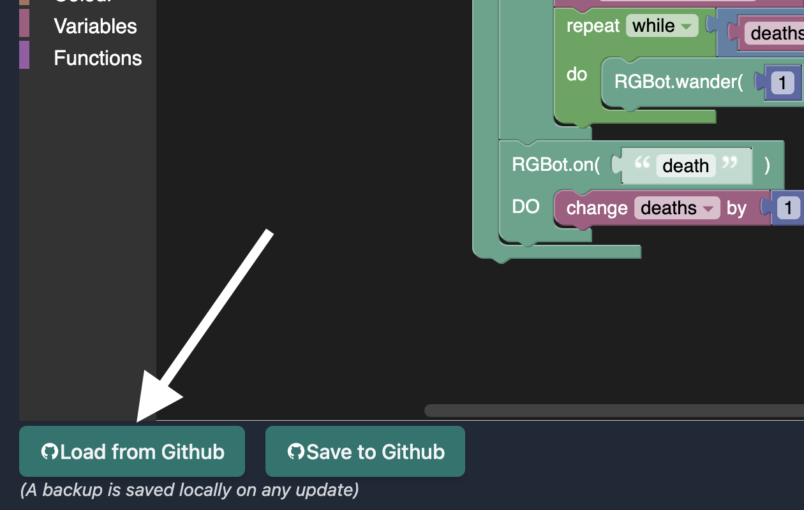
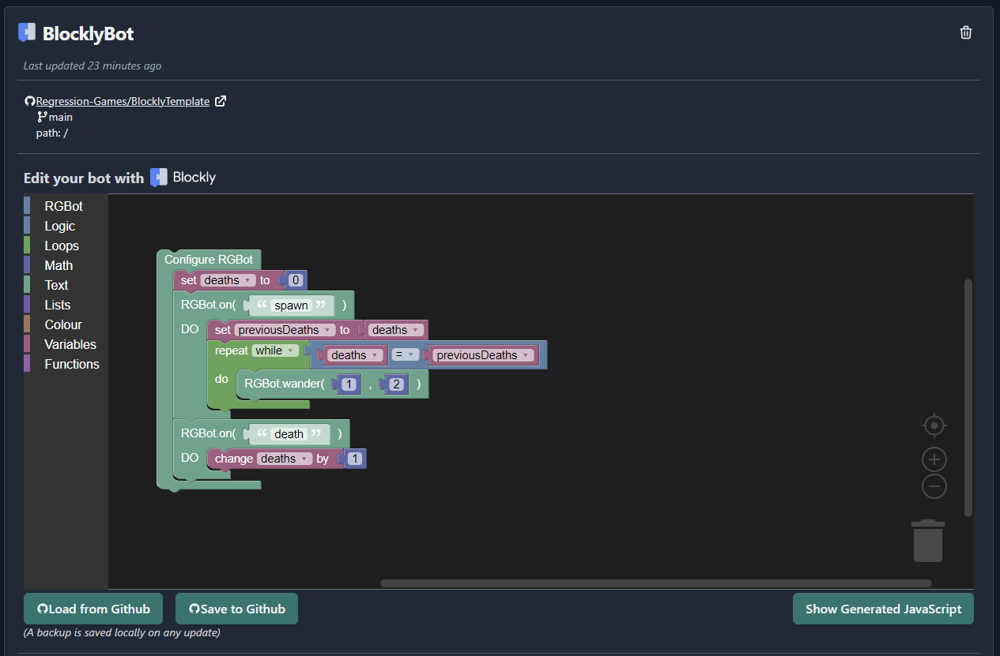
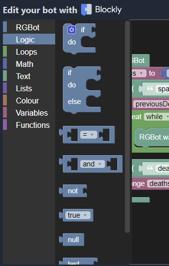
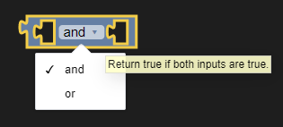
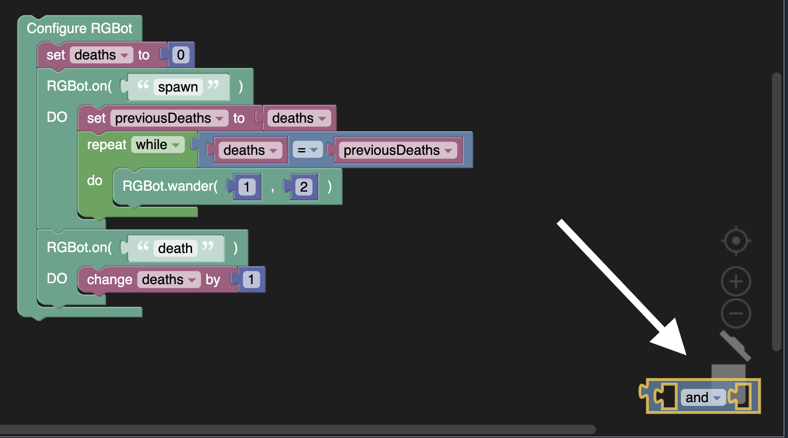
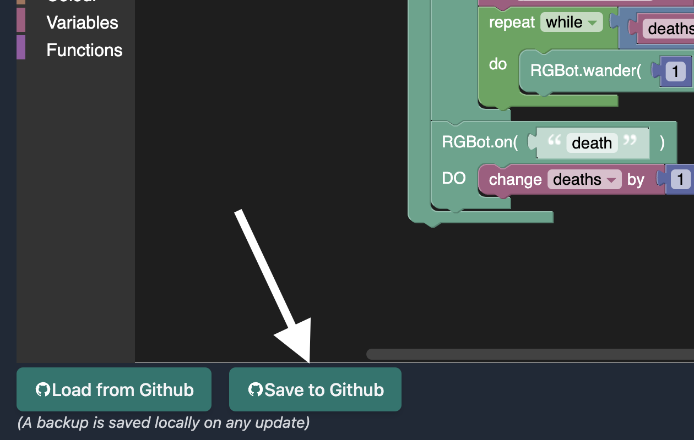
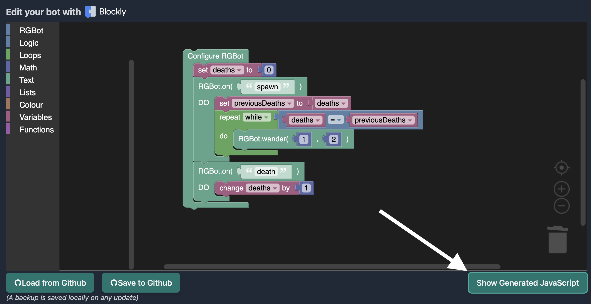
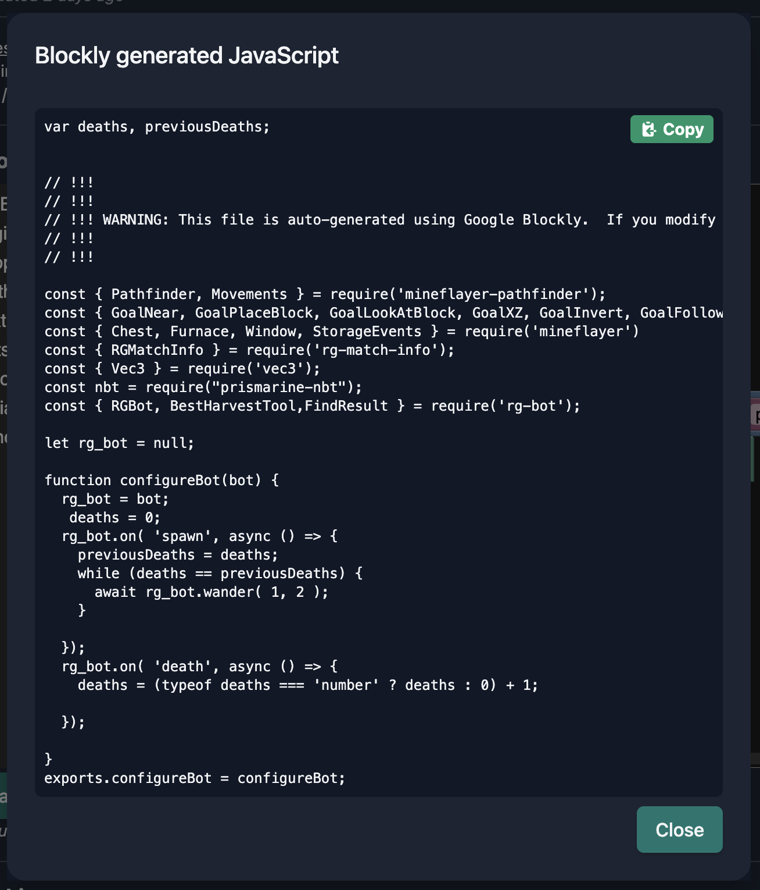

import CreateBotImages from './_create_bot_images.md'

# Creating Bots Using Blockly

Regression Games' [Blockly](https://github.com/google/blockly) integration is an easy-to-use visual editor
for constructing AI logic using interlocking, graphical blocks that represent common code concepts 
(like variables, logical expressions, loops, etc.).
This is an excellent tool for players who are new to our AI libraries, or even to programming itself!

:::note
This tool is early in development - it is prone to change and may contain bugs.
Please report issues and feature requests for the Blockly editor [here](https://regression-games.sleekplan.app/feedback).
:::

## Getting Started with Blockly

Create a new AI from the Bot Manager and select `Blockly` from the list of creation options
(see the section on [Cloning a Starter Template](./starter-templates) to complete this step).

<CreateBotImages />

## Loading Your Workspace

If you've used the Blockly editor to create an AI before, you can locate that AI in the Bot Manager and click on it to open the editor.
The editor should automatically load your workspace from GitHub, but it's always a good idea to click the "Load from GitHub" button 
to make sure your workspace is up-to-date before making changes.



## Adding Blocks

When you create a new Blockly AI, we'll start you out with some sample logic that makes the AI wander randomly and record how many times it dies.
This sample may not be the most exciting (or effective) strategy, but you can build off of it easily. 



To add a Block to your workspace, first click one of the tabs from the left-hand menu.
This will display a tray containing available Blocks for that tab.
Then, drag a Block from the menu and drop it into the worspace. 



Hovering over the Block in your workspace will display a tooltip describing its current behavior.
Some Blocks have built-in dropdowns or text inputs that you can interact with to change the Block's behavior.



The tray will automatically close whenever you add a Block to the workspace, so you'll need to open it again to repeat this process. 

## Deleting Blocks

Deleting a Block from your workspace is as easy as adding one. 
Simply drag the Block to the trashcan in the lower right-hand corner of the editor.



## Saving Your Workspace

Save your workspace early and often! Any changes made to your AI will be lost if you leave the Blockly editor without saving.



## Editing an AI's Source Code

Blockly translates the Blocks in your workspace into runnable JavaScript code.
You can view this code at any time by clicking the "Show Generated JavaScript" button.





This code can be copied and pasted into the `index.js` file of a JavaScript AI project
(see our [Starter Templates](./starter-templates) section for a walkthrough on how to create one).
Then, you can make changes to the code in that new project. 
This method prevents your modifications from inadvertently breaking your Blockly project or being overwritten.

Alternatively, you can modify the Blockly project files directly in your favorite IDE. 
Whenever you save your current Blocks, the following files are pushed to GitHub:
* A config file named `blocklyWorkspace.json` which defines the Blocks in your logic
* An `index.js` file containing JavaScript code generated from your Blocks. This is used to run your AI in-game.

```
├── blocklyWorkspace.json
├── index.js
├── package.json
└── .gitignore
```

:::danger 
Changes made to files other than the `blocklyWorkspace.json` will be overwritten when you save your Blocks from the Blockly editor.
If you plan to modify files manually, we recommend creating a new GitHub repository to prevent losing your work.
:::

See the [Writing Your Own Code section](./coding/dev-requirements) for more information.
