import CodeSnippets from './_ide-setup-code-snippets.mdx';

# Development Dependencies & Requirements

Regression Games AIs are typically saved and managed as GitHub Repositories. 
You can read more about how to clone starter templates for your AIs using GitHub in our [Starter Templates Walkthrough](../starter-templates).

In this section, we'll walk you through requirements for developing your AIs. 
This guide focuses on writing the AI yourself, but you can alternatively use one of our creation tools 
such as [Blockly](../blockly) or [Agent Builder](../agent-builder) to generate code for you.

## Choosing an IDE

The first step to writing AI code is choosing an IDE that suits your needs.
An Integrated Development Environment (IDE) is a software application that helps programmers develop code 
by providing convenient features like syntax highlighting and autocompletion. 

Regression Games recommends several free-to-use online code editors with built-in GitHub support. 
These are great for players who want to jump into AI creation without installing additional software.
If you're already comfortable using Git and have a favorite IDE for Javascript, Typescript, or Python, then you can skip this section.
If you're opting out of using GitHub with Regression Games, then skip right to the [Local Development](./dev-requirementsi#local-development) section.

### Codespaces

[Codespaces](https://github.com/features/codespaces) is the fastest way to get started with AI development for Regression Games.
Codespaces is a cloud IDE offered by GitHub and Microsoft, based on VSCode. 
It allows you to edit your GitHub repositories straight from the GitHub website with minimal setup - it takes just a few clicks.

:::caution 
Please be mindful of the [usage limits for Codespaces](https://docs.github.com/en/billing/managing-billing-for-github-codespaces/about-billing-for-github-codespaces) 
on free GitHub accounts (~60 hrs free per month).
:::

First, log into your GitHub account and navigate to your AI's repository. 
If you need help locating it, you can log into Regression Games and find a link to your AI's repository through the Bot Manager.
Click the "Code" button on your repository's GitHub page and then the "Codespaces" tab. 
From here, click the "Create codespace on main" button to be redirected to an editor in your browser.
This is where you'll write your AI's code and push it to your GitHub repository.

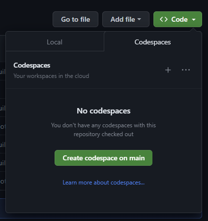

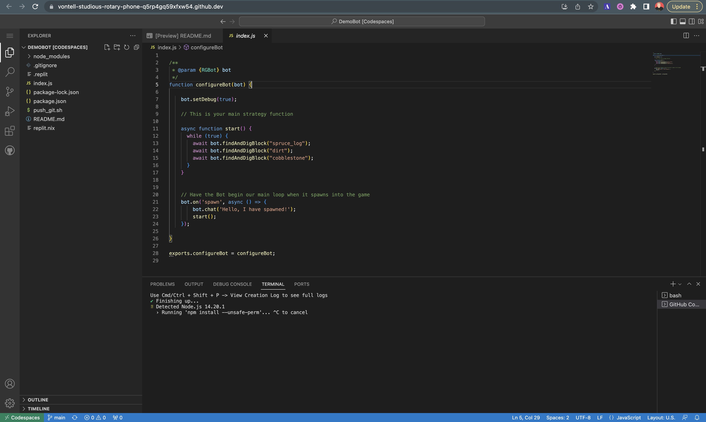

Next, we'll demonstrate how to save changes in Codespaces.

<CodeSnippets />

Click the Source Control button in the left-hand pane (or use the shortcut `Ctrl+Shift+G`). 
Here you'll be able to see which files you've changed, and inspect those changes line-by-line.
Enter a message to describe your changes (e.g. "This bot now says hello") and click "Commit". 
You may see a message about adding unstaged changes - you can click **always** for this.

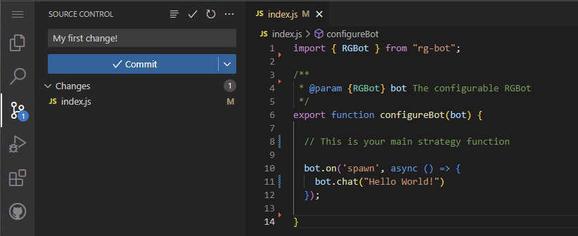

At this point, your changes haven't actually been pushed to the repository, but they are prepared for upload.
Click "Sync Changes" to finish pushing your code. 
You may see another dialog about where these changes are being saved - you can click "Ok, and don't show again".

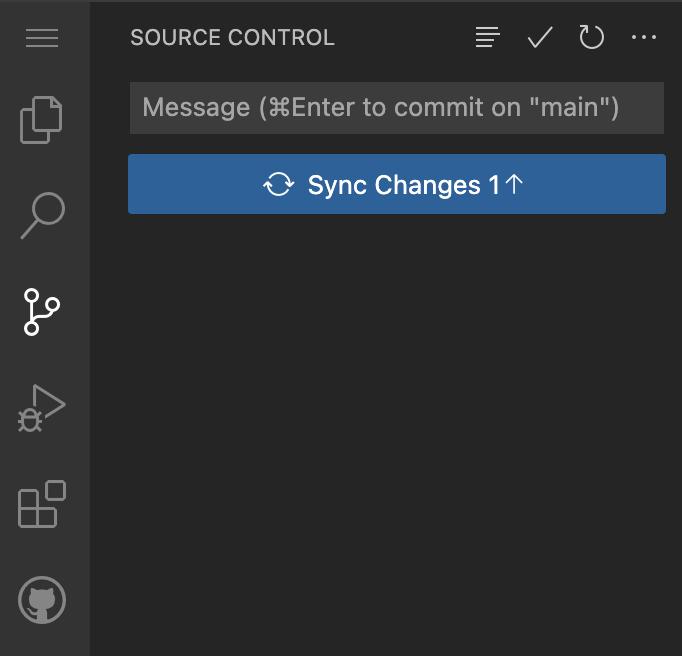

That's it! If you queue into a match, you should see your AI load and follow its new logic. 
If you're in a match while performing updates like these, you should see your AI disconnect for a brief moment and then reconnect, 
at which point it will follow its new logic.

### Replit

[Replit](https://replit.com/) is an online IDE with support for a variety of languages. 
It offers convenient features such as collaborative editing, community templates, AI code completion, and a mobile app for programming on-the-go.
You'll need to create an account in order to use Replit. 

:::note
Before beginning: Replit is free to use, but your GitHub repository must be public unless you have an active Replit subscription. 
If you wish to keep your repository private, then consider one of the other recommendations on this page.
Otherwise, you can make your repository public at the bottom of the repository's settings page in GitHub. 

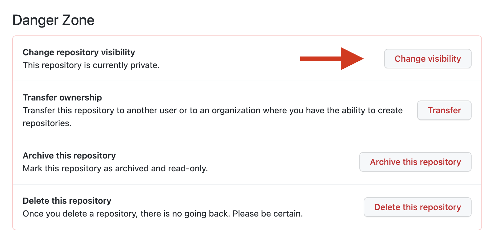
:::

Once you're logged into Replit, click the "Create Repl" button and then "Import from GitHub".

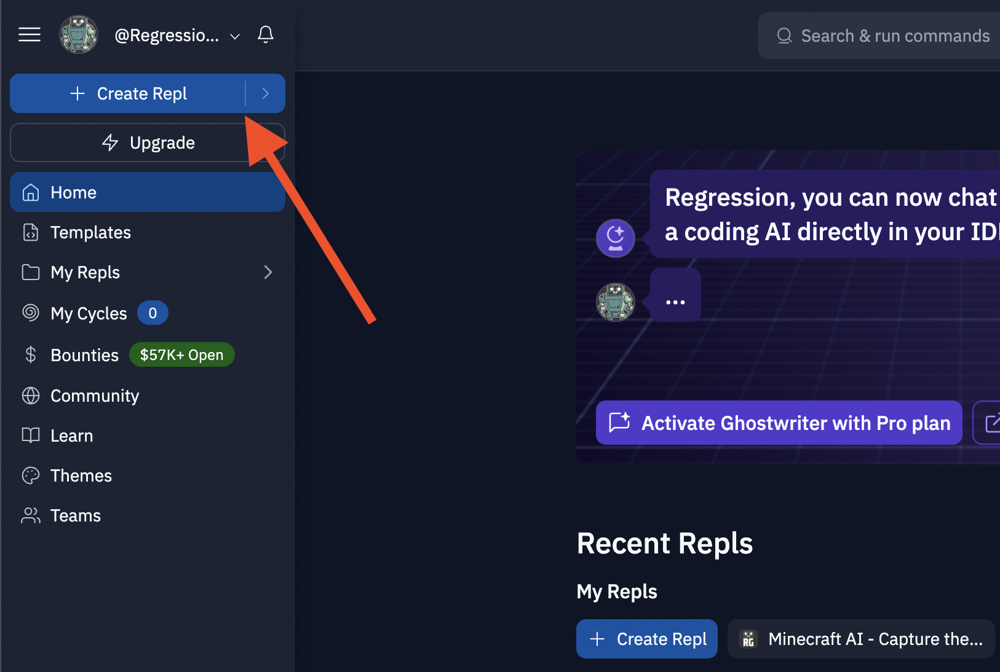

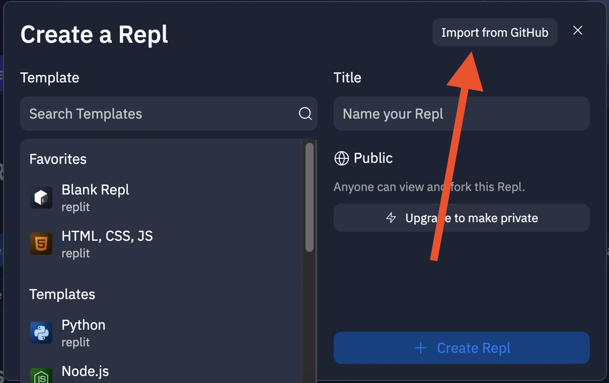

If this is your first time using Replit, you'll need to connect your GitHub account so that Replit can access your repositories.
Click the "Connect GitHub" link and follow the on-screen instructions. 
When you're finished, you should be able to return to Replit and see that the search box allows you to search through your existing repositories.

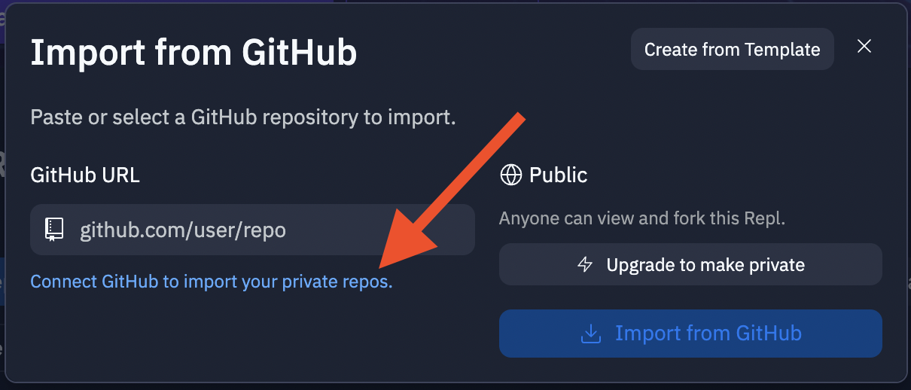

Search for your desired repository, select it, and then click "Import from GitHub".
You will be redirected to an editor containing your files.

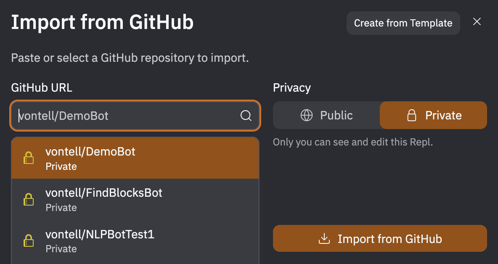

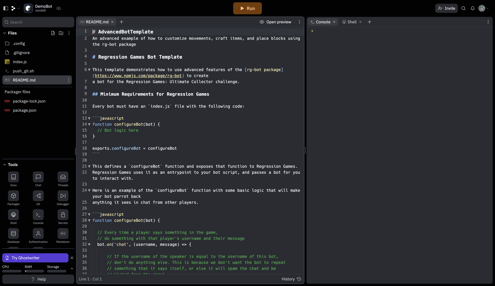

In order to push new code to your repository, Replit will need a bit more information from you.
From the bottom-left Tools menu, click "Secrets" - this is the option with the padlock icon. 
If this is your first time using Replit, you'll be shown an explanation of Replit Secrets. 
You can click “Got it” and then “Skip”. You should then see the screen below:

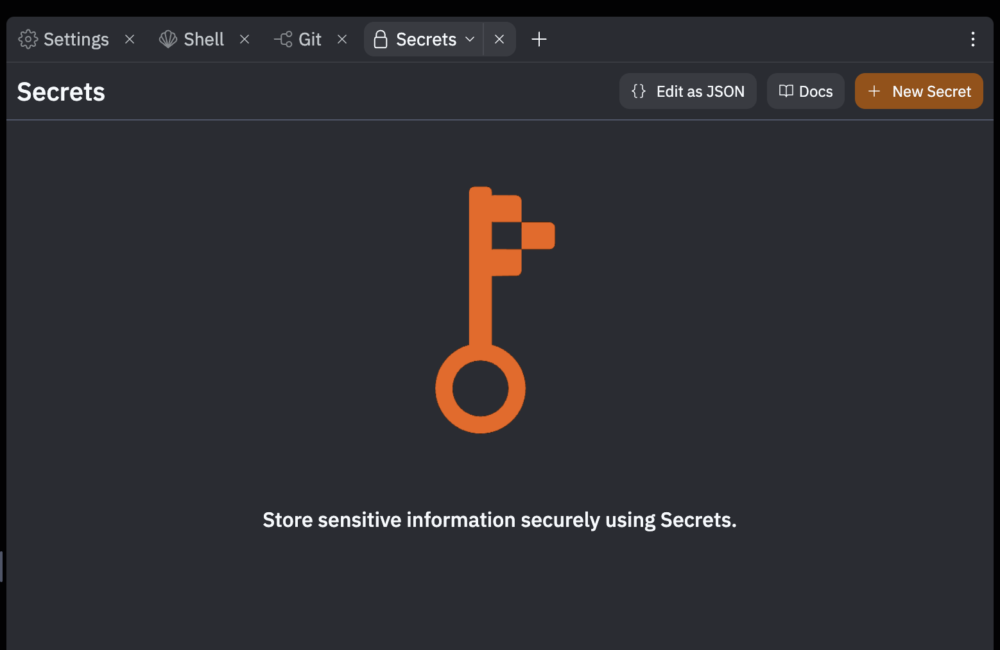

Click "Edit as JSON". 

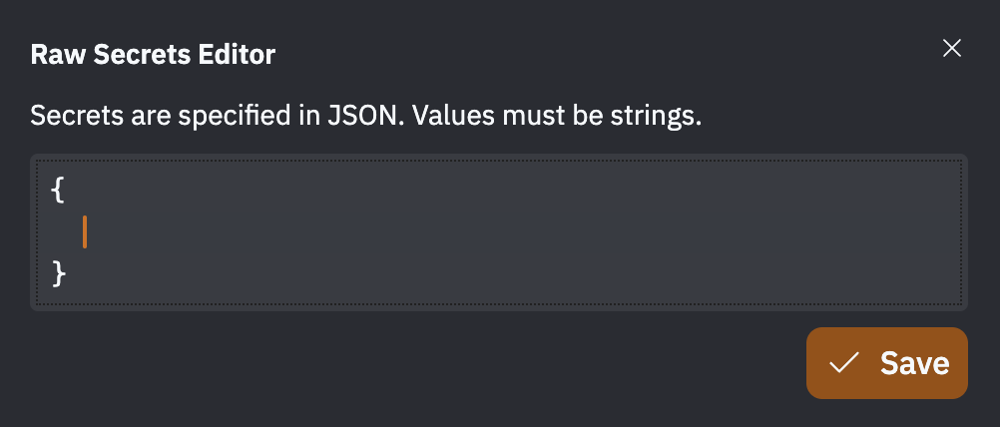

The JSON you'll need to copy and paste here can be found in your bot's details through the Bot Manager screen on the Regression Games website. 
Navigate to your bot, and click the "replit Settings" button. You'll see a section with JSON that you can copy.
Paste this into Replit.

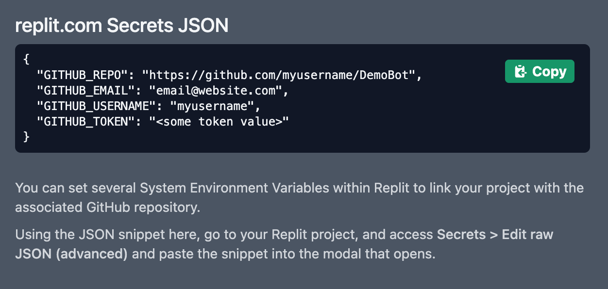

You may notice that the "GITHUB_TOKEN" secret isn't filled in. 
For this, you'll need to generate a personal access token in GitHub.

1. Open a new browser window, go to https://github.com/settings/tokens/new and sign into your GitHub account.
2. Enter a name for the token (ex. "RGToken" or "ReplitToken")
3. We recommend setting a reasonable expiration, such as 1 year, to secure your repositories
4. Select all permissions under "repo"
5. Click "Generate token"

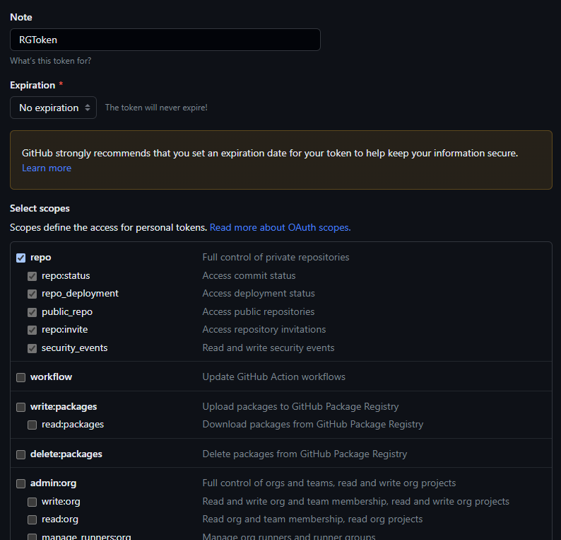

Once your token has been created, copy it and replace the placeholder text in Replit with your new token.
You're all set up! Let's make sure that you can save correctly. 

<CodeSnippets />

Simply click the "Run" button at the top of the Repl. The first run may take a bit of time, and you may need to click it twice.
When you're asked for a commit message, enter something that describes your changes. 
In this case, you can enter something like “Initial code”.
When you hit enter, you should see the console print some information about uploading this code to git. 

:::tip
Whenever you click “Run” remember to enter a message (or leave the message blank) and hit enter. 
Otherwise, your code won't upload.
:::

### Local Development

If our recommended online IDEs don't suit your development needs, then you'll need to choose and download your own IDE or text editor 
([VSCode](https://code.visualstudio.com/), [WebStorm](https://www.jetbrains.com/webstorm/), [PyCharm](https://www.jetbrains.com/pycharm/), etc.)
as well as [git](https://git-scm.com/book/en/v2/Getting-Started-Installing-Git).

Clone your repository from GitHub with `git clone git@github.com:<Your Repo>.git` 
(recommended but requires you to add [an ssh key to your GitHub account](https://docs.github.com/en/authentication/connecting-to-github-with-ssh/adding-a-new-ssh-key-to-your-github-account))
or `git clone https://github.com/<Your Repo>.git`.
If you need help locating the correct path, you can log into Regression Games and find a link to your AI's repository through the Bot Manager.

For JavaScript and TypeScript AIs, you'll also need to install [Node.js](https://nodejs.org/en/download) version 16.x (which can be checked by running `node -v`). 
You can use [nvm](https://github.com/nvm-sh/nvm) for managing multiple Node versions installed on a single machine. 
Navigate to the project's root directory and install project dependencies with `npm install`.

Now you can open your project in an IDE and start writing code for your AI.

#### Developing AIs without Git

You can use one of our starter templates to kick off your AI project even if you're not using Git to manage it.
Visit the [Regression Games GitHub page](https://github.com/Regression-Games?q=Template&type=all&language=&sort=) 
for a variety of starter templates to choose from. Once you select one, click the "Code" button on that template's repository page and then click "Download ZIP". 
Extract the contents of the downloaded ZIP, open the project in your IDE of choice, and you're ready to write some code.

Alternatively, you can set up your own project from scratch.
Create a new directory and navigate to it from the terminal. Use `npm` to initialize the project and install dependencies:

```
npm init -y
npm i @types/node node-fetch rg-bot rg-match-info vec3 minecraft-data mineflayer mineflayer-armor-manager mineflayer-pathfinder prismarine-entity prismarine-item prismarine-viewer 
```

Finally, create an `index.js`, `index.ts`, or `start.py` file (depending on which programming language you're using) at your project root.

