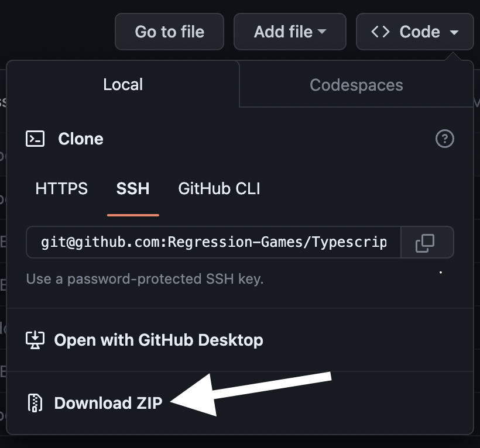
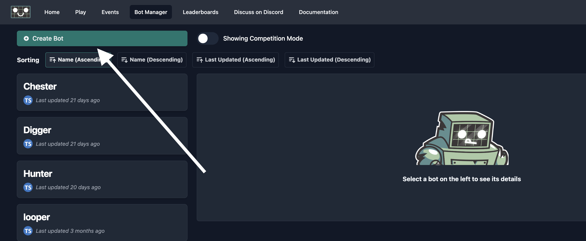
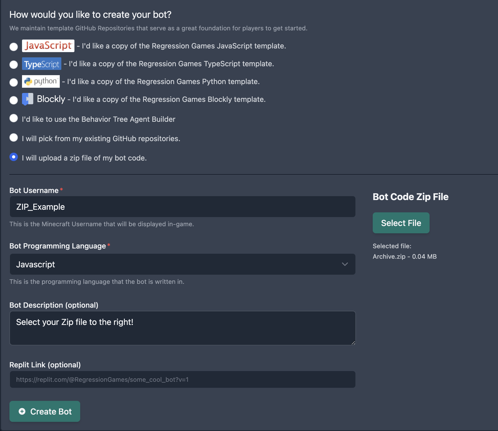
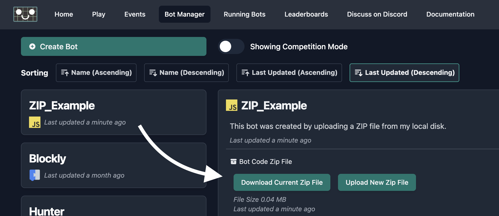

import Tabs from '@theme/Tabs';
import TabItem from '@theme/TabItem';

# Uploading Your AI as a ZIP File

Many of our AI creation tools will be unavailable if you opt out of linking a GitHub account to Regression Games,
but that doesn't mean you're out of luck.
This section describes how to manually upload an AI project that you're managing locally or via an unlinked GitHub account.

## Preparing Your Project

Once you've read the [Development Dependencies & Requirements](./dev-requirements) section, created an AI project, 
and made some changes to test out in-game, then you'll need to compress your project using the `.zip` format.

If you're pushing your project to GitHub, then you can navigate to your repository and click the "Code" button and then "Download as ZIP".



If you're managing your project locally, then navigate outside of the project's top-level folder and compress that folder into a ZIP.

<Tabs>
<TabItem value="windows_zip" label="Windows" default>

```
* Right-click folder
* "Send To" ->  "Compressed (zipped) folder"
```

</TabItem>
<TabItem value="mac_zip" label="macOS">

```
* Right-click folder
* "Compress <project_root>"
```

</TabItem>
<TabItem value="linux_zip" label="Linux">

```
zip -r <output_file> <project_root>
```

</TabItem>
</Tabs>

## Creating an AI from a ZIP File

Log into Regression Games and create a new AI from the Bot Manager. 



Select the option "I will upload a zip file of my bot code" from the available list.
Give your bot a name and use the "Select File" button to upload your ZIP file.
Select the correct programming language for your project then click "Create Bot".
It's that simple!



## Updating Your AI

The first ZIP file you upload for an AI likely won't be its final form.
After making modifications to your project, create a fresh ZIP file and then find your existing bot through the Regression Games' Bot Manager.
From here, you can see the current file's size and when it was uploaded, download a copy of it, and select a new ZIP file to replace it.
You can change your current file as many times as you want until you've achieved your AI masterpiece.



:::caution
Regression Games __does not__ keep a historical record of your uploaded ZIP files or their contents.
Make sure you have a copy of your current bot code saved before overwriting it, so that you can revert your changes if needed.
:::