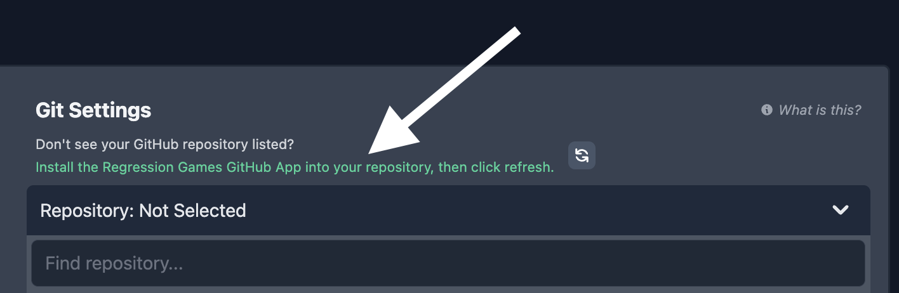

# Overview

Regression Games offers multiple tools for creating and developing AIs - from block-style programming interfaces
to flexible code libraries that allow programmers of any skill-level to bring their imaginations to (virtual) life.

## GitHub

Regression Games uses [GitHub](https://github.com/) to save, load, and version your AIs.
Our platform detects changes to your AI as soon as you push them to GitHub, which allows your AI to refresh itself and display new behaviors in real-time.
The majority of our development tools rely on access to GitHub and therefore will be unavailable to users without a valid account linked to Regression Games.

However, we do offer alternatives to users who prefer not to use GitHub such as [uploading your AI as a .zip file](TODO-REG-1023:-Add-section-and-link-here).
For this method, you can skip right to our sections on [writing your own AI code](TODO-REG-1035:-Add-section-and-link-here) and [uploading it to our platform](TODO-REG-1023:-Add-section-and-link-here).

## Creating a new AI

### Creating a GitHub Repository

AIs are created and managed within the [Bot Manager](https://play.regression.gg/bots).
Create a new AI under "Bot Manager" and select one of the creation options.
For the purpose of this demonstration, we'll keep the default option selected, but the process will be nearly identical for most options in this list.

When you confirm your selection, Regression Games will open a new tab in your browser and redirect you to GitHub to create a new repository.
This repository will represent the AI you're about to create, and Regression Games will access this repository whenever you queue your new AI for a match.
Give it a name, continue, and wait for GitHub to finish creating it.

### Granting Access to Repository Contents

Regression Games values the security and comfort of our users.
We can see which repositories you have access to, but we can't read contents from or write to any repositories under your GitHub account by default.
Instead, you'll need to tell us which ones we're allowed to access.
To do this, return to the Regression Games tab in your browser and follow the green link under "Git Settings" section.
This will take you back to GitHub to authorize the Regression Games app on your GitHub Account.

If you don't want to repeat this step for every AI you create, you can select the "All repositories" option.
If you want to explicitly restrict Regression Games to relevant repositories, then find your new repository under "Only select repositories."
Choose one of these options then click "Install."

### Finish Setup

Back in the Regression Games tab in your browser, refresh the repository search, find your new AI repository, and select it.
Lastly, name your AI - this is the name other players will see in-game. You can also give it an option description to help identify it from other AIs you create.
Finally, click the "Create Bot" button.

### Next Steps

Depending on the type of AI you've created, you'll either be returned to the Bot Manager where you can see a complete list of your AIs,
or you'll be redirected to a new page to interact with one of our AI development tools.
Continue through this section to learn about all of our development tools and how to use them, or how to program your AI by hand using our code libraries.
