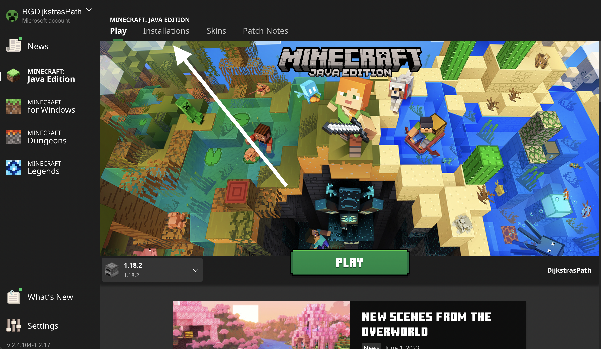
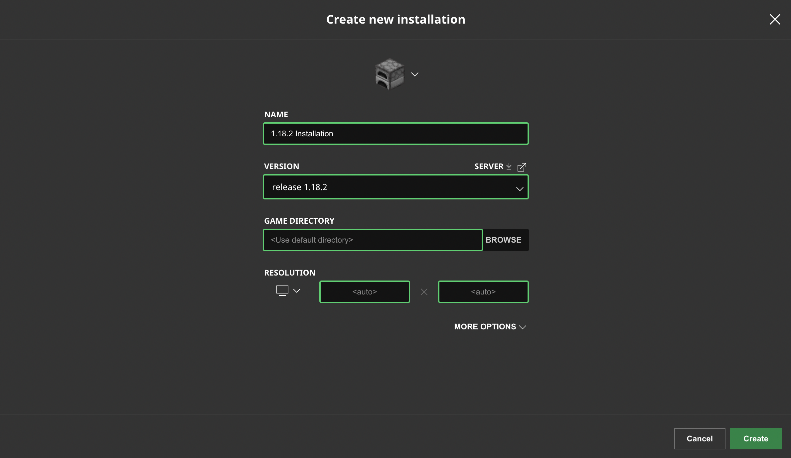
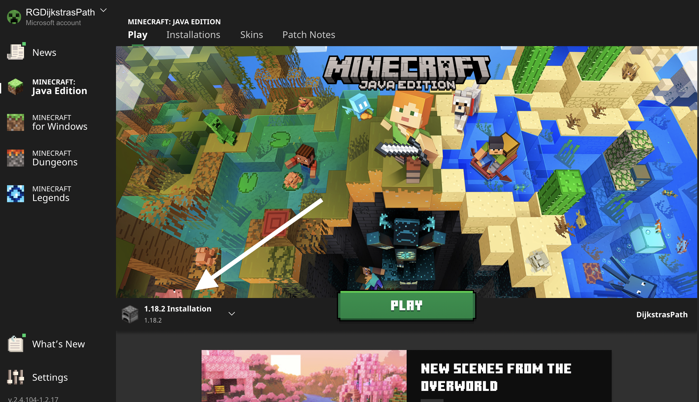

# Minecraft Setup and Requirements

In order to begin building AIs for Minecraft, you'll need a [Regression Games account](https://play.regression.gg),
a valid [Minecraft account](https://www.minecraft.net/en-us/login) and a copy of [Minecraft: Java Edition](https://www.minecraft.net/en-us/store/minecraft-java-bedrock-edition-pc).

## Installing Minecraft 1.18.2

Download the Minecraft launcher, then [change your game version](https://help.minecraft.net/hc/en-us/articles/360034754852-Change-Game-Version-for-Minecraft-Java-Edition) to **1.18.2**.
This step is important because Regression Games' custom Minecraft plugins may be incompatible with other versions.

## Connecting Your Minecraft account to Regression Games

Before jumping into your first match, make sure that the Minecraft username associated to your Regression Games account matches the one displayed in your Minecraft Client.
If you didn't enter a username during account setup, or if you don't remember what it was, you can view and update it from [your profile page](https://play.regression.gg/account) at any time.
