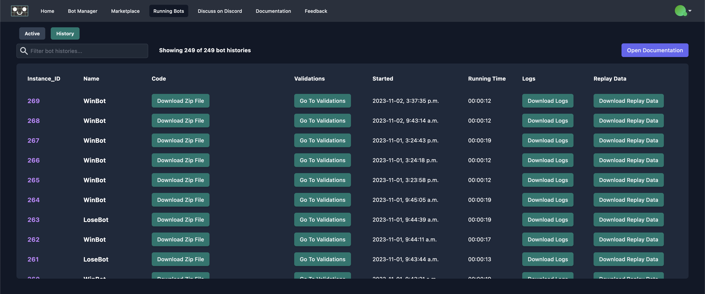

# Validations

Validations are used to assert the state of your bots at a point in time. You can think of them as tests that can be run to
ensure that your bots are behaving as you expect. Beyond functioning as tests, validations can be used to locate tricky errors
and to fine-tune your game's balance.

To get started with validations, check out our docs for both [C#](https://docs.regression.gg/studios/unity/unity-sdk/creating-bots/csharp/validation-bots) and [JavaScript](https://docs.regression.gg/studios/unity/unity-sdk/creating-bots/javascript/validation-bots) bots.

## Viewing Validations

On the Validations Page you can see all the bot instances for a particular bot. An instance can be expanded to show
each individual validation asserted during the course of that bot instance's lifetime. Validations can be filtered by passed,
failed, and warning results. By default, all validations will be shown regardless of result.

You can select an individual validation to view both a screenshot and the game state at the time
that the validation was asserted (unfortunately we can only display screenshots for C# bots at this time). Clicking on
the screenshot will show it at a larger size.

## How To Find The Validations Page

Visit the **Running Bots** tab and click on the **History** filter to see a list of your previous bot instances. Navigate to the
Validations Page for a bot instance by clicking on the **Go To Validations** button.

Visit the **Bot Manager** tab and select a bot whose validations you would like to view. Navigate to the Validations Page
for the selected bot by clicking on the **Go To Validations** button in the panel on the right.

