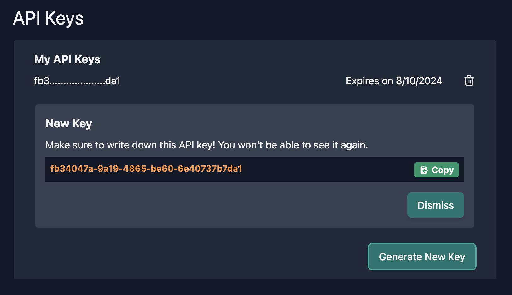

# Authenticating with API Keys

The Regression Games platform provides the ability to generate API keys, which can be used
to authenticate against our API. This is the recommended way to authenticate with our API
when connecting external systems to Regression Games.

## Generating an API Key

An API key can be generated from your [account](https://play.regression.gg/account) page. At
the bottom of the screen within the **API Keys** section, click **Generate New Key**. This
token should be copied and stored somewhere safe - you won't be able to see it again once it
is generated. Keys have a default expiration date of 1 year.



## Using the API Key

Once you have generated an API key, you can use it to authenticate against our API. To do
so, you must include the key in the `Authorization` header of your request. 

```
HEADERS
Authorization: Bearer <API_KEY>
```

Optionall, you may also receive a JWT using the API Key with the following endpoint:

```
POST /api_key_auth
Body: 
{
    "apiKey": "<API_KEY>"
}
Response:
{
    "token": "<JWT>"
}
```

## Revoking API Keys

You can remove API Keys at any time by deleting them from the [account](https://play.regression.gg/account) page.
Next to each key is a delete icon, which immediately revokes the key.

You may also revoke any API key that has been exposed with the following endpoint:

```
DELETE /api_key/<API_KEY>
```