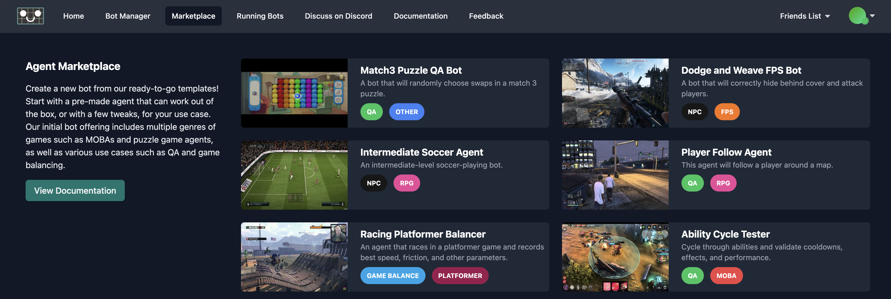
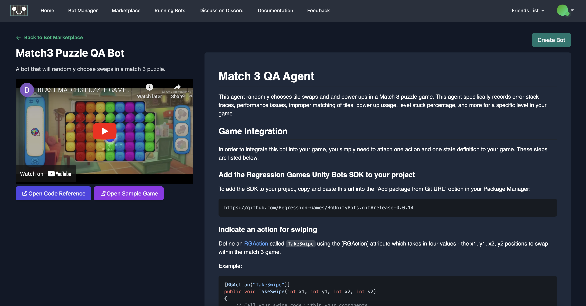
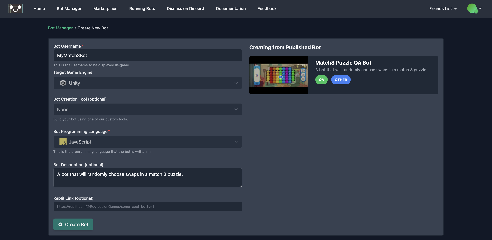
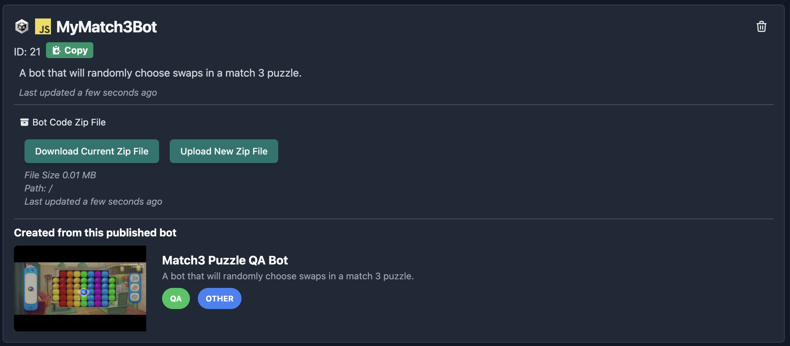

# Bot Marketplace

The Bot Marketplace is your one-stop-shop for ready-to-go bots. The Regression Games SDK allows you to build bots for 
many different use-cases, such as quality assurance (QA), game balancing, competitive bots, NPCs, and more. Choose bots 
from the Marketplace to apply to your game, and extend them to suit your games' unique needs. Bots are available for a 
range of genres, and for both single-player and multiplayer environments.

To visit the Marketplace, visit our site [here](https://play.regression.gg/marketplace) or click on the "Marketplace" tab
on the site.

## Learn About the Bots in the Marketplace

Click on a bot within the Marketplace to learn more about how this bot works. Every ready-to-go bot includes:

* A video demonstrating how the bot works and how to integrate it into your game
* A link to the source code for the bot
* A link to a sample game that uses the bot
* Documentation on how to integrate the bot into your game
* A button to create your own bot from this existing bot

Once you are ready to use the bot, click "Create Bot from Template".

## Creating a Bot from a Marketplace Bot

Once you click "Create Bot from Template", you will see the Bot Creation page, with everything preloaded for your bot
details. Fill out a desired name for your bot, and click create. Once on the Bot Manager page, you will see that your bot
entry has a reference to the bot it was created it from, so you can always go back and reference the documentation. 

From your bot details, you can always download and upload the bot code via a zip file.

