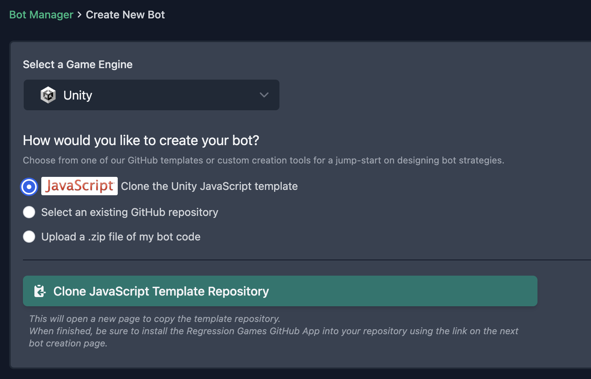
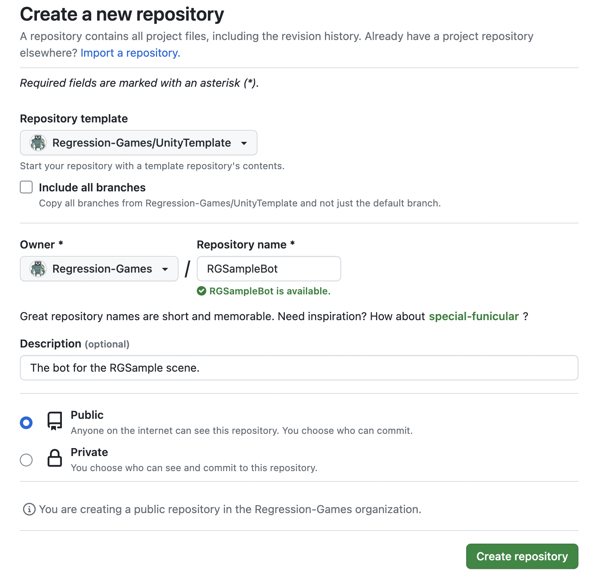
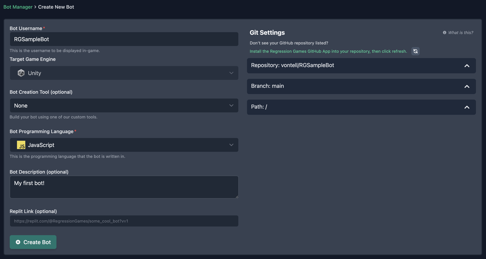

# Building Your First Bot

:::caution

This API and reference is subject to change, as the product is in an **early preview**. We
are making changes based on your recommendations and feedback, so let us know what you think at
info@regression.gg

:::

:::info

This tutorial assumes a basic understanding of Unity concepts.

:::

In this tutorial, we will get a simple game up and running where a character (represented by a green cube) needs to collect
power ups (represented by blue spheres). We will cover:

- How to integrate the RG Unity SDK into your game
- How to add various state and actions scripts to your game for bots to understand
- How to build your first bot


## Create an account on Regression Games

The first step is to create an account on Regression Games. Visit the [Regression Games site](https://play.regression.gg)
and click "sign up". Enter a username, email, and password. Once you log 
in, you will be prompted to connect a GitHub account. After connecting your account, the Regression Games platform will 
be able to pull and live reload bots through GitHub repositories.

You will also be prompted to enter a Minecraft username - you can put anything for this field (it will be removed
soon as part of our new studio-centric experience).

## Download the sample game

We have a sample project that you can play around with to get started. Download that project 
[here](https://github.com/Regression-Games/RGUnitySample/tree/starter) or clone it using GitHub. **Make sure to
download or clone the `starter` branch**, which serves as the starting point for this tutorial. For
the completed tutorial, see the `main` branch.

Run the following commands in your terminal to start:

```
git clone https://github.com/Regression-Games/RGUnitySample.git
cd RGUnitySample
git checkout starter
```

Once this is cloned, download **Unity version 2021.3.24f1** (visit the [Unity archive](https://unity.com/releases/editor/archive)
if you can't find that version). Open the cloned project in this Unity version. 

Once the project is loaded, open the scene at **Assets > Scenes > SampleScene**. This scene features a prefab 
for a character and a power up type, as well as three scripts; one for controlling 
the game loop, one for controlling the character, and one for controlling the power up logic.

## Import the Regression Games Unity Bots package

Our package is available via GitHub [here](https://github.com/Regression-Games/RGUnityBots). Import the repository by 
clicking **Add package from git URL** in the **Package Manager** window (this window can be opened
in the **Window > Package Manager** menu) and pasting in the following URL.

```
https://github.com/Regression-Games/RGUnityBots.git
```

- Note that this package utilizes TextMeshPro.  If you are prompted by Unity to add TextMeshPro assets to your project, please add them.
- Note that this package installs a dependency of Newtonsoft Json (https://docs.unity3d.com/Packages/com.unity.nuget.newtonsoft-json@3.1/manual/index.html) for serializing/deserializing Json message payloads.


## Restart Unity and your IDE

After installing the Regression Games Unity Bots package and its dependencies into Unity, please restart Unity and your IDE.  Without this step, your IDE may not properly resolve the new packages even after Unity recompiles the scripts.

## Log into Regression Games

After importing the Regression Games package, you can access the settings pane to input your email and password.
This will allow your project to access and start your bots. Access this setting page by going to **Edit** >
**Project Settings** > **Regression Games**.

Enter the following information:

* **RG Host URL:** `https://play.regression.gg`
* **RG Email:** `<your email>`
* **RG Password:** `<your password>`
* Make sure both "Enable Screen Overlay" and "Use Global Settings" are checked on


## Add the RGOverlayCanvas

The RGOverlayCanvas prefab provides a drag and drop overlay that let's you easily start and stop bots running
in your scene. This is extremely useful when initially creating and debugging your bots.

:::caution

Note that this overlay is **required to be placed into your scene** for Regression Games to function. The visibility
of the overlay can be hidden through the settings. If you have multiple scenes where a bot should be used, place
this into each scene - the SDK will ensure that only one instance is present.

:::

You can find this prefab by searching in the project file window for `RGOverlayCanvas` (make sure the "In Packages" filter is selected),
or by navigating to the **Packages** > **Regression Games Unity Bots** > **Runtime** > **Prefabs** folder.


Drag this overlay onto your scene. Once you have this overlay available, you can click play to see this in action! A
Regression Games logo will appear at the bottom of your screen. Click this button to see a dropdown for your bots. You
likely will not have any bots yet - that's alright, we will make one soon!

:::info

If you don't already, your **scene needs to have an EventSystem** to make interaction with the canvas possible.
You can do this by right-clicking your scene in the Hierarchy, and adding a **GameObject** > **UI** > **Event System**.
_You only need to do this if you plan on interacting with the canvas_.

:::


## Implement the RGBotSpawnManager

The RGBotSpawnManager is the primary point of configuration for how your bots are spawned into the game. This component
provides a few methods that can be overridden to control how bots are spawned into the scene, how they are seated into
your game logic before spawning, how they are destroyed, etc... For this particular tutorial, we need to define one
method, [`SpawnBot()`](/studios/unity/unity-sdk/RGBotSpawnManager#public-virtual-void-seatbotbotinformation-bottospawn). 
This method will define how our bot prefab is spawned into the scene.

First, create an `RGScripts/` folder in your `Assets` folder. Then, create a file called `CharacterBotSpawnManager.cs`.
Double click that file to open it within your editor of choice (we recommend Rider or Visual Studio). We highly recommend
that the file is opened as part of the solution / project as a whole, so that code completion is available.

Copy and paste the following code into this file. This component allows us to drag and drop a prefab for our bots and
a spawn point directly within our editor, and informs our SDK of these via those overridden functions.

See the [full reference](/studios/unity/unity-sdk/RGBotSpawnManager) for all the ways you can modify 
the spawning of bots. Sometimes you may need to add this
bot to a multiplayer network protocol, configure information like the character type, or define special start logic.
This can all be done through the interface provided by `RGBotSpawnManager`.

```cs
using RegressionGames;
using RegressionGames.Types;
using UnityEngine;

public class CharacterBotSpawnManager : RGBotSpawnManager
{
    
    [SerializeField]
    [Tooltip("The character to spawn")]
    private GameObject rgBotPrefab;

    [SerializeField]
    [Tooltip("Spawn point for RG Bots")]
    private Transform botSpawnPoint;

    public override GameObject SpawnBot(bool lateJoin, BotInformation botInformation)
    {
        Debug.Log("Spawning SAMPLE BOT");
        var bot = Instantiate(rgBotPrefab, Vector3.zero, Quaternion.identity);
        bot.transform.position = botSpawnPoint.position;

        // We will add more code here later to configure the bot further 

        return bot;
    }

}
```

Once this component is implemented, create an empty object within the scene, rename it to `RGBotSpawner` (just so we can find it later),
and attach this `CharacterBotSpawnManager` component to that object. Then, create another empty object, rename it to `CharacterSpawn`,
position it within the scene wherever you want to spawn your bot (ideally above the platform), and drag that game object into the 
**Bot Spawn Point** entry of the RGBotSpawner's `CharacterBotSpawnManager` component. Finally, find the **Player** prefab provided by the sample project (located within **Assets** > **Prefabs**), and drag this into the **Rg Bot Prefab** entry. Regression Games now knows how to load and unload bots from your scene! Make sure to save the scene.


## Add state information to relevant GameObjects

The next step is to indicate what state in your scene is available to bots. This state is used by bots to
make decisions on what actions to take. State is relayed to bots by attaching [`RGState`](/studios/unity/unity-sdk/RGState)
components to any game object or prefab that you want your bots to know about. 

The base implementation of [`RGState`](/studios/unity/unity-sdk/RGState) provided by Regression Games relays default 
information such as a `type`, `position`, and a unique identifier. In this sample scene, we will use this default 
state information, but of course you may need to provide additional state, such as a players team, health, if a door is open, etc...
You can do this by checking out the docs and examples for [`RGState.GetState()`](/studios/unity/unity-sdk/RGState#public-virtual-dictionarystring-object-getstate).

In this scene, open the `Player` prefab located in the **Assets > Prefabs** folder by double clicking
the prefab, click **Add Component**, and then add the `RGState` component by searching for "RG State" in the component
search modal that pops up. Once that component is added to the prefab, change the `Object Type` to `Player`. 
Make sure to save the changes you make to these existing prefabs by clicking **Save**! Repeat this process for
the `PowerUp` prefab, but change the `Object Type` to `PowerUp`.


That's all you need to do for your bot to see the state of the game!

## Implement actions your bot can take

Finally, we need to provide an interface that allows bots to control these characters in your game. This is
done using the [`RGAction`](/studios/unity/unity-sdk/RGAction) interface. 

```cs
/**
* Represents an action that a bot can instruct the game object to take.
* This RGAction class should be inherited in a sub class, and developers
* will need to implement the `StartAction` and `GetActionName` function.
*/
public abstract class RGAction : MonoBehaviour
{

    /**
    * The name of this action, which is used by the bot to request this specific action
    */
    public abstract string GetActionName();

    /**
    * The action to kick off, given some arguments. Usually this will set up some state
    * variables inside of this component, and then most of the logic will happen in an
    * update function.
    */
    public abstract void StartAction(Dictionary<string, object> input);

}
```

Create a new file called `RGPlayerMoveAction.cs` within the `RGScripts/` folder, and copy the following code into that file.

```cs
using System.Collections.Generic;
using RegressionGames.RGBotConfigs;
using UnityEngine;

public class RGPlayerMoveAction : RGAction
{
    
    private Vector3? targetPosition;
    private Rigidbody rigidbody;
    public float speed = 5000f;
    public float range = 1f;

    public void Awake()
    {
        rigidbody = GetComponent<Rigidbody>();
    }

    public override string GetActionName()
    {
        return "MoveToPosition";
    }

    public override void StartAction(Dictionary<string, object> input)
    {
        var targetX = float.Parse(input["x"].ToString());
        var targetY = float.Parse(input["y"].ToString());
        var targetZ = float.Parse(input["z"].ToString());
        targetPosition = new Vector3(targetX, targetY, targetZ);
    }

    public void Update()
    {
        
        // If we are in range, reset the action
        if (targetPosition != null && Vector3.Distance((Vector3) targetPosition, transform.position) < range)
        {
            targetPosition = null;
        }
        
        // Set the target velocity
        if (targetPosition != null)
        {
            rigidbody.velocity = ((Vector3) targetPosition - transform.position).normalized * speed * Time.deltaTime;
        }
    }
}
```

You can think of [`RGAction`](/studios/unity/unity-sdk/RGAction) as a task that your bot can run. In this case, 
we define a move action, which tells the bot to move to a location until they are in range of the target location. 
Because [`RGAction`](/studios/unity/unity-sdk/RGAction) is a MonoBehaviour, `Awake()` and `Update()` methods are 
implemented that run the logic for this type of action. An action can triggered by a Regression Games bot, and the
action script can execute the logic to perform that action.

`GetActionName()` defines this action with a name of `"MoveToPosition"`, which is the identifier that will be used
when writing the bot. `StartAction()` takes in the arguments passed by the bot that define how the action will run,
and stores this information within the component. These arguments are not used to execute logic right away, but rather
allows the `Update()` function to run the logic over time (as most actions will need more than one tick to run).
In this specific case, the bot passes an x, y, and z value, which is the position of the target that the
bot should approach.

**Add this new `RGPlayerMoveAction` component onto the Player prefab,** and make sure to click save.

Finally, search for and add the `RGAgent` script to the Player prefab - this tells Regression Games to find all `RGAction`s on this 
prefab and register them with the agent, and informs Regression Games that this prefab will act as an agent.


:::info

It is common that you will want to find GameObjects and other components within your scene to perform actions.
See the [`RGFindUtils`](../unity-sdk/RGFindUtils) class for helper functions which find GameObjects and components 
within your scene based on information coming in from an action.

:::

## Activate and start Regression Games in your game loop

The last Unity change needed is to start Regression Games when your game starts. Open up the 
`Assets/Prefabs/Game Scripts/GameLoop.cs` file, and copy these contents into the `GameLoop` class. You
will also need to add `using RegressionGames;` to the top of the file.

```cs
...

void Awake()
{
    RGSettings rgSettings = RGSettings.GetOrCreateSettings();
    if (rgSettings.GetUseSystemSettings())
    {
        int[] botIds = rgSettings.GetBotsSelected().ToArray();
        int errorCount = 0;
        Task.WhenAll(botIds.Select(botId =>
            RGServiceManager.GetInstance()
                ?.QueueInstantBot((long)botId, (botInstance) => { }, () => errorCount++)));
        if (errorCount > 0)
        {
            Debug.Log($"Error starting {errorCount} of {botIds.Length} RG bots, starting without them");
        }
    }
    RGBotServerListener.GetInstance()?.StartGame();
    RGBotServerListener.GetInstance()?.SpawnBots();
}

private void OnDestroy()
{
    RGBotServerListener.GetInstance()?.StopGame();
}

...
```

This will start the RegressionGames connection to the bot server, and will start spawning any pre-selected
bots from your settings. When the game shuts down, it will then stop any running bots.

## Putting it all together

The Unity integration for this game is now complete! The final part is to implement a bot that will connect to
the scene and perform on the behalf of a player.

Create a new bot by navigating to the [Bot Manager page](https://play.regression.gg/bots/create-bot) on
Regression Games and clicking **Create Bot**. Select the **Unity** option, which will open a GitHub
page to copy our Unity template. Create the GitHub repo with a name like "RGSampleBot" 
(note that sometimes GitHub seems to break at this  point, please try again if that happens), and 
then back on the Regression Games site, select that repo (click the refresh button in the panel on the right if 
you can't see your repository, or click the link to connect the repository if it is private), the main branch, 
and the root directory. Give your bot a name, select the Unity bot type, and then click **Create Bot**. 






Once the bot is created, clone the repository and open the `index.js` file.
Replace the contents with the following, and commit + push your changes to git.

```js
export function configureBot(rg) {
  rg.characterConfig = {
    speed: 4000
  };
}

export async function processTick(rg) {

  let powerUps = rg.findEntities("PowerUp")
  if (powerUps) {
    rg.performAction("MoveToPosition", powerUps[0].position)
  }

}
```

The bot will find all entities of the `PowerUp` type, and then queue the action `MoveToPosition` to
move towards that location. Push your changes, start up the scene in Unity, and then select and start the bot
from the Regression Games overlay (click the button in the bottom right of the screen).

After a few seconds, you will see your bot spawn and collect the power up! If something is not working,
send us a message on Slack or Discord and we will respond almost immediately!


## Extensions - Configuring your bot

You'll notice that in our JavaScript bot code, there is a `configureBot(rg)` function which allows
us to set arbitrary data that is passed to Unity to configure the bot. Let's extend our Unity integration
to take this `speed` configuration and set that on the bot in our code.

First, create a new file called `BotCharacterConfig.cs` within `RGScripts/` with the following contents.
This serialize type should match the data being returned by your bot's `configureBot` function, which
is serialized into JSON and later parsed using this type.

```cs
using System;

[Serializable]
public class BotCharacterConfig
{
    public float speed;
}
```

Now, within `CharacterBotSpawnManager.cs`, under the comment that says `// We will add more code here later to configure the bot further`
and before `return bot`, insert the following code:

```cs
RGPlayerMoveAction moveAction = bot.GetComponent<RGPlayerMoveAction>();
BotCharacterConfig config = botInformation.ParseCharacterConfig<BotCharacterConfig>();
if (config != null)
{
    Debug.Log($"Changed speed to ${config.speed}");
    moveAction.speed = config.speed;
}
```

On bot spawn, this will grab our action script and the bot config that is being passed in, and set the speed
to the speed defined in that JavaScript file.

Start up the scene, and use the overlay to spawn a bot. While your bot is running, try updating the JavaScript 
bot code to use very high and low values for speed. Add, commit, and push your changes, and you will see
the bot live reload and change its speed!

## Next steps

For immediate next steps, we recommend checking out our guide on [creating bots that can do QA validations](/studios/unity/unity-sdk/creating-bots/validation-bots). In soon-to-be-added guides, tutorials will walk you through:

- Creating bots with abilities
- Pairing a Regression Games bot with dialog systems such as character.ai
- Creating bots that can exploit level structure and attempt to break your game
- Bots that can click through menus