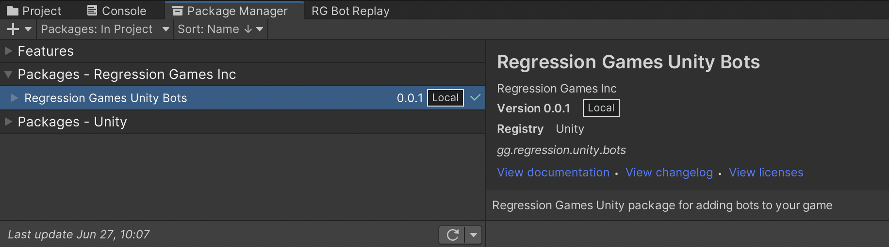
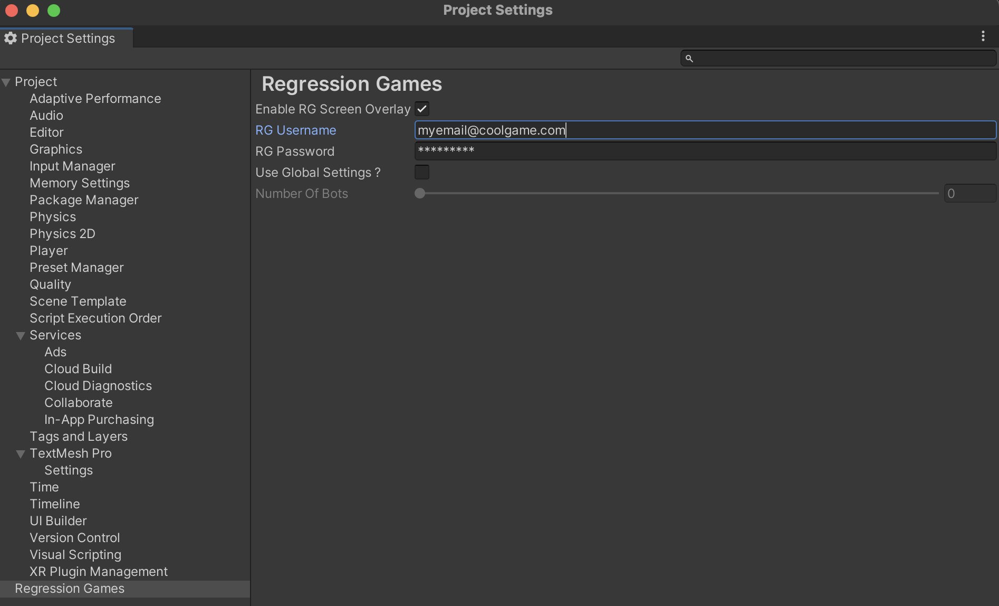
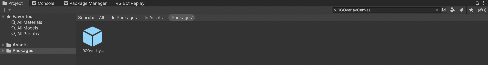
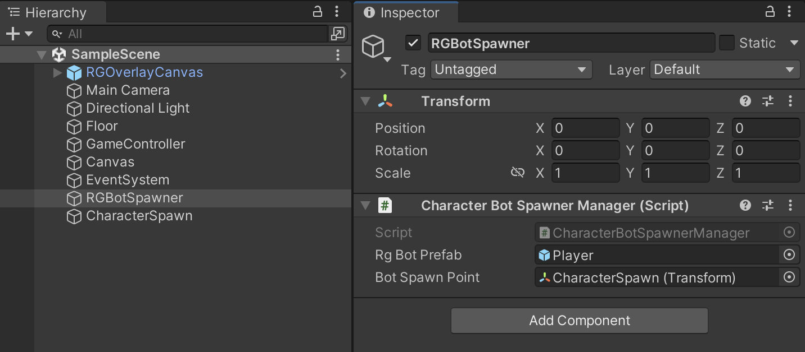
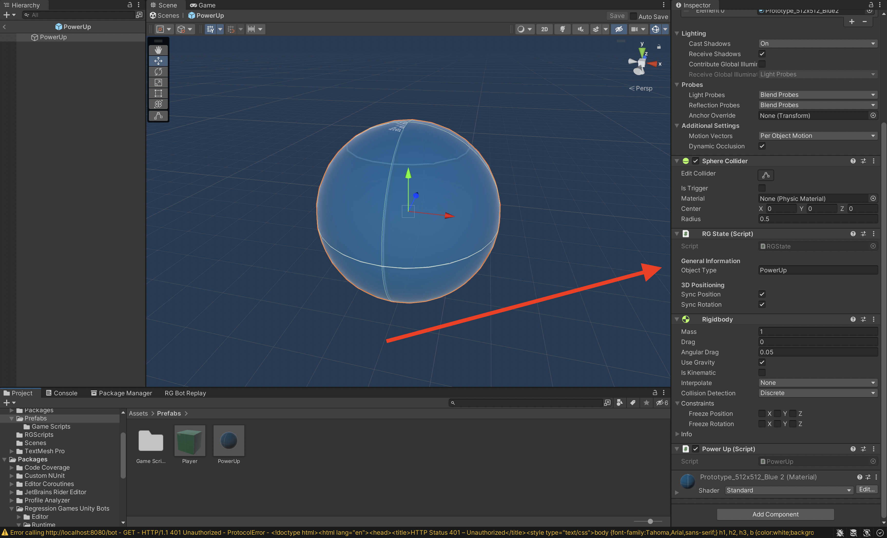
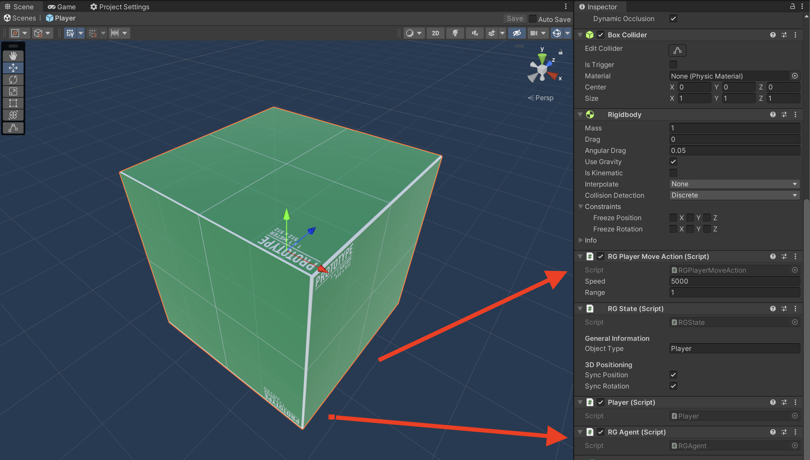

# Building Your First Bot

:::caution

This API and reference is subject to change, as the product is in an **early preview**. We
are making changes based on your recommendations and feedback, so let us know what you think at
info@regression.gg

:::

In this tutorial, we will get a simple game up and running where a character (represented by a green cube) needs to collect
power ups (represented by blue spheres). We will cover:

- How to integrate the RG Unity SDK into your game
- How to add various state and actions scripts to your game for bots to understand
- How to build your first bot


## Create an account on Regression Games

The first step is to create an account on Regression Games. Visit the Regression Games site (usually
this is [https://play.regression.gg](https://play.regression.gg), but it may be different for your organization),
and click "sign up". Enter a username, email, and password. Once you log in, you will be prompted to connect
a GitHub account. After connecting your account, the Regression Games platform will be able to pull and live reload
bots through GitHub repositories.

You will also be prompted to enter a Minecraft username - you can put anything for this field (it will be removed
soon as part of our new studio-centric experience).

## Download the sample scene

We have a starting scene that you can play around with to get started. Download that project 
[here](https://github.com/Regression-Games/RGUnitySample/tree/starter) or clone it using GitHub. **Make sure to
download or clone the `starter` branch**, which serves as the starting point for this tutorial. For
the completed tutorial, see the `main` branch.

```
git clone git@github.com:Regression-Games/RGUnitySample.git
cd RGUnitySample
git checkout starter
```

This scene features a prefab for a character and a power up type, as well as three scripts; one for controlling 
the game loop, one for controlling the character, and one for controlling the power up logic.

## Import the Regression Games Unity Bots package

Our package is available via GitHub [here](https://github.com/Regression-Games/RGUnityBots). Clone or download the repository, 
and import the package by clicking **Add package from disk** in the **Package Manager** window.  
- Note that this package utilizes TextMeshPro.  If you are prompted by Unity to add TextMeshPro assets to your project, please add them.
- Note that this package installs a dependency of Newtonsoft Json (https://docs.unity3d.com/Packages/com.unity.nuget.newtonsoft-json@3.1/manual/index.html) for serializing/deserializing Json message payloads.



## Restart Unity and your IDE

After installing the Regression Games Unity Bots package and its dependencies into Unity, please restart Unity and your IDE.  Without this step, your IDE may not properly resolve the new packages even after Unity recompiles the scripts.

## Log into Regression Games

After importing the Regression Games package, you can access the settings pane to input your email and password.
This will allow your project to access and start your bots. Access this setting page by going to **Edit** >
**Project Settings** > **Regression Games**.



## Add the RGOverlayCanvas

The RGOverlayCanvas prefab provides a drag and drop overlay that let's you easily start and stop bots running
in your scene. This is extremely useful when initially creating and debugging your bots.

:::caution

Note that this overlay is **required to be placed into your scene** for Regression Games to function. The visibility
of the overlay can be hidden through the settings. If you have multiple scenes where a bot should be used, place
this into each scene - the SDK will ensure that only one instance is present.

:::

You can find this prefab by searching in the project file window for `RGOverlayCanvas` within the Packages filter,
or by navigating to the **Packages** > **Regression Games Unity Bots** > **Runtime** > **Prefabs** folder.



Drag this overlay onto your scene. Once you have this overlay available, you can click play to see this in action! A
Regression Games logo will appear at the bottom of your screen. Click this button to see a dropdown for your bots. You
likely will not have any bots yet - that's alright, we will make one soon!


:::info

If you don't already, your **scene needs to have an EventSystem** to make interaction with the canvas possible.
You can do this by right-clicking your scene in the Hierarchy, and adding a **GameObject** > **UI** > **Event System**.
_You only need to do this if you plan on interacting with the canvas_.

:::


## Implement the RGBotSpawnManager

The RGBotSpawnManager is the primary point of configuration for how your bots are spawned into the game. This component
provides a few methods that can be overridden to control how bots are spawned into the scene, how they are seated into
your game logic before spawning, how they are destroyed, etc... For this particular tutorial, we will define the two
methods that must be implemented - `GetBotPrefab()` and `GetBotSpawn()`. These two methods define what prefab should be
used to control the character, and where the character should be spawned.

First, create a new file called `CharacterBotSpawnManager.cs`. It's best practice to put all Regression Games scripts
into a common directory (we put ours in an `RGScripts/` folder).

Copy and paste the follow code into this file. This component allows us to drag and drop a prefab for our bots and
a spawn point directly within our editor, and informs our SDK of these via those overridden functions.

See the [full reference](#) for all the ways you can modify the spawning of bots. Sometimes you may need to add this
bot to a multiplayer network protocol, configure information like the character type, or define special start logic.
This can all be done through the interface provided by `RGBotSpawnManager`.

```cs
using RegressionGames;
using UnityEngine;

public class CharacterBotSpawnManager : RGBotSpawnManager
{
    
    [SerializeField]
    [Tooltip("The character to spawn")]
    private GameObject rgBotPrefab;

    [SerializeField]
    [Tooltip("Spawn point for RG Bots")]
    private Transform botSpawnPoint;

    public override GameObject GetBotPrefab()
    {
        return rgBotPrefab;
    }

    public override Transform GetBotSpawn()
    {
        return botSpawnPoint;
    }

}
```

Once this component is implemented, create an empty object within the scene, and attach this component to that object. Then,
create another empty object and position it within the scene above the platform, and drag that game object into the **Bot Spawn Point** entry. Finally, find the **Player** prefab provided by the sample project (located within **Assets** > **Prefabs**), and
drag this into the **Rg Bot Prefab** entry. Regression Games now knows how to load and unload bots from your scene!



## Add state information to relevant GameObjects

The next step is to indicate what state in your scene is available to bots. This state is then used by bots to
make decisions on what actions to take. State is relayed to bots by attaching `RGState` components to any game
object or prefab that you want your bots to know about. 

The base implementation of `RGState` provided by Regression Games relays default information such as a `type`, `position`,
and a unique identifier. In this sample scene, we will use this default state information, but of course you may need
to provide additional state, such as a players team, health, if a door is open, etc...

In this scene, we open the `Player` and `PowerUp` prefabs, and add a component, searching for "RG State". Once that
component is added to the prefab, change the `Object Type` to `PowerUp` for the PowerUp, and change it to `Player`
for the player. Make sure to save the changes you make to these existing prefabs by clicking **Save**!



That's all you need to do for your bot to see the state of the game!

## Implement actions your bot can take

Finally, we need to provide an interface that allows bots to control these characters in your game. This is
done using the RGAction interface. 

```cs
/**
* Represents an action that a bot can instruct the game object to take.
* This RGAction class should be inherited in a sub class, and developers
* will need to implement the `StartAction` and `GetActionName` function.
*/
public abstract class RGAction : MonoBehaviour
{

    /**
    * The name of this action, which is used by the bot to request this specific action
    */
    public abstract string GetActionName();

    /**
    * The action to kick off, given some arguments. Usually this will set up some state
    * variables inside of this component, and then most of the logic will happen in an
    * update function.
    */
    public abstract void StartAction(Dictionary<string, object> input);

}
```

Create a new file called `RGPlayerMoveAction.cs`, and copy the following code into that file.

```cs
public class RGPlayerMoveAction : RGAction
{
    
    private Vector3? targetPosition;
    private Rigidbody rigidbody;
    public float speed = 5000f;
    public float range = 1f;

    public void Awake()
    {
        rigidbody = GetComponent<Rigidbody>();
    }

    public override string GetActionName()
    {
        return "MoveToPosition";
    }

    public override void StartAction(Dictionary<string, object> input)
    {
        var targetX = float.Parse(input["x"].ToString());
        var targetY = float.Parse(input["y"].ToString());
        var targetZ = float.Parse(input["z"].ToString());
        targetPosition = new Vector3(targetX, targetY, targetZ);
    }

    public void Update()
    {
        
        // If we are in range, reset the action
        if (targetPosition != null && Vector3.Distance((Vector3) targetPosition, transform.position) < range)
        {
            targetPosition = null;
        }
        
        // Set the target velocity
        if (targetPosition != null)
        {
            rigidbody.velocity = ((Vector3) targetPosition - transform.position).normalized * speed * Time.deltaTime;
        }
    }
}
```

You can think of an `RGAction` as a task that you bot should run. In this case, we define a move task, which
tells the bot to move to a location until they are in range of the target location. Because `RGAction` is a
MonoBehaviour, `Awake()` and `Update()` methods are implemented that run the logic for this type of action.

Name the action as `"MoveToPosition"`, implemented within `GetActionName()`, which is the identifier that will be used
when writing the bot. Next, implement `StartAction()`, which takes in the arguments passed by the bot to perform
this action. In this specific case, the bot passes an x, y, and z value, which is the position of the target that the
bot should approach.

The `Update()` function implements the logic to move towards that position. If the target position is
set, and the bot is not within a specific range, then propel the RigidBody in that direction. If the target is
reached, then reset the target to nothing.

Add this new `RGPlayerMoveAction` component onto the Player prefab. 

Finally, search for and add the `RGAgent` script to the Player prefab - this tells Regression Games to find all `RGAction`s on this 
prefab and register them with the agent, and informs Regression Games that this prefab will act as an agent.



## Activate and start Regression Games in your game loop

The final piece to start everything up is to start up Regression Games in the game loop. Open up the 
`Assets/Prefabs/Game Scripts/GameLoop.cs` file, and copy these contents into the `GameLoop` class.

```cs
...

void Awake()
{
    RGSettings rgSettings = RGSettings.GetOrCreateSettings();
    if (rgSettings.GetUseSystemSettings())
    {
        int[] botIds = rgSettings.GetBotsSelected().ToArray();
        int errorCount = 0;
        Task.WhenAll(botIds.Select(botId =>
            RGServiceManager.GetInstance()
                ?.QueueInstantBot((long)botId, (botInstance) => { }, () => errorCount++)));
        if (errorCount > 0)
        {
            Debug.Log($"Error starting {errorCount} of {botIds.Length} RG bots, starting without them");
        }
    }
    RGBotServerListener.GetInstance()?.StartGame();
    RGBotServerListener.GetInstance()?.SpawnBots();
}

private void OnDestroy()
{
    RGBotServerListener.GetInstance()?.StopGame();
}

...
```

This will start the RegressionGames connection to the bot server, and will start spawning any pre-selected
bots from your settings. When the game shuts down, it will then stop any bots.

## Putting it all together

The Unity integration for this game is now complete! The final part is to implement a bot that will connect to
the scene and perform on the behalf of a player.

Create a new bot by navigating to the [Bot Creation page](https://play.regression.gg/bots/create-bot) on
Regression Games, and pick the first option. Once the bot is created, clone and open the `index.js` file.
Replace the contents with the following:

```js
export function configureBot(rg) {
  rg.characterConfig = {
    speed: 4000
  };
}

export async function processTick(rg) {

  let powerUps = rg.findEntities("PowerUp")
  if (powerUps) {
    rg.performAction("MoveToPosition", powerUps[0].position)
  }

}
```

The bot will find all entities of the `PowerUp` type, and then queue the action `MoveToPosition` to
move towards that location. Push your changes, start up the scene, and then select and start the bot
from the Regression Games overlay (click the button in the bottom right of the screen).

After a few seconds, you will see your bot spawn and collect the power up!

