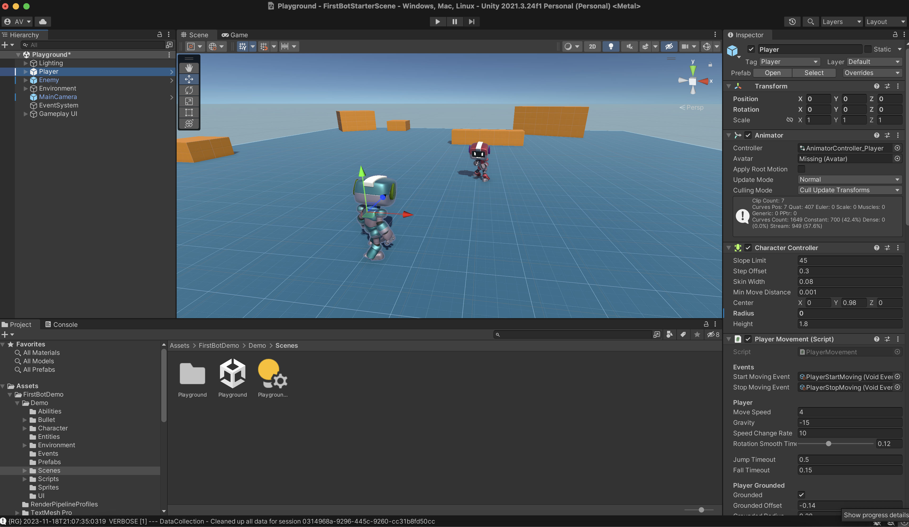
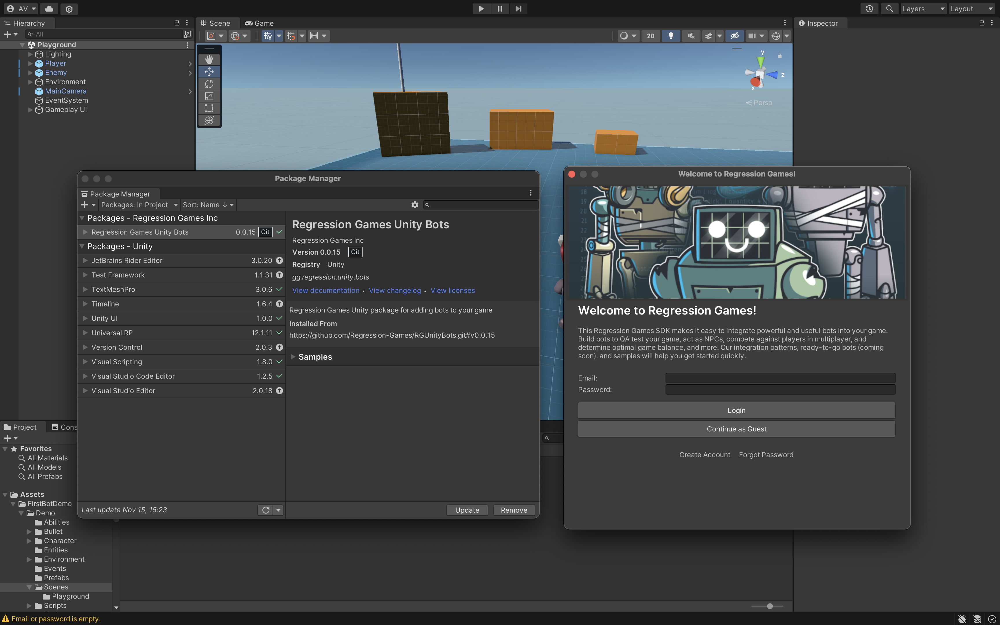
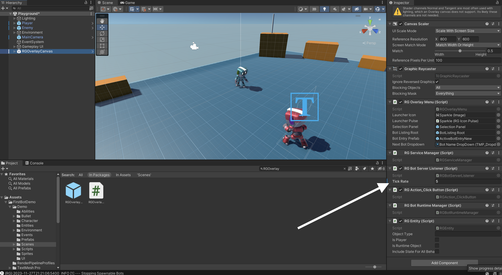
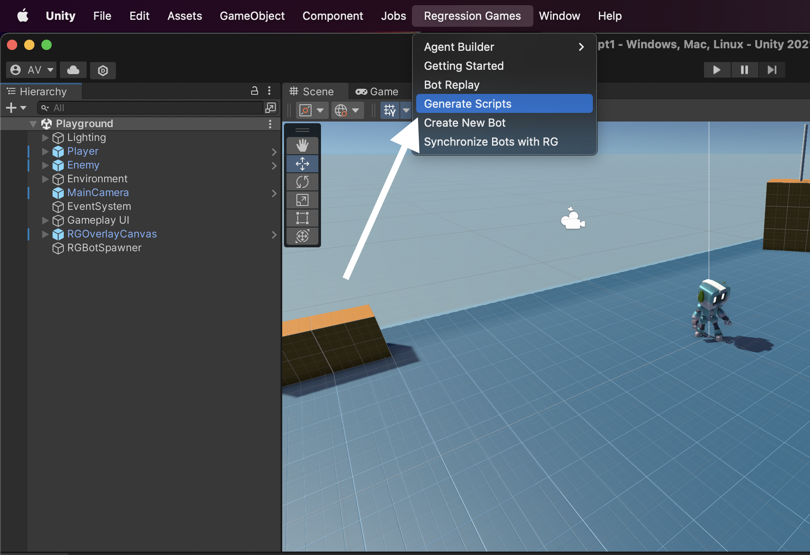
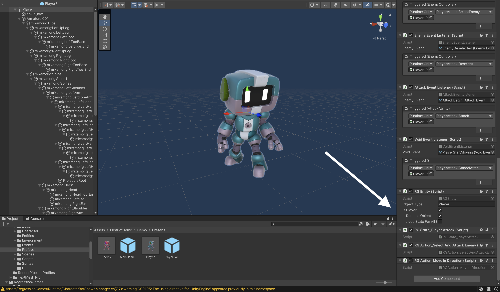
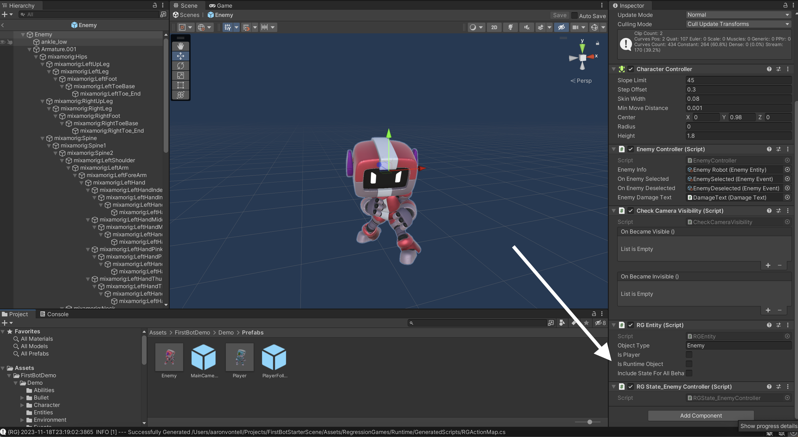
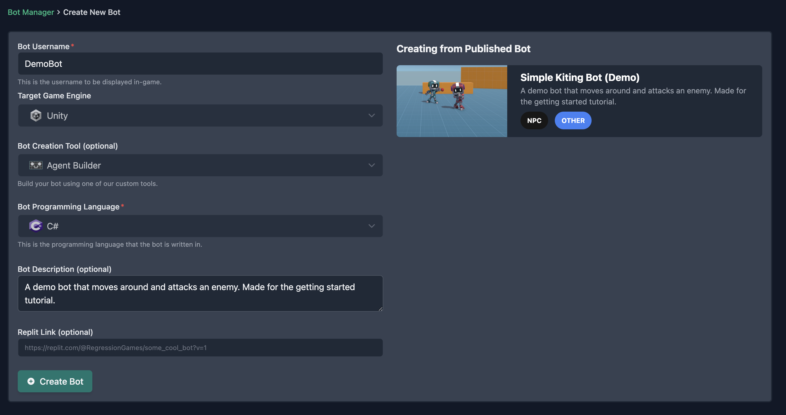
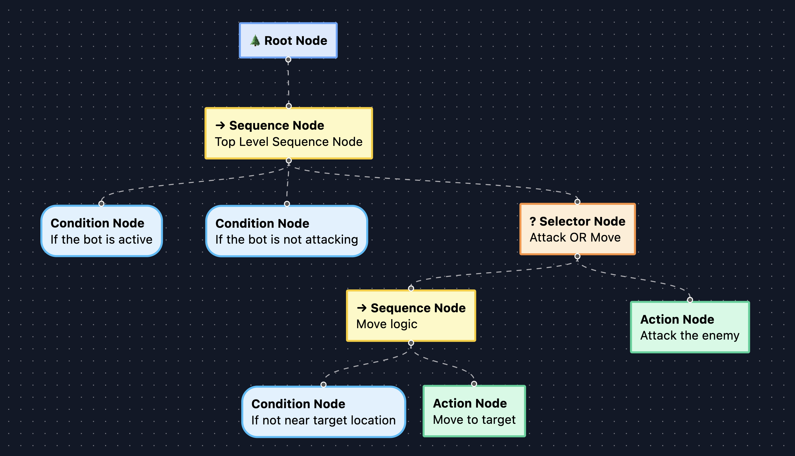

# Integrating and Building Your First Bot

:::info

This tutorial assumes a basic understanding of Unity concepts. If you get stuck, join our [Discord](https://discord.com/invite/925SYVse2H) and we can help you out!

:::

In this tutorial, we will get a simple bot integrated and running in a game. The bot will run to a random position and then
shoot the enemy in our playground sample. This tutorial will cover:

- How to integrate the RG Unity SDK into your game
- How to add various state and actions attributes to the game so your bot can understand the game
- How to use a ready-to-go bot from the Bot Marketplace, and edit that bot in the Agent Builder

<div style={{position: "relative", paddingBottom: "50.40485829959515%", height: 0}}><iframe src="https://www.loom.com/embed/c4a31389df6742ba9320bf7dc0e91739?sid=336eaf3b-208c-4ea3-a0b3-c6ad3d2d2cee" frameborder="0" webkitallowfullscreen mozallowfullscreen allowfullscreen style={{position: "absolute", top: 0, left: 0, width: "100%", height: "100%"}}></iframe></div>

## Download the sample game

Feel free to follow this tutorial within your own game, but we recommend starting with a simple sample game. Clone the project
at the [Regression-Games-Marketplace/SampleDemoScene](https://github.com/Regression-Games-Marketplace/SampleDemoScene.git) GitHub repository
and open it within Unity version 2021.3.24f1 (visit the [Unity archive](https://unity.com/releases/editor/archive) if 
you can't find that version).

```
git clone https://github.com/Regression-Games-Marketplace/SampleDemoScene.git
```

Once the project is loaded, the default scene with the bots in a playground should open. If it does not, open the **Playground**
scene by double clicking the scene file at **Assets > FirstBotDemo > Demo > Scenes**. If you'd like, click play and use the WASD
keys to move around the character.



## Import the Regression Games Unity Bots package

Our package is available on GitHub [here](https://github.com/Regression-Games/RGUnityBots). Import the repository by 
clicking **Add package from git URL** in the **Package Manager** window (this window can be opened
in the **Window > Package Manager** menu) and pasting in the following URL.

```
https://github.com/Regression-Games/RGUnityBots.git#v0.0.15
```

- Note that this package utilizes TextMeshPro.  If you are prompted by Unity to add TextMeshPro assets to your project, please add them.
- Note that this package installs a dependency of Newtonsoft Json (https://docs.unity3d.com/Packages/com.unity.nuget.newtonsoft-json@3.1/manual/index.html) for serializing/deserializing Json message payloads.



After importing the package, you will be greeted by a login screen. Create an account on
[https://play.regression.gg](https://play.regression.gg) and login with these credentials. If you need to login again in the future, 
you can enter your login info by visiting the following menu: **Edit** > **Project Settings** > **Regression Games**.

## Restart Unity and your IDE

After installing the Regression Games Unity Bots package and its dependencies into Unity, please restart Unity and your IDE.  Without this step, your IDE may not properly resolve the new packages even after Unity recompiles the scripts.

## Add the RGOverlayCanvas

The RGOverlayCanvas prefab provides a drag and drop overlay that let's you easily start and stop bots running
in your scene. This is extremely useful when initially creating and debugging your bots.

:::caution

Note that this overlay is **required to be placed into your scene** for Regression Games to function. The visibility
of the overlay can be hidden through the settings. If you have multiple scenes where a bot should be used, place
this into each scene - the SDK will ensure that only one instance is present.

:::

You can find this prefab by searching in the project file window for `RGOverlayCanvas` (make sure the "In Packages" filter is selected),
or by navigating to the **Packages** > **Regression Games Unity Bots** > **Runtime** > **Prefabs** folder.


Drag this overlay onto your scene in the object hierarchy. Once you add it to the scene, scroll down to the `RG Bot Server Listener` 
component and set the Tick Rate to `5` (this means that every 5 game ticks, bots will receive and respond to state 
information from the game).



Once you have this overlay available, you can click play to see this in action! A
Regression Games logo will appear at the bottom of your screen. Click this button to see a dropdown for your bots. You
likely will not have any bots yet - that's alright, we will make one soon!

:::info

If you don't already, your **scene needs to have an EventSystem** to make interaction with the canvas possible.
You can do this by right-clicking your scene in the Hierarchy, and adding a **GameObject** > **UI** > **Event System**.
_You only need to do this if you plan on interacting with the canvas_.

:::


## Implement the RGBotSpawnManager

The [RGBotSpawnManager](/studios/unity/unity-sdk/RGBotSpawnManager) is the primary point of configuration for how your bots are spawned into the game. This component
provides a few methods that can be overridden to control how bots are spawned into the scene, how they are seated into
your game logic before spawning, how they are destroyed, etc... For this particular tutorial, we need to define one
method, [`SpawnBot()`](/studios/unity/unity-sdk/RGBotSpawnManager#public-virtual-void-seatbotbotinformation-bottospawn). 
This method will define how our bot prefab is spawned into the scene.

First, create a `RegressionGames/Runtime/` folder in your `Assets` folder. Then, create a file called `CharacterBotSpawnManager.cs`.
Double click that file to open it within your editor of choice (we recommend Rider or Visual Studio). We highly recommend
that the file is opened as part of the solution / project as a whole, so that code completion is available.

Copy and paste the following code into this file. This component allows us to drag and drop a prefab for our bots and
a spawn point directly within our editor, and informs our SDK of these via those overridden functions.

See the [full reference](/studios/unity/unity-sdk/RGBotSpawnManager) for all the ways you can modify 
the spawning of bots. Sometimes you may need to add this
bot to a multiplayer network protocol, configure information like the character type, or define special start logic.
This can all be done through the interface provided by `RGBotSpawnManager`.

```cs
using UnityEngine;

using RegressionGames;
using RegressionGames.Types;

public class CharacterBotSpawnManager : RGBotSpawnManager
{
    
    // Expose a field in the editor for the prefab to spawn as a bot
    [SerializeField]
    [Tooltip("The character to spawn")]
    private GameObject rgBotPrefab;

    // Expose a field in the editor to define where the bot should spawn
    [SerializeField]
    [Tooltip("Spawn point for RG Bots")]
    private Transform botSpawnPoint;

    public override GameObject SpawnBot(bool lateJoin, BotInformation botInformation)
    {
        // Loads the bot prefab and spawns it into the scene
        var bot = Instantiate(rgBotPrefab, Vector3.zero, Quaternion.identity);
        bot.transform.position = botSpawnPoint.position;
        return bot;
    }
    
    new void Awake()
    {
        // Prepares the RG SDK for spawning bots
        base.Awake();
        RGBotServerListener.GetInstance()?.StartGame();
        RGBotServerListener.GetInstance()?.SpawnBots();
    }

    private void OnDestroy()
    {
        // Stops all bots and cleans up the RG SDK
        RGBotServerListener.GetInstance()?.StopGame();
    }

}
```

Once this component is implemented, create an empty object within the scene, rename it to `RGBotSpawner` (just so we can find it later),
and attach this `CharacterBotSpawnManager` component to that object. Position it within the scene wherever you want to spawn your bot 
(**make sure to set the Y coordinate to 0 so your bot does not float!**), and drag `RGBotSpawner`'s own Transform into the 
**Bot Spawn Point** entry of the RGBotSpawner's `CharacterBotSpawnManager` component. Finally, find the 
**Player** prefab provided by the sample project (located within `Assets/FirstBotDemo/Demo/Prefabs/Player.prefab`), and drag 
this into the **Rg Bot Prefab** entry. Regression Games now knows how to load and unload bots from your scene! Make sure to save the 
scene.


## Add state information to relevant GameObjects

We are onto the final parts of the integration! We need to indicate the following within our game:

* What state information our bots can see
* What actions our bots can perform

First, let's add the state information. Regression Games marks states for bot consumption using the `[RGState]` attribute.
This attribute can be applied to any public method that returns a value or any variable within a `MonoBehaviour`, and
it will automatically be sent to the bot.

First, open the `Assets/FirstBotDemo/Demo/Scripts/Player/PlayerAttack.cs` file, and add the following method to the class, which
will allow our bot to know when it is currently in an attack animation (make sure to import any missing imports):

```csharp
[RGState]
public bool IsAttacking()
{
    return !string.IsNullOrEmpty(_attackAnimation) && _animator.GetBool(_attackAnimation);
}
```

Then, within the `Assets/FirstBotDemo/Demo/Scripts/EnemyController.cs` file, add the following attributes to the existing `GetCurrentHp()`
and `GetTotalHp()` methods:

```csharp
/*
* Gets the enemies current hp
*/
[RGState("CurrentHealth")]
public int GetCurrentHp()
{
    return _currentHp;
}

/*
* Gets the enemy's total HP from its assigned info
*/
[RGState("MaxHealth")]
public int GetTotalHp()
{
    if (!enemyInfo)
    {
        Debug.LogWarning($"{gameObject.name} is missing entity info. Please check the inspector and assign missing fields");
        return default;
    }
    return enemyInfo.hp;
}
```

That's it (besides a final component generation and attaching step). The bot will now be able to see the current and max
health of the enemy, and whether or not the player is attacking.

## Implement actions your bot can take

Now, similar to states, we will tag the actions that a bot can take. In our case, a bot can either move or attack.

Open the `Assets/FirstBotDemo/Demo/Scripts/Player/PlayerInputControl.cs` file, and replace the contents with the following.
This change does a few things:

1. Adds an editor field that allows us to mark a specific prefab instance as being a bot (vs a character controlled by a real player).
2. Uses that field to ensure that keyboard/input handling only applies to non-bot game objects.
3. Marks the movement method as being an action that the bot can perform.

```csharp
using RegressionGames;
using UnityEngine;

namespace FirstBotDemo
{
    public class PlayerInputControl : MonoBehaviour
    {
        [Header("Character Input Values")]
        public Vector2 move;
        public Vector2 look;
        public bool jump;

        [Header("Movement Settings")]
        public bool analogMovement;

        [Header("BotSettings")] public bool isBot = true;

        private void Update()
        {
            if (!isBot)
            {
                MoveInput(new Vector2(Input.GetAxis("Horizontal"), Input.GetAxis("Vertical")));
                JumpInput(Input.GetButtonDown("Jump"));
            }
        }
        
        [RGAction("MoveInDirection")]
        public void MoveInput(Vector2 newMoveDirection)
        {
            move = newMoveDirection;
        }
        
        public void JumpInput(bool newJumpState)
        {
            jump = newJumpState;
        }
    }
}
```

Then, open the `Assets/FirstBotDemo/Demo/Scripts/Player/PlayerAttack.cs` file again, and add the following method to the class,
which defines an action that allows a bot to target an enemy and use an ability:

```csharp
[RGAction]
public void SelectAndAttackEnemy(int enemyId, int ability)
{
    var enemy = RGFindUtils.Instance.FindOneByInstanceId<EnemyController>(enemyId);
    SelectEnemy(enemy);
    Attack(abilities[ability]);
}
```

That's it for actions! A bot may now call into two actions (moving and attacking), which we will demonstrate in the section
when we build our bot.


:::info

It is common that you will want to find GameObjects and other components within your scene to perform actions.
See the [`RGFindUtils`](../unity-sdk/RGFindUtils) class for helper functions which find GameObjects and components 
within your scene based on information coming in from an action.

:::

## Generate the scripts and attach to the prefabs

The final step is to generate the scripts that will be used by the bots, and then attach those scripts to the prefabs.
The attributes by themselves do not inform the bots of anything - we use these attributes to generate components that
are attached to the objects in your scene.

First, go to the **Regression Games** menu in the menu bar and click **Generate Scripts** to create the components, which
get added to your project under the `Assets/RegressionGames` folder.



Then, open the `Player` prefab (found at `Assets/FirstBotDemo/Demo/Prefabs/Player.prefab`) and add the following components with
the requested settings (you can find these components by typing them into the component search bar after clicking **Add Component**):

* `RG Entity`
  * Set object type to `Player` (this is how the bot will identify objects of this type)
  * Make sure `Is Player` and `Is Runtime Object` are **checked**, but `Include State for All Behaviours` does not need to be checked.
* `RG State_Player Attack`
* `RG Action_Select And Attack Enemy`
* `RG Action_Move In Direction`



:::caution

Make sure you are editing the prefab, and not the character in the scene. Also make sure to **save**!

:::

Then, open the `Enemy` prefab (found at `Assets/FirstBotDemo/Demo/Prefabs/Enemy.prefab`) and add the following components with
the requested settings:

* `RG Entity`
  * Set object type to `Enemy`
  * All checkboxes are off - this is because the enemy is already in the scene and is not a bot-controlled entity.
* `RG State_Enemy Controller`



As a last step here, in the player input code, you will see that we introduced an `isBot` field to the `PlayerInputControl` component.
This will allow our player to be controlled by the bot logic when it is set to true. However, there is an existing `Player`
GameObject in the scene, which we want to control using our manual input controls. Click this `Player` in the object hierarchy,
find the `Player Input Control` component, set `Is Bot` to unchecked, and then save (you may find that it is already unchecked).


## Starting from our template - Bot Marketplace

Now that our integration is complete, our final step is to use an implementation of a bot. We will start with a template
found in our [Bot Marketplace](https://play.regression.gg/marketplace), and then edit it further.

Go to [this page](https://play.regression.gg/marketplace/1) to see the existing bot, and click "Create Bot" to create a copy 
of the bot. On the bot creation page, give it a name such as "DemoBot", and then click "Create Bot". You will then be
taken to the Agent Builder tool; feel free to click around and see how the bot works!





Go back to Unity, and within the **Regression Games** menu in the menu bar, click **Synchronize Bots with RG**. This will pull your new
bot into your Unity project. At this point, you can click play, and then select the Regression Games overlay button in the bottom
right of your game screen. Use the dropdown to select the bot you just created, and then click "Start Bot". The bot will begin to
run around and shoot the enemy!


## Editing the bot in the Agent Builder

Now that we have the bot working, let's extend its behavior to instead circle around the enemy and shoot every
500 ticks.

Go back to the Agent Builder page for your bot, and remove the nodes underneath the "Move logic" sequence node (click the node and click
the red delete button in the editor pane). Click and drag from the small black circle at the bottom of the "Move logic" sequence node 
towards underneath the node. Once you release the mouse, a dialog with node types will become available.

First, create a `Condition` node. Give it a name of "If we are waiting to attack", and then enter the following code into
the code editor.

```csharp
protected override NodeStatus Execute(RG rgObject)
{
  // Retrieve the last time we attacked
  var lastAttackTick = GetData<long?>("lastAttackTick");

  // If we have never attacked, abort the movement operation (so we can attack)
  if (lastAttackTick == null)
  {
      return NodeStatus.Failure;
  }

  // If it has been less than 200 ticks since our last attack, then
  // we can focus on moving
  else if (rgObject.Tick - lastAttackTick < 200)
  {
      return NodeStatus.Success;
  }
  // Otherwise it has been at least 200 ticks since our last attack,
  // so we should cancel moving and attack instead.
  else
  {
      return NodeStatus.Failure;
  }
}
```

This will cause the bot to only complete the move sequence if it has been at least 200 ticks since we last attacked.
Now, we will implement the code to move radially around the enemy. From the "Move logic" sequence node, click and drag
the small black circle again and create an Action node. Give it a name of "Move radially around enemy", and then enter
the following code into the code editor.

```csharp
protected override NodeStatus Execute(RG rgObject)
{
  // Find this player and the closest Enemy
  var myPlayer = rgObject.GetMyPlayer();
  var nearestEnemy = rgObject.FindNearestEntity("Enemy", myPlayer.position);
  if (nearestEnemy == null)
    return NodeStatus.Failure;

  // Get a vector from the player to the enemy
  var directionToEnemy = nearestEnemy.position - myPlayer.position;

  // By default, move in a vector that is 90 degrees from the direction to the enemy
  // This means we will move in a way that circles the enemy
  var directionToMove = new Vector2(-directionToEnemy.z, directionToEnemy.x); 

  // However, if we are too far from the enemy, move directly towards the enemy first
  if (RG.MathFunctions.DistanceSq(myPlayer.position, nearestEnemy.position) > 10) {
    directionToMove = new Vector2(directionToEnemy.x, directionToEnemy.z);
  }

  // Kick off the action to move towards the enemy
  rgObject.PerformAction(new RGActionRequest("MoveInDirection", new Dictionary<string, object> { { "newMoveDirection", directionToMove } }));
  return NodeStatus.Success;
}
```

This code will cause the bot to move in a circle around the enemy, and then move directly towards the enemy if it is
too far away. Finally, we will implement the code to attack the enemy. In the existing "Attack the enemy" Action node,
copy and paste the following code:

```csharp
protected override NodeStatus Execute(RG rgObject)
{
  // Find this player and the closest Enemy
  var myPlayer = rgObject.GetMyPlayer();
  var nearestEnemy = rgObject.FindNearestEntity("Enemy", myPlayer.position);
  if (nearestEnemy == null)
    return NodeStatus.Failure;

  // Create the arguments for our attack - we provide the enemy to attack,
  // and the ability (0 is the default attack)
  var actionParams = new Dictionary<string, object> { { "enemyId", nearestEnemy.id }, { "ability", 0 } };

  // Kick off two actions - the attack action, and a request to stop moving
  rgObject.PerformAction(new RGActionRequest("SelectAndAttackEnemy", actionParams));
  rgObject.PerformAction(new RGActionRequest("MoveInDirection", new Dictionary<string, object> { { "newMoveDirection", Vector2.zero } }));
	
  // Finally, set a global variable that defines when we last attacked
  // This is used in our condition for determining when to stop moving
  SetData("lastAttackTick", rgObject.Tick);
  return NodeStatus.Success;
}
```

This is similar to our previous attack code, but it also sets a global variable that is read in our movement condition
code. This variable, `lastAttackTick`, will track how long it has been since we last attacked, and will only stop the
bot from moving to focus on attacking if it has been at least 200 ticks since we last attacked.

Save this new agent by clicking **Save to Server** in the top right of the Agent Builder. Then, go back to Unity and
click **Synchronize Bots with RG** again. Finally, click play and start the bot. The bot will now circle around the
enemy and shoot every 200 ticks!

<div style={{position: "relative", paddingBottom: "50.40485829959515%", height: 0}}><iframe src="https://www.loom.com/embed/b5de89edf51841e489d18dc0f282f6f9?sid=336eaf3b-208c-4ea3-a0b3-c6ad3d2d2cee" frameborder="0" webkitallowfullscreen mozallowfullscreen allowfullscreen style={{position: "absolute", top: 0, left: 0, width: "100%", height: "100%"}}></iframe></div>


## Next Steps

Congratulations, you've now experienced the integration process for bots! Using this guide and our reference material,
you can now integrate bots into your own game. If you have any questions, please reach out to us on our 
[Discord](https://discord.com/invite/925SYVse2H). Please note that we offer **dedicated support** for your integration, 
we are happy to do it for you or walk you through it on a call step by step.

The following guides and references are great next steps:

* Check out the bot marketplace to see what bots are available for your game
* Learn how to build your own bot using the Agent Builder
* Learn how to setup a QA / validation testing bot
* Learn how to get your bot up and running in a CI/CD environment such as GitHub Actions