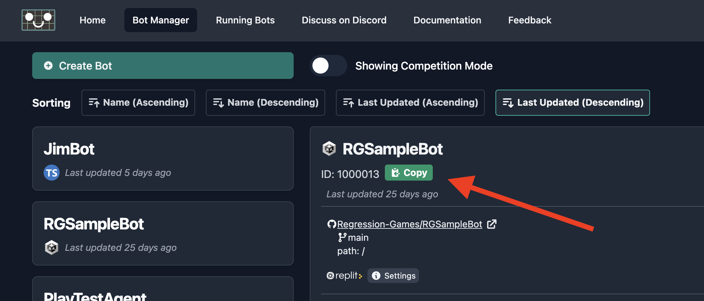
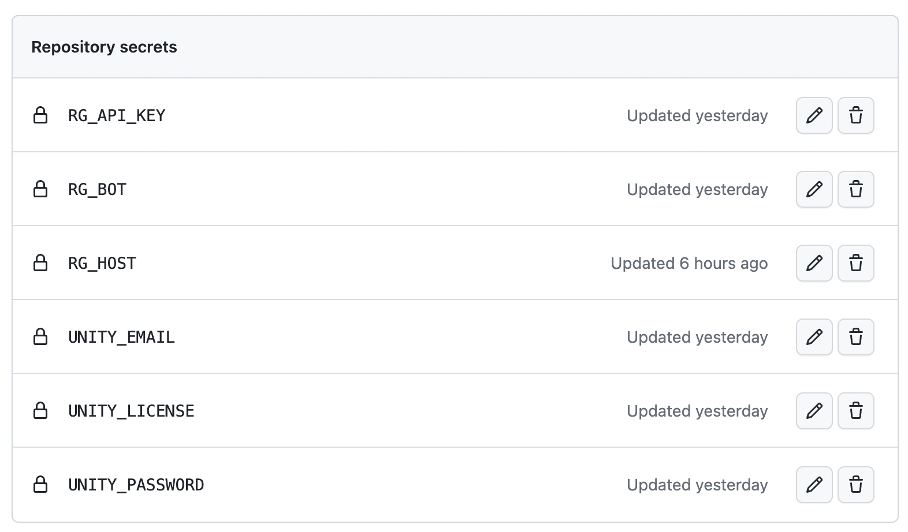
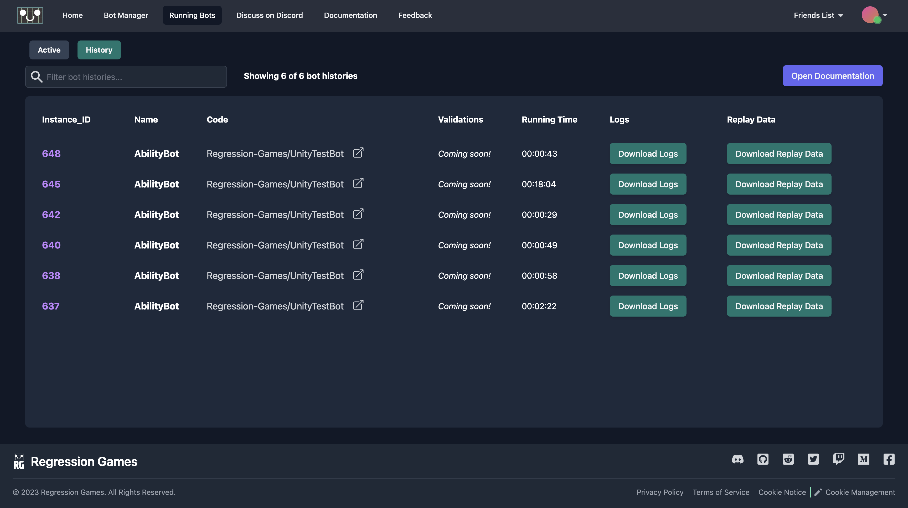

# Testing with GitHub Actions

This tutorial will walk you through the following steps to create a QA Bot for your Unity project using 
[GitHub Actions](https://docs.github.com/en/actions) and [GameCI](https://game.ci):

1. Add GitHub Actions workflow files to your project to enable Unity builds.
2. Configure the GitHub Actions workflow files to work with GameCI and Regression Games.
3. Add a test to your Unity project that will start and run your bot.
4. Learn how to view test results.

This tutorial assumes you have some familiarity with GitHub Actions, and that you have a working 
bot within your game (see more on this in the [Creating Bots in JavaScript section](/studios/unity/unity-sdk/creating-bots/configuration)).
By the end of this tutorial, every push to your GitHub repo will build your Unity project and start bots for testing.
You can find a working example in [this repository](https://github.com/Regression-Games/RGUnitySample) for reference.

:::caution

This guide is subject to change, as the product is an **early preview**. We
are making changes based on your recommendations and feedback, so let us know what you think at
info@regression.gg, or join our [Discord](https://discord.com/invite/925SYVse2H). This particular
tutorial is a first-pass at supporting CI/CD, but more features are coming soon to make this easier!

:::

:::info

This feature requires a Unity license, as CI/CD builds for Unity are only available to those with
a Unity license. If you want to use an existing CI/CD pipeline, you can skip ahead to the sections
below regarding [test configurations](#3-add-the-qa-bot-workflow-file-to-your-project) and 
[test files](#add-a-test-to-your-unity-project).

:::

## Add GitHub Actions Workflow Files

[GameCI](https://game.ci/) provides a collection of GitHub Actions for building Unity projects. This is our foundation 
for running GitHub CI/CD builds for Unity.

### Create a New Branch in your Project

First, create a new branch in your project so that you can test out the GitHub Actions workflow files before committing them to your
main branch. You can name this branch anything, but we named ours `qa-tests`.

### Follow the Steps on GameCI to Activate a [Unity License](https://game.ci/docs/github/activation)

It is critical that you follow this step! This allows the CI/CD Docker images to properly start and use Unity.
You can test that the license is configured properly by running this [GitHub Action](https://github.com/marketplace/actions/unity-activate)
in your GitHub repository.

### Add the QA Bot Workflow File to Your Project

The QA Bot workflow file is a GitHub Action that will build your Unity project and start a test that will run a bot. From step 2 above,
you should have a `.github/workflows` folder inside of your project/repository. Inside of this folder, create a new file called 
`qa-bot.yml` and paste the contents below.

```yaml
#file: .github/workflows/qa-bot.yml

name: Regression Games Bots QA 🤖

on: [push]

# See https://game.ci/docs/github/test-runner and RG_DOCS for more info
jobs:
  build:
    name: Build my project ✨
    runs-on: ubuntu-latest
    permissions: write-all # This is to allow writing results into the artifacts section of GitHub Actions
    steps:
          
      # Checkout (without LFS)
      - name: Checkout repository
        uses: actions/checkout@v3

      # Git LFS
      - name: Create LFS file list
        run: git lfs ls-files -l | cut -d' ' -f1 | sort > .lfs-assets-id

      - name: Restore LFS cache
        uses: actions/cache@v3
        id: lfs-cache
        with:
          path: .git/lfs
          key: ${{ runner.os }}-lfs-${{ hashFiles('.lfs-assets-id') }}

      - name: Git LFS Pull
        run: |
          git lfs pull
          git add .
          git reset --hard

      # Cache
      - uses: actions/cache@v3
        with:
          path: Library
          key: Library-${{ hashFiles('Assets/**', 'Packages/**', 'ProjectSettings/**') }}
          restore-keys: |
            Library-

      # Test
      # See https://game.ci/docs/github/test-runner for more information
      - name: Run tests
        uses: game-ci/unity-test-runner@v2
        env:
          UNITY_LICENSE: ${{ secrets.UNITY_LICENSE }}
        with:
          customParameters: -RG_BOT ${{ secrets.RG_BOT }} -RG_API_KEY ${{ secrets.RG_API_KEY }} -RG_HOST ${{ secrets.RG_HOST }}
          githubToken: ${{ secrets.GITHUB_TOKEN }}

      # Output
      - uses: actions/upload-artifact@v3
        with:
          name: Build
          path: build
```

:::info

Note that this will actually run all of your tests, not just the QA Bot test. To configure this workflow to only
run the QA test, see the [Unity Test Runner Command Line docs](https://docs.unity3d.com/Packages/com.unity.test-framework@2.0/manual/reference-command-line.html),
which has filter options that can be passed within `customParameters` within the `Run tests` step above. For example,
see the `customParameters` property below:

```yaml
...
- name: Run tests
  uses: game-ci/unity-test-runner@v2
  env:
    UNITY_LICENSE: ${{ secrets.UNITY_LICENSE }}
  with:
    customParameters: -testFilter "<name of method to test>" -RG_BOT ${{ secrets.RG_BOT }} -RG_API_KEY ${{ secrets.RG_API_KEY }} -RG_HOST ${{ secrets.RG_HOST }}
    githubToken: ${{ secrets.GITHUB_TOKEN }}
...
```

:::

## Configure GitHub Actions

The final piece on the GitHub actions side is to configure the secrets that are used in the workflow file above. Visit the secrets
page for your GitHub repository by going to your **Repo** > **Settings** > **Secrets and variables** > **Actions**. Add 
the following secrets by clicking the green **New repository secret** button.

1. `RG_HOST` - `https://play.regression.gg`
2. `RG_API_KEY` - Your API key from Regression Games, which can be found in your [account settings](https://play.regression.gg/account).
                  Full instructions for this can be found in the [Authentication docs](studios/api_reference/authentication).
3. `RG_BOT` - The ID of the bot you want to run. You can find this through the bot's details within the Regression Games 
              [Bot Manager page](https://play.regression.gg/bots).



Once you are done adding these secrets, your secrets section should look similar to the following:



## Add a Test to Your Unity Project

The QA Bots are started via the Unity Test Runner in [Play Mode](https://docs.unity3d.com/2019.1/Documentation/Manual/PlaymodeTestFramework.html),
In this testing mode, the game starts as if you are playing it, and then terminates once the function finishes.

Complete the following steps to setup the required test - feel free to skip some of these steps if you have existing Play tests
in your Unity project.

### Add Your Scenes to Your Build

Before adding the test, make sure your desired test scenes are placed inside your build. You can add your scenes to the build
using the menu option **File** > **Build Settings**.


### Configure Test Runner for Your Project

Next, we need to configure the Unity Test Runner for your project. To do this, go to **Window** > **General** > **Test Runner**.
Then, in the pane that open, click **Play Mode** > **Create PlayMode Test Assembly Folder**. Create that tests folder with
the name `Tests`, and find that folder in your editor (e.g. Rider, Visual Studio). You should see a file called `Tests.asmdef` - 
open that file and replace it with the contents below, which will include Regression Games as a dependency:

```json
{
    "name": "Tests",
    "references": [
        "RegressionGames"
    ],
    "optionalUnityReferences": [
        "TestAssemblies"
    ]
}
```

You can learn more about the Test Runner and setup instructions [here](https://docs.unity.cn/560/Documentation/Manual/testing-editortestsrunner.html).

### Create an `RGBotTests` File to Run Your Bot

Within the `Tests` folder, create a new file called `RGBotTests.cs` and copy the following contents into the file.

:::caution

Make sure to edit the file below to use the correct starting scene for your test! Update `Scenes/SampleScene` to
instead be the scene you are starting with.

:::

Also, update `defaultBotId` to an ID of a bot that you'd like to start in your local editor. Remember, you can find
the ID of a bot within the [Bot Manager page](https://play.regression.gg/bots).

```csharp
using System;
using System.Collections;
using System.Linq;
using System.Threading.Tasks;
using RegressionGames;
using UnityEngine;
using UnityEngine.SceneManagement;
using UnityEngine.TestTools;

public class RGBotTests
{
    [UnityTest]
    public IEnumerator RunBotTest()
    {
        
        // Override this to change how long a test will wait for bots to join before failing
        const int TIMEOUT_IN_SECONDS = 60;

        // For in-editor purposes, feel free to define a default bot to use!
        int defaultBotId = 1000015;

        // NOTE: Make sure to fill in the name of the scene to start your test with!
        AsyncOperation asyncLoadLevel = SceneManager.LoadSceneAsync("Scenes/SampleScene", LoadSceneMode.Single);
        // Wait until the scene finishes loading, then wait a frame so every Awake and Start method is called
        while (!asyncLoadLevel.isDone)
            yield return null;
        yield return new WaitForEndOfFrame();

        // Grab the bot to start (override with the one from CI/CD if defined)
        if (RGEnvConfigs.ReadBotId() != null)
        {
            defaultBotId = Int32.Parse(RGEnvConfigs.ReadBotId());
        }
        int[] botIds = {defaultBotId};
        Debug.Log($"Running test with bots {string.Join(", ", botIds)}");
        
        // Start the bots
        RGBotServerListener.GetInstance().StartGame();
        Task.WhenAll(botIds.Select(delegate(int botId)
        {
            Debug.Log("Creating task to spawn bot with ID " + botId);
            return RGServiceManager.GetInstance()
                .QueueInstantBot((long) botId, (botInstance) =>
                {
                    RGBotServerListener.GetInstance().AddClientConnectionForBotInstance(botInstance.id);
                }, () =>
                {
                    Debug.LogError($"Error starting bot with ID {botId}");
                });
        }));
        RGBotServerListener.GetInstance().SpawnBots();
        
        // Wait until at least one bot is connected. Fail the test if the connection takes too long
        var startTime = DateTime.Now;
        while (!RGBotServerListener.GetInstance().HasBotsRunning())
        {
            var timePassed = DateTime.Now.Subtract(startTime).TotalSeconds;
            if (timePassed > TIMEOUT_IN_SECONDS) Assert.Fail($"Bots failed to connect within {TIMEOUT_IN_SECONDS} seconds");
            yield return null;
        }
        
        // Now run until all bots complete their tasks
        while (RGBotServerListener.GetInstance().HasBotsRunning())
            yield return null;
        
        // Cleanup when done
        RGBotServerListener.GetInstance()?.StopGame();
    }
    
}

```

At a high level, this test is doing the following:

1. Loading the scene, and waiting for it to start up before activating bots
2. Queuing up a task that will start a bot and spawn it into the scene
3. The test then waits for at least one bot to connect. If a bot does not connect within one minute, the test will fail.
4. Once at least one bot is connected, the test runs until all bots complete their tasks (i.e the bot calls `rg.complete()`)

### Test it out with an Existing Bot

Our test is now setup! Before we commit and push our changes, let's test it out locally with an existing bot. To do this, you can
follow the [first bot guide](/studios/unity/tutorials/first_tutorial) or [creating bots reference](/studios/unity/unity-sdk/creating-bots/configuration)
to create and configure a bot. As a quick test, you can make a bot that simply waits for a few seconds before completing its test. Note
that **having your bot call `rg.complete()` is extremely important! Without this line of code, your bot will run forever!**

```javascript
export function configureBot(rg) {
  // No config for now
}

var startTime = null

export async function processTick(rg) {

  if (!startTime) startTime = new Date().getTime();

  if (new Date().getTime() - startTime > 5000) {
    // Now try to finish
    rg.complete();
  }

}
```

## Viewing Test Results

Once your tests have completed, you can view their results on Regression Games by navigating to the **History** section of the
[Running Bots](https://play.regression.gg/running-bots) tab. From this page you can download bot logs for the test session which 
contain output from your bot-code. You can also download in-game replay data which can be loaded in the Unity Editor to watch the 
movements and actions of each bot, as well as analyze the validations they performed. See the 
[In-Editor Replay](/studios/unity/unity-sdk/in-editor-replay) for instructions on how to load replay data.



