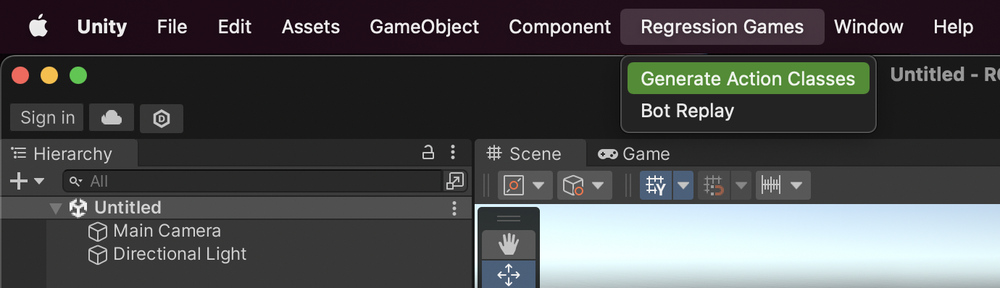

import Tabs from '@theme/Tabs';
import TabItem from '@theme/TabItem';

# Defining Bot Actions

This section refers to an "action" as any instruction that a bot can issue to its GameObject.
This can be anything from movement to casting abilities to navigating UI components.

It is common for actions to interact with entities in the [game state](./RGState) and their corresponding GameObjects.
The [`RGFindUtils`](./RGFindUtils) class contains utility functions for finding such GameObjects within the scene and is
useful for these types of actions.

## Using the `RGAction` Attribute

Defining an action is as simple as adding the `RGAction` attribute to a method.
This allows the Regression Games SDK to recognize this method as the entrypoint into a callable action from your bot code ([C#](./creating-bots/csharp/configuration)) ([JavaScript](./creating-bots/javascript/configuration)).

:::info
The `RGAction` attribute must be used within a component, a class that inherits from `MonoBehavior`, or a class whose parent inherits from `MonoBehavior`.
:::

By default, the action's name matches the method's, but this can be overridden by passing a different name to `RGAction`.
Action names must be unique within your Unity project.

Any parameters that the method accepts will be valid arguments in your bot code.
Argument names and data types in the bot code must match those expected by the action.

<Tabs>
<TabItem value="action_with_default_name" label="RGAction" default>

```cs
// This is called using the name "OpenContainer"

[RGAction]
public void OpenContainer(bool isLocked)
{
    // Your logic here
}
```

</TabItem>
<TabItem value="action_with_name" label="RGAction with Overridden Name">

```cs
// This is called using the name "Open Chest"

[RGAction("Open Chest")]
public void OpenContainer(bool isLocked)
{
    // Your logic here
}
```

</TabItem>
</Tabs>

The `RGAction` attribute is designed for ease of integration.
A method with this attribute may execute an action from start to finish, or it may start an action that `MonoBehavior` methods such as `FixedUpdate` should complete.
Depending on how your code is structured, you may be able to add the `RGAction` attribute to your existing code with minimal refactoring.

<Tabs>
<TabItem value="complete_action" label="RGAction Completes the Action" default>

```cs
public class Player : MonoBehavior
{
    public float jumpPower = 10f;
    private RigidBody _rigidbody;

    void Start()
    {
        _rigidbody = GetComponent<Rigidbody>();
    }

    [RGAction]
    public void Jump()
    {
        _rigidbody.AddForce(Vector3.up * jumpPower, ForceMode.Impulse);
    }
}
```

</TabItem>
<TabItem value="action_with_update" label="RGAction Starts the Action">

```cs
public class Player : MonoBehavior
{
    public float speed = 100f;
    public float range = 1f;
    private RigidBody _rigidbody;
    private Vector3? _targetPosition;

    void Start()
    {
        _rigidbody = GetComponent<Rigidbody>();
    }

    public void Update()
    {
        // If we are in range, reset the action
        if (targetPosition != null && Vector3.Distance((Vector3) targetPosition, transform.position) < range)
        {
            targetPosition = null;
        }

        // Set the target velocity
        if (targetPosition != null)
        {
            Vector3 direction = ((Vector3)targetPosition - transform.position).normalized;
            direction.y = 0;
            float force = speed * Time.deltaTime;
            _rigidbody.AddForce(direction * force);
        }
    }

    [RGAction]
    public void MoveToPosition(float x, float y, float z)
    {
        targetPosition = new Vector3(x, y, z);
    }
}
```

</TabItem>
</Tabs>

:::info
We recommend using primitive data types for `RGAction` parameters.
    Full support for non-primitive types is coming soon.
    If your method requires non-primitive parameters, consider using a proxy method:

```cs
// Proxy method for the AttackPlayer action
[RGAction]
public void AttackPlayerProxy(int playerId)
{
    var player = RGFindUtils.Instance.FindOneByInstanceId<RGState>(playerId);
    AttackPlayer(player.gameObject);
}

// The method we want to expose as an action
private void AttackPlayer(GameObject player)
{
  // your implementation here...
}
```

:::

## Assigning Actions to GameObjects

The Regression Games SDK relies on generated files to help translate commands sent from your bot into the correct actions within your Unity project.
Whenever you add, remove, or modify actions, you will need to instruct the SDK to generate new scripts by opening the `Regression Games` dropdown and selecting "Generate Action Classes".



This should result in a unique generated script for each action you've defined using the `RGAction` attribute.
You can find these files in your Unity project under `RegressionGames/Runtime/GeneratedScripts/RGActions`.
Each of these scripts can then be added as components to the appropriate GameObjects within your scene.
When assigning action scripts to a GameObject, make sure that GameObject has all of the components that the action references.


If your bot code attempts to call an action whose script is not assigned to its GameObject,
then the Regression Games SDK will ignore that command and continue executing your bot code as if the action was not called.

:::caution
Be mindful when removing the `RGAction` attribute from a method, or deleting an action altogether -
this may result in GameObjects missing the corresponding action script the next time you Generate Action Classes.
:::