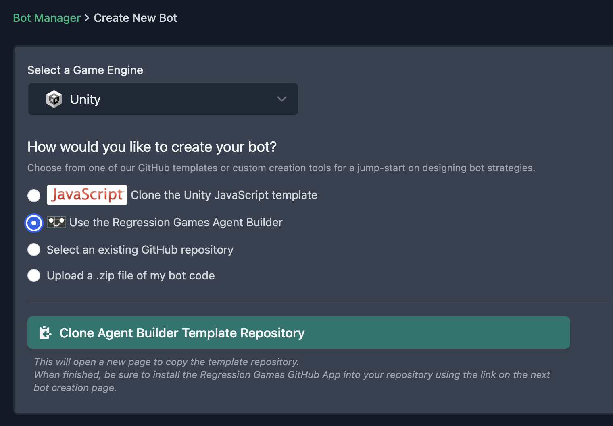
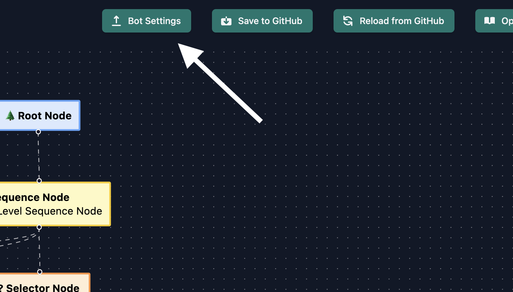
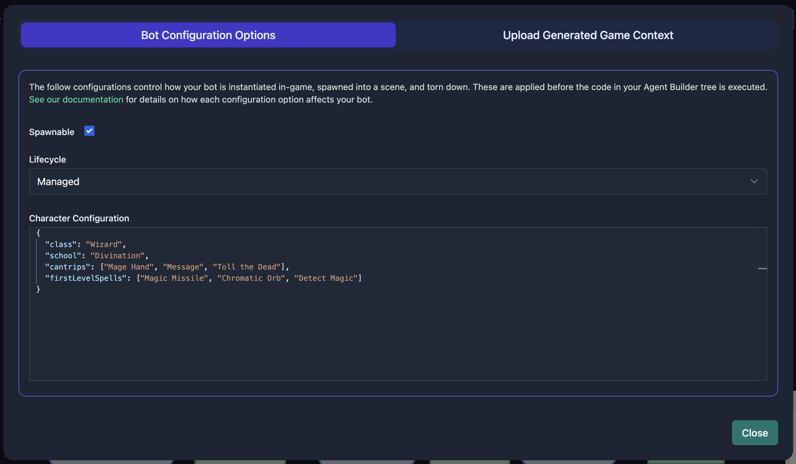
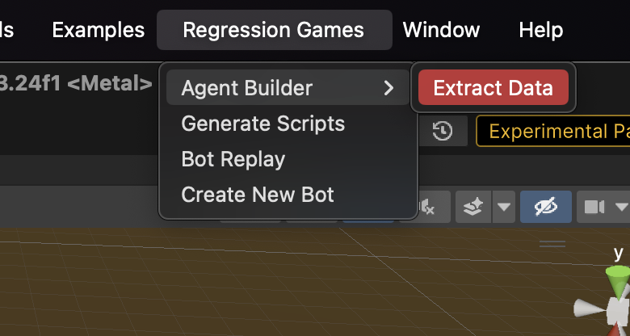
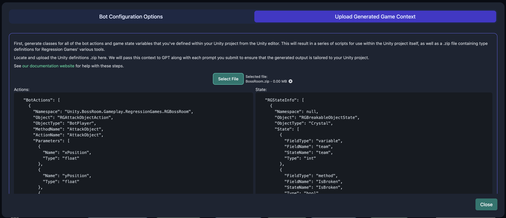
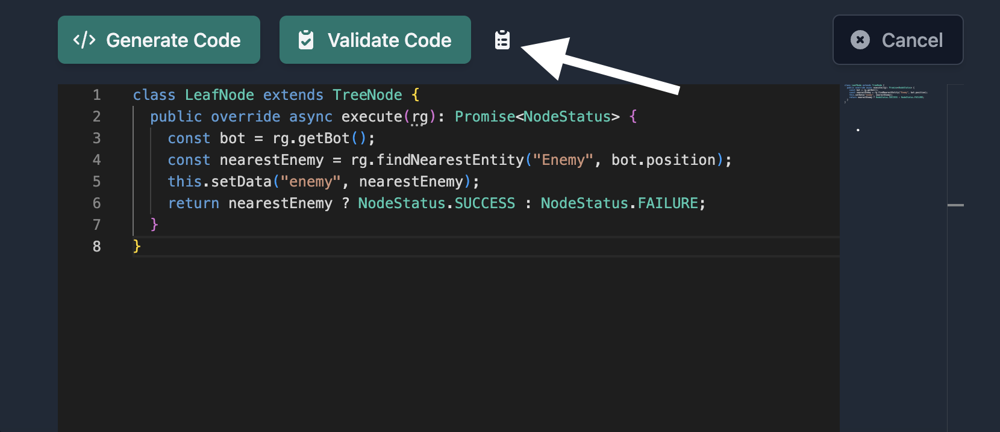

import BehaviorTree from '../../../../../common/agent-builder/_behavior-trees.md'
import LoadingYourTree from '../../../../../common/agent-builder/_loading-your-tree.mdx'
import AddingNodes from '../../../../../common/agent-builder/_adding-nodes.mdx'
import SavingYourTree from '../../../../../common/agent-builder/_saving-your-tree.mdx'

# Creating AIs Using the Agent Builder

Regression Games' Agent Builder is an easy-to-use visual editor for constructing AI behavior trees.
Our editor utilizes large language models like [OpenAI's GPT-4](https://openai.com/blog/chatgpt) to write code for you.
This makes the Agent Builder an excellent tool for writing bots as you familiarize yourself with your project's SDK integration.

:::note
This tool is early in development - it is prone to change and may contain bugs.
Please report issues and feature requests for the Agent Builder [here](https://regression-games.sleekplan.app/feedback).
:::

## What Is a Behavior Tree?

<BehaviorTree />

## Creating a Bot

Create a new AI from the Bot Manager and select `Agent Builder` from the list of creation options
(see this section on [Cloning a Starter Template](../../../../../players/creating-bots/starter-templates) to complete this step).




## Loading Your Tree

<LoadingYourTree />

## Getting Started with the Agent Builder

### Agent Builder and Your Game Integration

At its core, our Unity SDK revolves around defining actions that your bot can perform and defining
information about your game-state that the bot can analyze to make decisions. Actions and game-state information will be different
for every game, so Agent Builder requires some simple setup for your unique integration.

:::info
The Agent Builder is designed for the creation of [PlayTest bots](./playtest-bots), which form decisions every tick.
This means your Agent Builder tree will be executed once per game tick.

Performing actions through our SDK queues them to be handled within your game asynchronously.
This means a node in your tree will **not** wait for an action to complete before executing its next line of code.
To avoid interrupting previously-queued actions, it's a good idea to include flags in your state to indicate whether the bot is ready for new instructions.
:::


#### Bot Configuration

Click the "Bot Settings" button in the Agent Builder interface to access a range of important settings for your bot.
See the [Bot Configuration section](./configuration) for information on each setting and how it affects bot startup and teardown.
Bot configurations are applied at runtime before the first game-tick your tree is executed.




#### Saving Your Unity Context

From the Unity Editor, expand the "Regression Games" menu and select "Agent Builder > Extract Data".
This will save your Unity Context as a .zip to your top-level project directory.



In the Agent Builder, click the "Bot Settings" button, then select the .zip from the "Upload Generated Game Context" tab.



### Adding Nodes

<AddingNodes />

### Generating Code

:::note
All samples in this section are written in Typescript, which is the only language currently supported by the Agent Builder.
If you'd like to see support for other languages, like C#, let us know [here](https://regression-games.sleekplan.app/feedback).
:::

The nodes in your tree won't be useful until you give them some logic to execute.
Click on a leaf node to open the side-panel. You'll see the following stub provided in the code editor:

```javascript
class LeafNode extends TreeNode {
  public override async execute(rg): Promise<NodeStatus> {
    return NodeStatus.SUCCESS;
  }
}
```

:::info
All of your node's code must be defined within the `LeafNode` class, and the `execute` method must be defined as your entrypoint into the node.
You may encounter errors loading your AI into a game if these are not properly defined when you save your tree.
:::

You can either manually type code into the editor (see the [PlayTest Bots API](./playtest-bots)), or you can have GPT do the heavy lifting for you.
To generate code using GPT, describe what you want this node to do in the "GPT Prompt" field then click the "Generate Code" button.
The editor will be disabled as code appears, and you can modify the output once it's finished.

:::caution
Generating Code will overwrite anything currently in the editor. It's a good idea to save your tree before trying out new prompts.
:::

You may have many decision-making points and available actions depending on the complexity of your game,
so let's start with something simple.
Let's assume that an "Enemy" ObjectType is defined within our game and that the bot's character has the
"ApproachEntity" and "AttackEntity" actions.

If we enter the following prompt:
```text
If there is an Enemy within 10 square meters then approach them and store a reference to them
```

then GPT should output code similar to this:
```typescript
class LeafNode extends TreeNode {
  public override async execute(rg): Promise<NodeStatus> {
    const bot = rg.getBot();
    const enemy = await rg.findNearestEntity("Enemy", bot.position, (entity) => {
      return rg.MathFunctions.distanceSq(bot.position, entity.position) <= 10;
    });

    if (enemy) {
      rg.performAction("ApproachEntity", { targetId: enemy.id });
      this.setData("enemy", enemy);
      return NodeStatus.SUCCESS;
    }

    return NodeStatus.FAILURE;
  }
}
```

We can then enter another prompt in a separate node to complete our goal:
```text
Attack the stored enemy
```
```typescript
class LeafNode extends TreeNode {
  public override async execute(rg): Promise<NodeStatus> {
    const enemy = this.getData<RGEnemyState>("enemy");
    if (!enemy) {
      return NodeStatus.FAILURE;
    }
    rg.performAction("AttackEntity", { targetId: enemy.id });
    return NodeStatus.SUCCESS;
  }
}
```

The above outputs are good examples of how properly-formatted code should look when you're finished generating or writing it.

You may notice that these examples invoke the `getData` and `setData` methods.
These can be used to share data between nodes, and it's a good practice to specify a data type for `getData` to take advantage of the editor's Intellisense.

:::note
Classes to represent available state variables for entities are coming soon
:::

For instance:

```typescript
// you can define and retrieve your own key-value pairs
this.setData("myString", "Hello World");
const myString = this.getData<string>("myString");

this.setData("myBool", true);
const myBool = this.getData<boolean>("myBool");
```

Whenever you submit a prompt to GPT, we supplement it with context about your game's available actions and state attributes as well as our bot API.
However, large language models like GPT are still in their infancy and may output code that doesn't follow our expected format, or code that functions differently in-game than your prompt intends.
You may need to alter your prompt and re-submit it for new output when this happens, or you can fix the output manually.

### Validating Code

The embedded code editor offers standard syntax highlighting and Intellisense features for Regressions Games APIs.
To take this a step further, GPT can analyze code from the editor and provide suggestions for fixing syntax errors, bugs, and inefficiencies.
Clicking the "Validate Code" button will cause a text box to appear with GPT's analysis results.

Let's give this a try with some code that doesn't properly await one of our async APIs.

```typescript
class LeafNode extends TreeNode {
  public override async execute(rg): Promise<NodeStatus> {
    const bot = rg.getBot();
    const nearestEnemy = rg.findNearestEntity("Enemy", bot.position);
    this.setData("enemy", nearestEnemy);
    return nearestEnemy ? NodeStatus.SUCCESS : NodeStatus.FAILURE;
  }
}
```

Clicking the "Validate Code" button should cause GPT to warn us that `findNearestEntity` should be awaited if we want to capture the actual "Enemy" entity.


You can close validation results at any time and reopen them by clicking the clipboard icon.



## Saving Your Tree

<SavingYourTree />

## Editing an AI's source code

Whenever you save your tree, multiple files are pushed to GitHub - a config file named `agentBuilderWorkspace.json` which defines the nodes in your tree,
a `botConfig.json` which stores your bot configurations, an `actions.json` and `state.json` which define your Unity context,
and a series of typescript files generated from the workspace which are used to run your AI in-game.

```
├── lib
│   ├── BaseClasses
│   │   ├── **/*.ts
│   ├── **/*.ts
├── agentBuilderWorkspace.json
├── index.ts
├── actions.json
├── state.json
├── botConfig.json
├── package.json
├── tsconfig.json
└── .gitignore
```

You can modify these files in your favorite IDE for more control over the AI's behaviors and dependencies.
See our [PlayTest Bot API](./playtest-bots) for more information.

:::danger
Changes made to `index.ts`, `package.json`, `tsconfig.json` and `/lib` files
will be overwritten when you save the tree from the Agent Builder interface.
If you plan to modify files manually, it's a good idea to create a new GitHub repository to prevent losing your work.
:::
