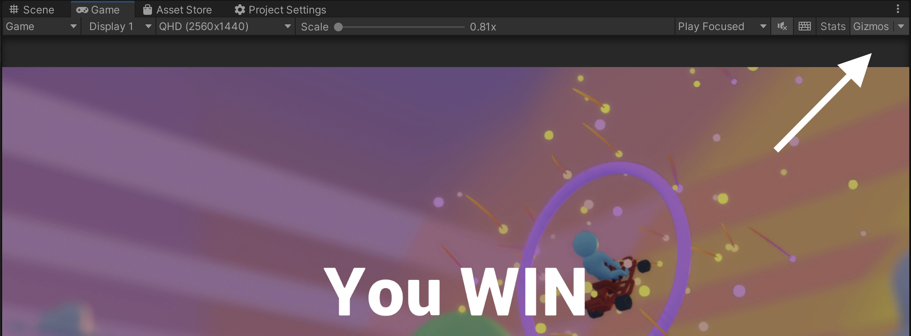

import Tabs from '@theme/Tabs';
import TabItem from '@theme/TabItem';

# Utilities for C# Bots

## RGGizmos

`RGGizmos` is a utility for drawing specific Gizmos and debug information within your Unity scene. It is
primarily a wrapper around Unity's built-in [Gizmos feature](https://docs.unity3d.com/ScriptReference/Gizmos.html),
but it also provides some additional functionality around text drawing and rendering Gizmos from the bot threads.
The RGGizmos library currently supports three main features:

* Drawing lines betweens entities and positions
* Drawing speheres at entities and positions
* Rendering billboard text above an entity 

**Skip to the end of the RGGizmos section to see a video of these in action.**

All methods below can be accessed via the `RGGizmos` variable in your `ProcessTick(RG rgObject)` method.

```csharp
public override void ProcessTick(RG rgObject)
{
    ...
    RGGizmos.CreateText(thisAgent.id, "Hello, World!");
    ...
}
```

:::caution

You must have Gizmos enabled to see these features. While in Play mode, you can turn on the Gizmos in the top-right of
the editor:



:::

### Drawing and Removing Lines

Drawing a line is as simple as calling `RGGizmos.CreateLine()` with the appropriate parameters. There are four overloaded
variants of this function, which allows you to indicate an combination entity/position start and ending locations for the
line. A color and name is also indicated (the name is used to delete specific lines later).

**`public void CreateLine(int startEntityId, Vector3 endPosition, Color color, string name)`**

**`public void CreateLine(Vector3 startPosition, int endEntityId, Color color, string name)`**

**`public void CreateLine(int startEntityId, int endEntityId, Color color, string name)`**

**`public void CreateLine(Vector3 startPosition, Vector3 endPosition, Color color, string name)`**


Argument Name | Type | Default | Description
---|---|---|---|
`startEntityId / startPosition` | `int / Vector3` | required | The id of the `RGStateEntity` to start the line, or a position within the scene to start the line.
`endEntityId / endPosition` | `int / Vector3` | required | The id of the `RGStateEntity` to end the line, or a position within the scene to end the line.
`color`| `Color` | required | The color of the line.
`name` | `string` | required | The name of the line. Used to remove the line later.

<Tabs>
<TabItem value="create_line_entity_entity" label="Line from entity to entity" default>

```csharp
var thisPlayer = rgObject.FindPlayers()[0];
var nextWaypoint = rgObject.FindEntities("waypoint")[0];
RGGizmos.CreateLine(thisPlayer.id, nextWaypoint.id, Color.green, "Next Waypoint Line");
```

</TabItem>
<TabItem value="create_line_entity_position" label="Line from entity to position" default>

```csharp
var thisPlayer = rgObject.FindPlayers()[0];
var somePoint = new Vector3(10, 20, 30);
RGGizmos.CreateLine(thisPlayer.id, somePoint, Color.blue, "Some location line");
```

</TabItem>
<TabItem value="create_line_position_entity" label="Line from position to entity" default>

```csharp
var thisPlayer = rgObject.FindPlayers()[0];
var somePoint = new Vector3(10, 20, 30);
RGGizmos.CreateLine(somePoint, thisPlayer.id, Color.green, "A cool line");
```

</TabItem>
<TabItem value="create_line_position_position" label="Line from position to position" default>

```csharp
var pointOne = new Vector3(0, 0, 0);
var pointTwo = new Vector3(10, 20, 30);
RGGizmos.CreateLine(pointOne, pointTwo, Color.green, "Points of interest");
```

</TabItem>
</Tabs>

You can then destroy these lines via their names, or simply destroy all lines.

**`public void DestroyLine(string name)`**

**`public void DestroyAllLines()`**

<Tabs>
<TabItem value="delete_a_line" label="Delete a specific line" default>

```csharp
var thisPlayer = rgObject.FindPlayers()[0];
var nextWaypoint = rgObject.FindEntities("waypoint")[0];
RGGizmos.CreateLine(thisPlayer.id, nextWaypoint.id, Color.green, "Next Waypoint Line");

// Later on...
RGGizmos.DestroyLine("Next Waypoint Line");
```

</TabItem>
<TabItem value="delete_all_lines" label="Delete all lines" default>

```csharp
var thisPlayer = rgObject.FindPlayers()[0];
var nextWaypoint = rgObject.FindEntities("waypoint")[0];
RGGizmos.CreateLine(thisPlayer.id, nextWaypoint.id, Color.green, "Next Waypoint Line");

// Later on...
RGGizmos.DestroyAllLines();
```
</TabItem>
</Tabs>

### Drawing and Removing Spheres

Drawing a sphere is as simple as calling `RGGizmos.CreateSphere()` with the appropriate parameters. There are two overloaded
variants of this function, which allows you to indicate an entity or position to draw the sphere at. A color, radius, and name
is also indicated (the name is used to delete specific spheres later).

**`public void CreateSphere(int entityId, Color color, float size, bool isWireframe, string name)`**

**`public void CreateSphere(Vector3 position, Color color, float size, bool isWireframe, string name)`**

Argument Name | Type | Default | Description
---|---|---|---|
`entityId / position` | `int / Vector3` | required | The id of the `RGStateEntity` to draw the sphere at, or a position within the scene to draw the sphere at.
`color`| `Color` | required | The color of the sphere.
`size`| `float` | required | The size of the sphere.
`isWireframe`| `bool` | required | Whether or not the sphere is wireframe (if false, it will be solid).
`name` | `string` | required | The name of the sphere. Used to remove the sphere later.

<Tabs>
<TabItem value="create_sphere_entity" label="Sphere at entity" default>

```csharp
var thisPlayer = rgObject.FindPlayers()[0];
RGGizmos.CreateSphere(thisPlayer.id, Color.green, 0.5f, true, "Player Sphere");
```

</TabItem>
<TabItem value="create_sphere_position" label="Sphere at position" default>

```csharp
var somePoint = new Vector3(10, 20, 30);
RGGizmos.CreateSphere(somePoint, Color.blue, 0.5f, true, "Some location sphere");
```

</TabItem>
</Tabs>

You can then destroy these spheres via their names, or simply destroy all spheres.

**`public void DestroySphere(string name)`**

**`public void DestroyAllSpheres()`**

<Tabs>
<TabItem value="delete_a_sphere" label="Delete a specific sphere" default>

```csharp
var thisPlayer = rgObject.FindPlayers()[0];
RGGizmos.CreateSphere(thisPlayer.id, Color.green, 0.5f, true, "Player Sphere");

// Later on...
RGGizmos.DestroySphere("Player Sphere");
```

</TabItem>
<TabItem value="delete_all_spheres" label="Delete all spheres" default>

```csharp
var thisPlayer = rgObject.FindPlayers()[0];
RGGizmos.CreateSphere(thisPlayer.id, Color.green, 0.5f, true, "Player Sphere");

// Later on...
RGGizmos.DestroyAllSpheres();
```
</TabItem>
</Tabs>


### Drawing Text

Drawing text is as simple as calling `RGGizmos.CreateText()` with the appropriate parameters. It allows you to draw
text above an entity which always faces the camera.

**`public void CreateText(int entityId, string text, float yOffset = 2.0f)`**

Argument Name | Type | Default | Description
---|---|---|---|
`entityId` | `int` | required | The id of the `RGStateEntity` to draw the text above.
`text`| `string` | required | The text to draw above the entity.
`yOffset` | `float` | optional | The offset in the y direction to draw the text above the entity. Defaults to 2.

<Tabs>
<TabItem value="create_text" label="Text above entity" default>

```csharp
var thisPlayer = rgObject.FindPlayers()[0];
RGGizmos.CreateText(thisPlayer.id, "Hello, World!");
```

</TabItem>
<TabItem value="create_text_offset" label="Text above entity (with offset)" default>

```csharp
var thisPlayer = rgObject.FindPlayers()[0];
RGGizmos.CreateText(thisPlayer.id, "Hello, World, but higher!", 5.0f);
```

</TabItem>
</Tabs>

You can then destroy this text via the entity id, or by deleting all of the texts drawn so far.

**`public void DestroyText(int entityId)`**
**`public void DestroyAllTexts()`**

<Tabs>
<TabItem value="delete_text" label="Delete text" default>

```csharp
var thisPlayer = rgObject.FindPlayers()[0];
RGGizmos.CreateText(thisPlayer.id, "Hello, World!");

// Later on...
RGGizmos.DestroyText(thisPlayer.id);
```

</TabItem>

<TabItem value="delete_all_text" label="Delete all text" default>

```csharp
var thisPlayer = rgObject.FindPlayers()[0];
RGGizmos.CreateText(thisPlayer.id, "Hello, World!");

// Later on...
RGGizmos.DestroyAllTexts();
```

</TabItem>
</Tabs>

:::caution

Because these billboard text objects are not using the Unity Gizmos framework, they will still be present in the scene
if you create them and then turn off Gizmos. If you want to remove them, you must call `DestroyAllTexts()`.

:::

### Putting it all together

Let's put this all together! Here is a snippet of code from the a bot written for Unity's Kart Racer sample. This demonstrates
creating lines, spheres, text, and removing some of these elements.

```csharp
// Inside of processTick()

counter++; // We keep a counter so we can keep track of the gizmos we draw
var thisAgent = rgObject.FindPlayers()[0];
var nextWaypoint = ...; // We grab the RGStateEntity for the next waypoint our racer should follow
var distance = ...; // Calculate some parameters we want to debug and show

RGGizmos.CreateLine(thisAgent.id, nextWaypoint.position, Color.green, "Next Waypoint Line" + counter);
RGGizmos.CreateSphere(nextWaypoint.position,  Color.red, 0.3f, true, "Next Waypoint Spot" + counter);
RGGizmos.CreateText(thisAgent.id, $"Distance: {distance}");

// Only keep the four latest lines and spheres
if (counter > 4)
{
    RGGizmos.DestroyLine("Next Waypoint Line" + (counter - 4));
    RGGizmos.DestroySphere("Next Waypoint Spot" + (counter - 4));
}
```


<div style={{position: "relative", paddingBottom: "63.454759106933025%", height: 0}}><iframe src="https://www.loom.com/embed/a4a7692ac2704e148edf988600f6cbe5?sid=e8a74c95-0d15-4ac4-b432-8d896424b713" frameborder="0" webkitallowfullscreen mozallowfullscreen allowfullscreen style={{position: "absolute", top: 0, left: 0, width: "100%", height: "100%"}}></iframe></div>