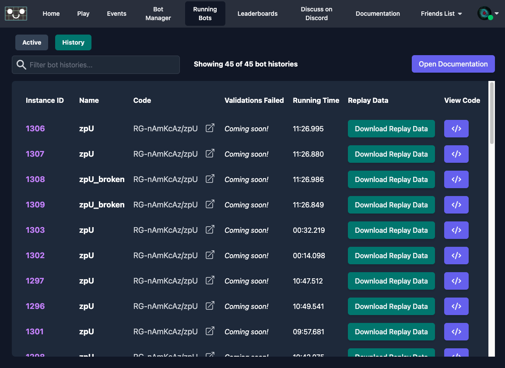
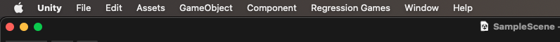
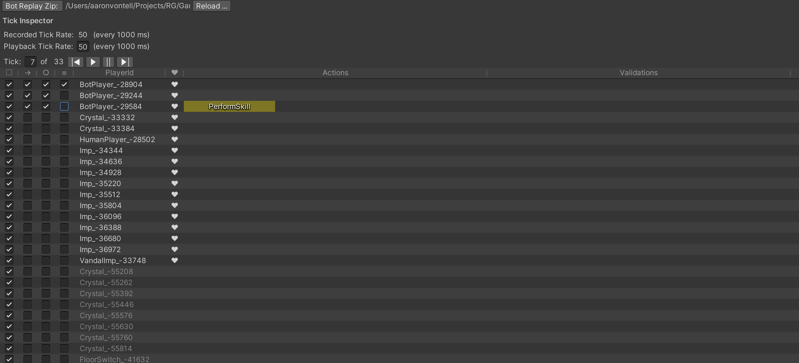

# Replaying Bot Behaviors in the Unity Editor

Bots running on Regression Games save all states observed, all actions sent, and all validations performed.  This data can be loaded in the editor for visualization and playback in the scene. This feature, combined with our validation framework, allows you to find and debug specific errors within your game.

## Downloading the Replay Data

At the end of a Bot's lifecycle, the replay data for every game tick processed by that bot is saved into a single Zip file.  This file can be downloaded from the `History` section of the `Running Bots` tab in the Regression Games client.  Click the `Download Replay Data` button for the Bot instance you want to download.  This will download a file named `rg_bot_replay_data-<botInstanceId>.zip`.

## The Bot Replay Window

### Opening the Bot Replay Window 
With the Regression Games SDK installed in your Unity Editor Project, you can open the Regression Games `Bot Replay Window` from the `Regression Games` menu in the top bar.

### Loading your scene
The Bot Replay Window will render the game replay state in the currently loaded editor scene.  For the best experience, make sure your gameplay scene is loaded in the editor so that all fixed scene assets will be visible and line up with the replay data.

**Note:** _This replay process will dynamically create objects within the currently loaded scene.  Don't worry!  These objects will automatically be removed when running, saving, or building the scene.  You may occassionally be prompted to save the scene because it has been changed.  It is safe to save; the Bot replay objects will be removed from the scene before the save processes._

### Loading the replay data
The first step in using the Bot Replay Window is loading the replay data Zip file.  Click the `Bot Replay Zip:` button in the top left of the window.  This will open a file chooser window.  Choose the `rg_bot_replay_data-<botInstanceId>.zip` file you downloaded from the Regression Game Client.

### Tick Inspector: Controlling the current tick
After loading the file, the data for all game ticks will be available for replay.  

The tick rate at which the data was recorded is shown, followed by the tick rate for playback.  By default, the playback tick rate will match the recorded tick rate, but it can be modified for faster or slower plaback.

The current tick and the total tick count are shown next to buttons for controlling the replay.  You can Play the replay which will automatically update the editor at the playback tick rate.  You can also manually jump to a specific tick number, or manually step forward or back 1 tick at a time.

### Tick Inspector: Evaluating the current tick
For each tick, the Bot Replay Window will show all objects that were tracked as part of the Game State sent to Regression Games.  These are sorted alphabetically with any objects controlled by Regression Games Bots and any active objects listed first.

For each object in the tick, you can use the checkboxes to enable or disable rendering its information in the scene
- Enable or disable rendering of that object model
- Enable or disable renderingthe path history of that object
- Enable or disable rendering a targeting circle around that object
- Enable or disable rendering action information of that object

By default, all 4 checkboxes are enabled for the object of the botInstance that the replay data was recorded from.

In addition to controlling rendering, the tick inspector also highlights and shows a heart icon for  objects that are active in the current tick.

### Tick Inspector: Actions and Validations
For the object in the tick representing the botInstance that the replay data was recorded from, there can also be actions and validations shown.

#### Actions
Shows any command(s) that the bot sent to the game for the current tick.  These could be movement, ability actions, object interactions, etc

#### Validations
Shows any validation(s) that the bot performed on the current tick.  These are normally test cases coded into the bot to validate that the tick data changed as expected based on prior actions or other factors in the game state.

### Registering custom models for replay objects
... Coming Soon ...
