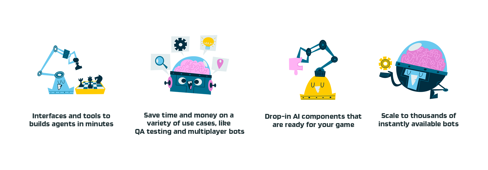

# Regression Games for Unity

Regression Games is developing a platform where studios can **build and deploy bots for a variety of use cases in minutes.** We are designing for scale (deploy thousands of bots), ease of use (e.g. generative AI to build bots), ease of integration (minimal impact on game development time), and feature richness (e.g. A/B bot test for engagement).

## Current Stage of the Product

This product is currently a **release preview**. We are actively talking with studios and game developers to discover the best features and use cases to tackle, and we're making changes frequently. That being said, we do have
a set of initial features and documentation that you can try now - we would absolutely love to get your [feedback](https://regression-games.sleekplan.app/feedback).

The team has focused on the foundation of supporting use cases and initial infrastructure to get bots to connect to Unity. The bulk
of our value will come from the interfaces to build bots, the scale of our infrastructure, the speed of integration, and the products
built around these bots.

## SLAs and General Support

The Regression Games team offers the following SLAs for our initial testing with developers. Additionally, we have a dedicated Discord
server for support, and can also create a Slack Connect channel, giving you direct access to our entire team. For access to
these channels, send an email to [aaron@regression.gg](mailto:aaron@regression.gg).

### Service Level Agreements

* A single account can run at least 10 bots concurrently
* The time from requesting a bot to be started to the time it connects to Unity will take less than 10 seconds if the bot is relying on dependencies that are common to most bots. This SLA does not cover bots that may have lots of dependencies.

## Implemented Features

The table below details and links to documentation for the features implemented on our platform. You can provide feedback on these
features on our [feedback site](https://regression-games.sleekplan.app/feedback).

| **Feature**                    | **Description**                                                                                                                   | **Documentation** |
|--------------------------------|-----------------------------------------------------------------------------------------------------------------------------------|-------------------|
| Unity Integration              | A set of scripts and interfaces are provided to easily send state and actions between bots and your game objects                  | [Link](./RGBotSpawnManager)       |
| Timeline/Replay                | All bot actions and states are preserved, with a timeline/replay feature available within Unity                                   | [Link](./in-editor-replay)       |
| JavaScript SDK                 | A JavaScript SDK for implementing bots                                                                                            | [Link](./creating-bots/configuration)       |
| Live Reloading                 | Reload bots almost instantly without rebuilding your game, managed via GitHub                                                     | _Docs coming soon_       |
| Bot Code Generation            | _Only available in Minecraft, see proposals_. Create bots with low-code tools such as behavior trees powered by GPT.              | [Link](../../../players/creating-bots/agent-builder)       |
| Platform and Language Agnostic | Our protocol permits bots to eventually be written in multiple engines and languages. Vote for support in the feedback link above. | _Docs coming soon_       |