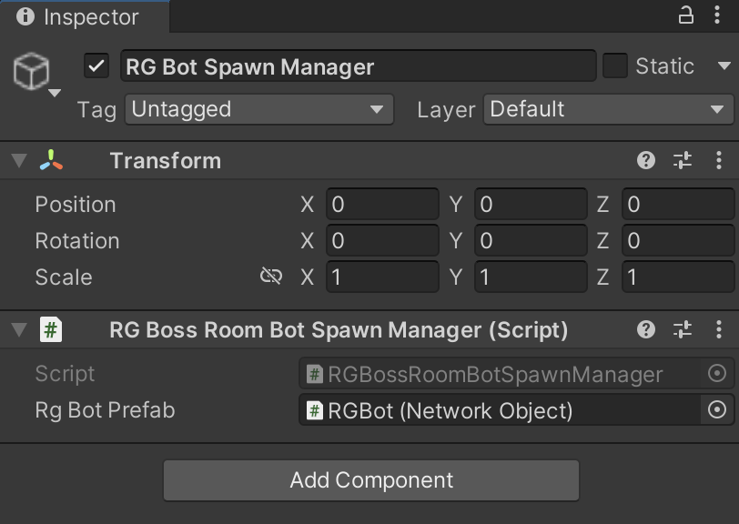
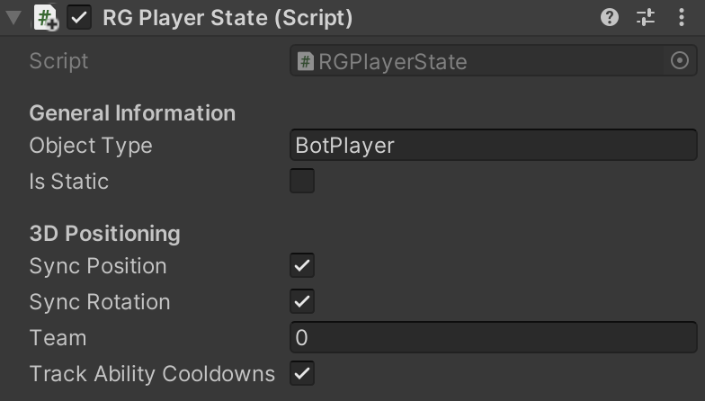

# Setup and Integration

The Regression Games Unity SDK provides tools for relaying state and action information between your
bots and the game logic. The package includes a variety of components, scripts, prefabs, and editor
tools to make this integration easy and seamless.

## Setting up the SDK configuration

### Step 1. Attaching the RG Bot Manager

The first step to enabling Regression Games within Unity is to add the `RGBotSpawnerManager` component to your scene.
You can do this by creating an empty GameObject at the root of your scene, and adding the `RGBotSpawnerManager` script
to this prefab.



You will also need to drag and drop an `RG Bot Prefab`, which is the prefab that gets spawned for a bot connected
to Regression Games.

### Step 2. Attach `RGState` objects to relevant objects

Any object or concept within the game whose state you want the bot to see should have an `RGState` component
attached to it. By default, this state will include the following:

* The position of the object
* The rotation of the object
* The tag of the object (which can be set within the editor)



Within your bot's code, it will then be possible to do operations such as "find me the closest enemy".

It is often necessary to attach additional information to this state - a player's health, the state of a switch
being on or off, an ability cooldown, etc... This can be done by extending the RGState class to include that
additional information via the `GetCustomState()` function. For example, here is a custom state for a lever
within our game, which can be on or off. Notice how it accesses other components within the game object to
derive the state.

```csharp
public class RGSwitchState: RGState
{

    private FloorSwitch m_FloorSwitch;

    public void Start()
    {
        m_FloorSwitch = GetComponent<FloorSwitch>();
    }

    public override Dictionary<string, object> GetCustomState()
    {
        var state = new Dictionary<string, object>();
        state["isOn"] = m_FloorSwitch.IsSwitchedOn.Value;
        return state;
    }

}
```

### Step 3. Define your bot actions

