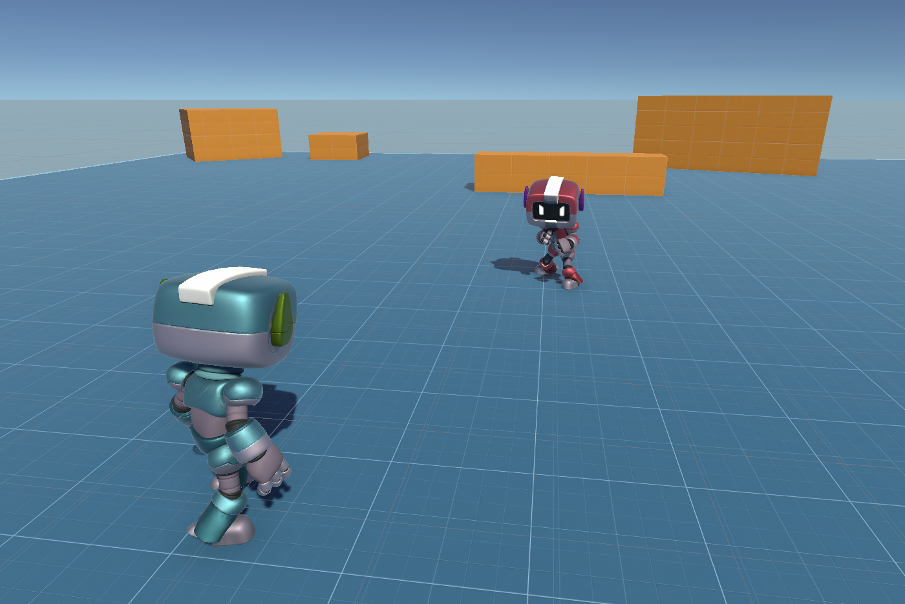
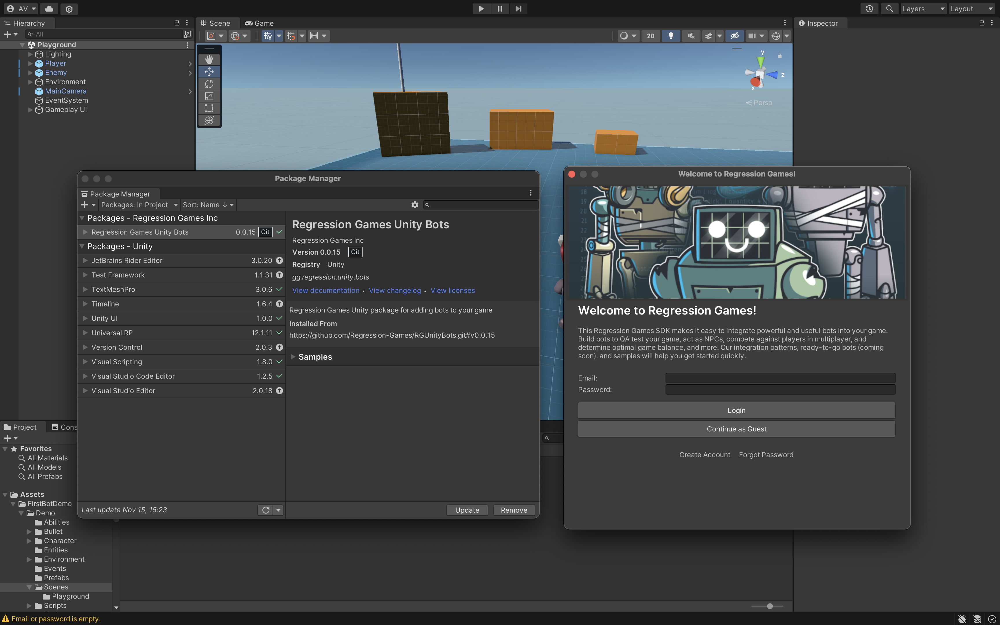
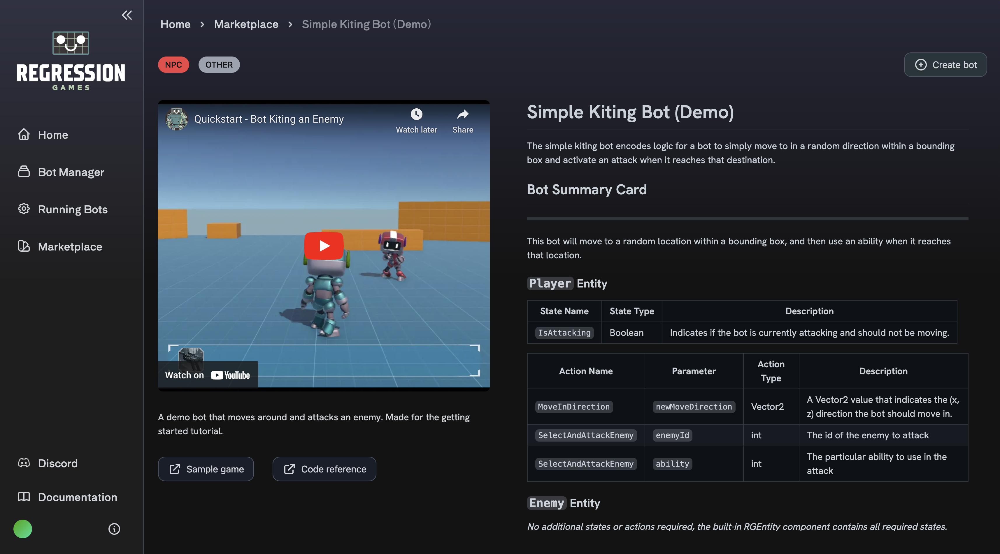
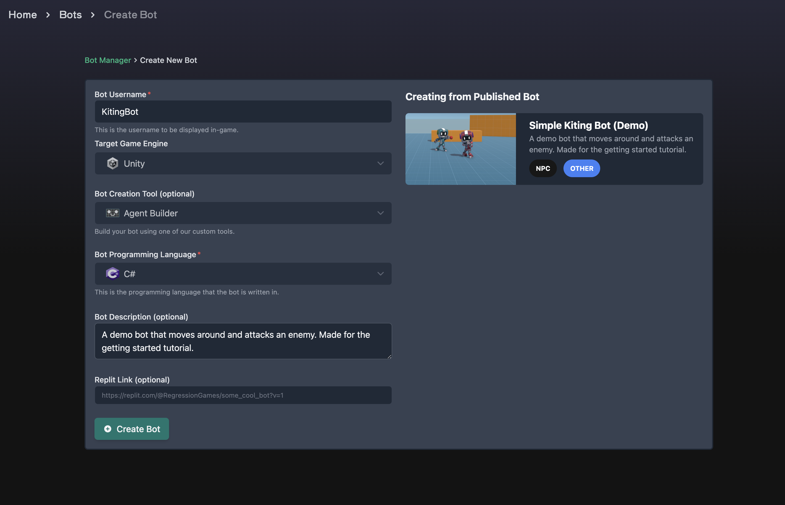
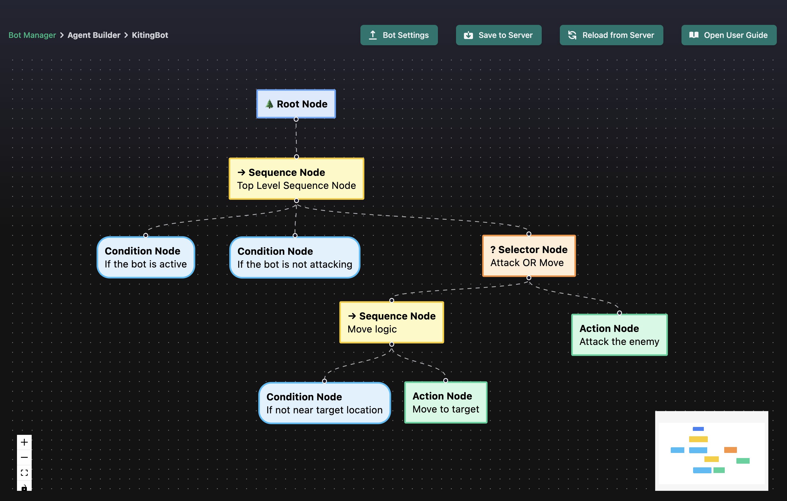
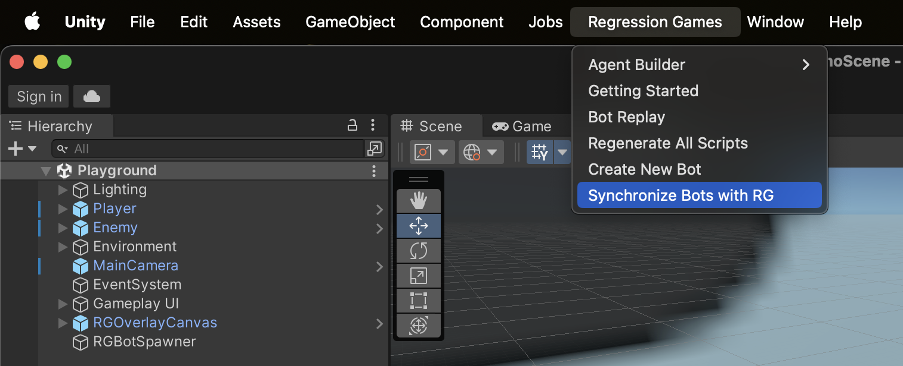
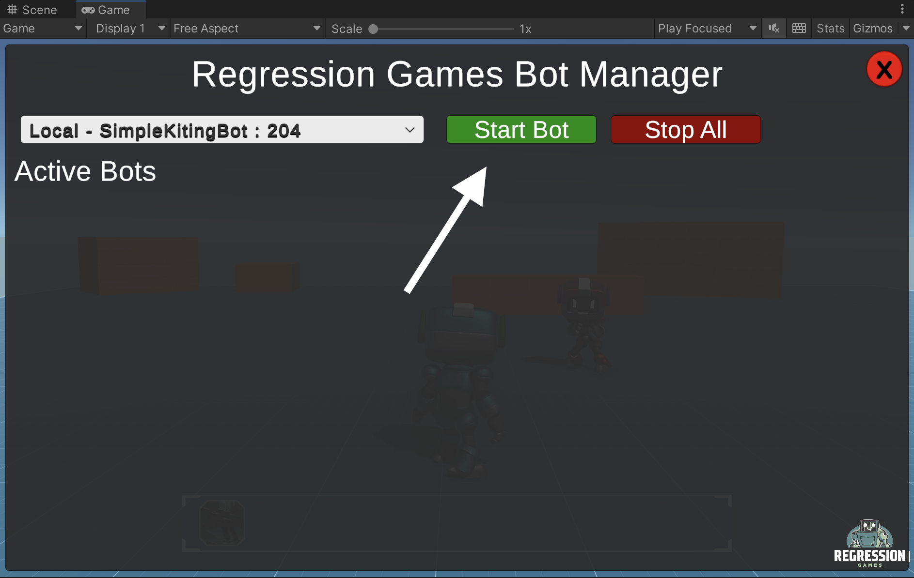

import OverlayPartial from '../partials/_add-overlay-partial.mdx';

# Integrating and Building Your First Bot

:::info

This tutorial assumes a basic understanding of Unity concepts. If you get stuck, join our [Discord](https://discord.com/invite/925SYVse2H) and we can help you out!

:::

In this tutorial, we will get a simple bot integrated and running in a Unity game. The bot will run to a random position and then
shoot the enemy in our playground sample. This tutorial will cover:

- How to integrate the RG Unity SDK into your game
- How to add various state and actions attributes so your bot can understand the game
- How to use a ready-to-go bot from the Bot Marketplace, and how to modify its code

<div style={{position: "relative", paddingBottom: "50.40485829959515%", height: 0}}><iframe src="https://www.loom.com/embed/c4a31389df6742ba9320bf7dc0e91739?sid=336eaf3b-208c-4ea3-a0b3-c6ad3d2d2cee" frameborder="0" webkitallowfullscreen mozallowfullscreen allowfullscreen style={{position: "absolute", top: 0, left: 0, width: "100%", height: "100%"}}></iframe></div>

## Download the sample game

Feel free to follow this tutorial within your own game, but we recommend starting with a simple sample game. Clone the project
from the [Regression-Games-Marketplace/SampleDemoScene](https://github.com/Regression-Games-Marketplace/SampleDemoScene.git) GitHub repository.

```
git clone https://github.com/Regression-Games-Marketplace/SampleDemoScene.git
```

Open it within Unity version 2021.3.24f1 (visit the [Unity archive](https://unity.com/releases/editor/whats-new/2021.3.24) if 
you can't find that version from Unity Hub). Once the project is loaded, a default scene with bots in a playground should open. If it does not, 
then find the **Playground** scene under **Assets** > **FirstBotDemo** > **Demo** > **Scenes** and open it manually. If you'd like, you can 
click play now to see how the characters move.



## Import the Regression Games Unity Bots package

You can find [our package on GitHub](https://github.com/Regression-Games/RGUnityBots). Import the package into your Unity project by opening 
the **Package Manager** window (**Window** > **Package Manager**) and click **Add package from git URL**. Then, paste the following URL:

```
https://github.com/Regression-Games/RGUnityBots.git?path=src/gg.regression.unity.bots
```

:::info

- This package utilizes TextMeshPro.  If you are prompted by Unity to add TextMeshPro assets to your project, please add them.
- This package installs a dependency of Newtonsoft Json (https://docs.unity3d.com/Packages/com.unity.nuget.newtonsoft-json@3.1/manual/index.html) for serializing/deserializing Json message payloads.
- If you get a note about Unity's new input system, click **Yes** and allow the editor to restart.

:::



After importing the package, you will be greeted by a login screen. Create an account at
[https://play.regression.gg](https://play.regression.gg) and login to Unity with your account credentials. If you need to login again in the future, 
you can enter your login info by visiting the **Edit** > **Project Settings** > **Regression Games** menu.

## Restart Unity and your IDE

After installing the Regression Games Unity Bots package and its dependencies into Unity, please restart Unity 
and your code editor (e.g. Rider or Visual Studio). Without this step, Unity and your code editor may not properly 
resolve the new packages even after Unity recompiles the scripts.

## Add the RGOverlayCanvas

The RGOverlayCanvasV2 prefab provides a drag and drop overlay that lets you easily start and stop bots running
in your scene. This is useful when initially creating and debugging your bots.

<OverlayPartial />

## Using a ready-to-go bot from the Bot Marketplace

Now that the SDK integration is complete, our final step is to use an implementation of a bot. We will start with a template
found in our [Bot Marketplace](https://play.regression.gg/marketplace), and then will show you where to edit its code.

Find the [Simple Kiting Bot in the Bot Marketplace](https://play.regression.gg/marketplace/1) and click "Create Bot" to copy 
it to your Regression Games account. On the bot creation page, give it a name such as "KitingBot", and then click "Create Bot". 
You will then be taken to the Agent Builder tool; feel free to click around and see how the bot works!







Go back to Unity, and within the **Regression Games** menu in the menu bar, click **Synchronize Bots with RG**. This will pull your new
bot into your Unity project. 



At this point, you can click play, and then select the Regression Games overlay button in the bottom
right of your Scene View. Use the dropdown to select the bot you just created, and then click "Start Bot". The bot will begin to
run around and shoot the enemy!



You now have a working bot, fully integrated into your game! If you want to modify the bot's behavior, you can make edits
within the Agent Builder, or edit the code in your Unity project at `Assets/RegressionGames/Runtime/Bots/BOTNAME/Nodes`.

## Next Steps

Congratulations, you've now experienced the integration process for bots! Using this guide and our reference material,
you can now integrate bots into your own game. If you have any questions, please reach out to us on our 
[Discord](https://discord.com/invite/925SYVse2H). Please note that we offer **dedicated support** for your integration. 
We are happy to work directly on your project with you, or walk you step-by-step through the integration process over a
call.

The following guides and references are great next steps:

* Check out the [bot marketplace](https://play.regression.gg/marketplace) to see what bots are available for your game
* Learn how to build your own bot using the [Agent Builder](/creating-bots/csharp/agent-builder)
* Learn how to setup a [QA / validation testing bot](/session-insights/client-dashboard)
* Learn how to get your bot up and running in a [CI/CD environment such as GitHub Actions](/tutorials/github-actions)