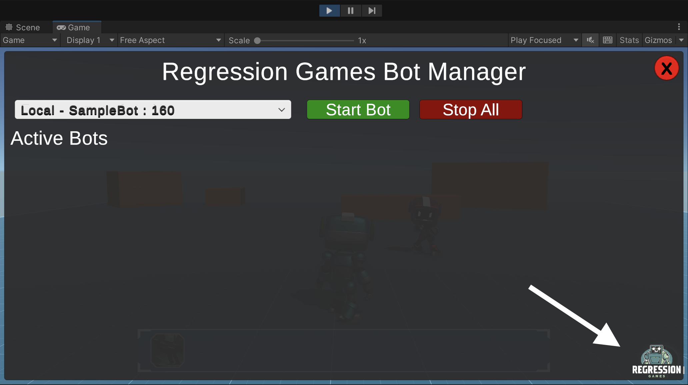
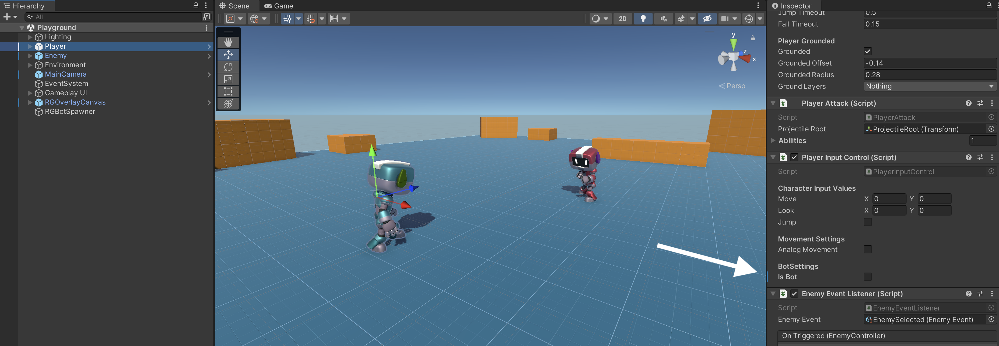

# Integrating and Building Your First Bot

:::info

This tutorial assumes a basic understanding of Unity concepts. If you get stuck, join our [Discord](https://discord.com/invite/925SYVse2H) and we can help you out!

:::

In this tutorial, we will get a simple bot integrated and running in a Unity game. The bot will run to a random position and then
shoot the enemy in our playground sample. This tutorial will cover:

- How to integrate the RG Unity SDK into your game
- How to add various state and actions attributes so your bot can understand the game
- How to use a ready-to-go bot from the Bot Marketplace, and how to modify its code

<div style={{position: "relative", paddingBottom: "50.40485829959515%", height: 0}}><iframe src="https://www.loom.com/embed/c4a31389df6742ba9320bf7dc0e91739?sid=336eaf3b-208c-4ea3-a0b3-c6ad3d2d2cee" frameborder="0" webkitallowfullscreen mozallowfullscreen allowfullscreen style={{position: "absolute", top: 0, left: 0, width: "100%", height: "100%"}}></iframe></div>

## Download the sample game

Feel free to follow this tutorial within your own game, but we recommend starting with a simple sample game. Clone the project
from the [Regression-Games-Marketplace/SampleDemoScene](https://github.com/Regression-Games-Marketplace/SampleDemoScene.git) GitHub repository
and open it within Unity version 2021.3.24f1 (visit the [Unity archive](https://unity.com/releases/editor/archive) if 
you can't find that version).

```
git clone https://github.com/Regression-Games-Marketplace/SampleDemoScene.git
```

Once the project is loaded, a default scene with bots in a playground should open. If it does not, open the **Playground**
scene by double clicking the scene file at **Assets > FirstBotDemo > Demo > Scenes**. If you'd like, click play and use the WASD
keys to move around the character.


## Import the Regression Games Unity Bots package

Our package is available on GitHub [here](https://github.com/Regression-Games/RGUnityBots). Import the repository by 
clicking **Add package from git URL** in the **Package Manager** window (this window can be opened
in the **Window > Package Manager** menu) and pasting in the following URL.

```
https://github.com/Regression-Games/RGUnityBots.git#v0.0.17
```

- Note that this package utilizes TextMeshPro.  If you are prompted by Unity to add TextMeshPro assets to your project, please add them.
- Note that this package installs a dependency of Newtonsoft Json (https://docs.unity3d.com/Packages/com.unity.nuget.newtonsoft-json@3.1/manual/index.html) for serializing/deserializing Json message payloads.
- If you get a note about Unity's new input system, click **Yes** and allow the editor to restart.


After importing the package, you will be greeted by a login screen. Create an account at
[https://play.regression.gg](https://play.regression.gg) and login to Unity with your account credentials. If you need to login again in the future, 
you can enter your login info by visiting the **Edit** > **Project Settings** > **Regression Games** menu.

## Restart Unity and your IDE

After installing the Regression Games Unity Bots package and its dependencies into Unity, please restart Unity and your IDE.  Without this step, your IDE may not properly resolve the new packages even after Unity recompiles the scripts.

## Add the RGOverlayCanvas

The RGOverlayCanvas prefab provides a drag and drop overlay that lets you easily start and stop bots running
in your scene. This is extremely useful when initially creating and debugging your bots.

:::caution

Note that this overlay **must be present in your scene** for Regression Games to function. The visibility
of the overlay can be hidden through the settings. If you have multiple scenes where you want bots to run, then place
this into each scene - the SDK will ensure that only one instance is present.

:::

You can find this prefab by searching in the project file window for `RGOverlayCanvas` (make sure the "In Packages" filter is selected),
or by navigating to the **Packages** > **Regression Games Unity Bots** > **Runtime** > **Prefabs** folder. Drag this overlay onto your 
scene in the object hierarchy.


Once you have this overlay available, you can click play to see it in action! The
Regression Games logo will appear at the bottom of your screen. Click this button to see a dropdown for your bots. You
likely will not have any bots yet - that's alright, we will make one soon!

:::info

If you don't already, your **scene needs to have an EventSystem** to make interaction with the canvas possible.
You can do this by right-clicking your scene in the Hierarchy, and adding a **GameObject** > **UI** > **Event System**.
_You only need to do this if you plan on interacting with the canvas_.

:::



## Implement the RGBotSpawnManager

The [RGBotSpawnManager](/integrating-with-unity/seating-and-spawning-bots) is the primary point of configuration for how your bots are spawned into the game. This component
provides a few methods that can be overridden to control how bots are spawned into the scene, how they are seated into
your game logic before spawning, how they are destroyed, etc. For this particular tutorial, we need to define one
method, [`SpawnBot()`](/integrating-with-unity/seating-and-spawning-bots#canbenull-public-abstract-gameobject-spawnbotbool-latejoin-botinformation-botinformation). 
This method will define how our bot prefab is spawned into the scene.

First, create a `RegressionGames/Runtime/` folder in your `Assets` folder. Then, create a file called `CharacterBotSpawnManager.cs`.
Double click that file to open it within your editor of choice (we recommend Rider or Visual Studio). We highly recommend
that the file is opened as part of the solution / project as a whole, so that code completion is available.

Copy and paste the following code into this file. This component allows us to drag and drop a prefab for our bots and
a spawn point directly within our editor, and informs our SDK of these via those overridden functions.

See the [full reference](/integrating-with-unity/seating-and-spawning-bots) for all the ways you can modify 
the spawning of bots. Sometimes you may need to add this
bot to a multiplayer network protocol, configure information like the character type, or define special start logic.
This can all be done through the interface provided by `RGBotSpawnManager`.

```cs
using UnityEngine;

using RegressionGames;
using RegressionGames.Types;

public class CharacterBotSpawnManager : RGBotSpawnManager
{
    
    // Expose a field in the editor for the prefab to spawn as a bot
    [SerializeField]
    [Tooltip("The character to spawn")]
    private GameObject rgBotPrefab;

    // Expose a field in the editor to define where the bot should spawn
    [SerializeField]
    [Tooltip("Spawn point for RG Bots")]
    private Transform botSpawnPoint;

    public override GameObject SpawnBot(bool lateJoin, BotInformation botInformation)
    {
        // Loads the bot prefab and spawns it into the scene
        var bot = Instantiate(rgBotPrefab, Vector3.zero, Quaternion.identity);
        bot.transform.position = botSpawnPoint.position;
        return bot;
    }
    
    void Start()
    {
        // Prepares the RG SDK for spawning bots
        RGBotServerListener.GetInstance()?.StartGame();
        RGBotServerListener.GetInstance()?.SpawnBots();
    }

    private void OnDestroy()
    {
        // Stops all bots and cleans up the RG SDK
        RGBotServerListener.GetInstance()?.StopGame();
    }

}
```

Once this component is implemented, create an empty object within the scene, rename it to `RGBotSpawner` (just so we can find it later),
and attach this `CharacterBotSpawnManager` component to the `RGBotSpawner`. Position the `RGBotSpawner` within the scene wherever you want your bot to spawn 
(**make sure to set the Y coordinate to 0 so your bot does not float!**), and drag `RGBotSpawner`'s own Transform into the 
**Bot Spawn Point** entry of the RGBotSpawner's `CharacterBotSpawnManager` component. Finally, find the 
**Player** prefab under `Assets > FirstBotDemo > Demo > Prefabs` and drag 
it into the **Rg Bot Prefab** entry. Regression Games now knows how to load and unload bots from your scene! Make sure to save the 
scene.


## Add state information to relevant GameObjects

We are onto the final parts of the integration! We need to indicate the following within our game:

* What game state our bots can see
* What actions our bots can perform

First, let's define some state information. Regression Games marks states for bot consumption using the 
[`[RGState]` attribute](/integrating-with-unity/defining-states#3---rgstate-fieldpropertymethod-attribute).
This attribute can be applied to any public method that returns a value or any variable within a `MonoBehaviour`, and
it will automatically be sent to the bot.

First, open the `Assets/FirstBotDemo/Demo/Scripts/Player/PlayerAttack.cs` file, and add the following method to the class. This
will allow our bot to know when it is currently in an attack animation (make sure to import any missing imports, with
`using RegressionGames;`):

```csharp
[RGState]
public bool IsAttacking()
{
    return !string.IsNullOrEmpty(_attackAnimation) && _animator.GetBool(_attackAnimation);
}
```

Then, within the `Assets/FirstBotDemo/Demo/Scripts/EnemyController.cs` file, add the following attributes to the existing `GetCurrentHp()`
and `GetTotalHp()` methods:

```csharp
/*
* Gets the enemies current hp
*/
[RGState("CurrentHealth")]
public int GetCurrentHp()
{
    return _currentHp;
}

/*
* Gets the enemy's total HP from its assigned info
*/
[RGState("MaxHealth")]
public int GetTotalHp()
{
    if (!enemyInfo)
    {
        Debug.LogWarning($"{gameObject.name} is missing entity info. Please check the inspector and assign missing fields");
        return default;
    }
    return enemyInfo.hp;
}
```

That's it! The bot will now be able to see the current and max
health of the enemy, and whether or not the player is attacking. See the full [state documentation](/integrating-with-unity/defining-states)
for more information on defining states within your game.

## Implement actions your bot can take

Similar to states, we will now tag the actions that a bot can take, using [`[RGAction]`](/integrating-with-unity/defining-actions). In our case, a bot can either move or attack.

Open the `Assets/FirstBotDemo/Demo/Scripts/Player/PlayerInputControl.cs` file, and replace its contents with the following.
This change does a few things:

1. Adds an editor field that allows us to mark a specific prefab instance as being controlled by a bot (versus a real player).
2. Ensures that physical inputs from mouse and keyboard are ignored by bots (so that you can play alongside your bot without interfering with its movements)
3. Marks the movement method as being an action that the bot can perform.

```csharp
using RegressionGames;
using UnityEngine;

namespace FirstBotDemo
{
    public class PlayerInputControl : MonoBehaviour
    {
        [Header("Character Input Values")]
        public Vector2 move;
        public Vector2 look;
        public bool jump;

        [Header("Movement Settings")]
        public bool analogMovement;

        [Header("BotSettings")] public bool isBot = true;

        private void Update()
        {
            if (!isBot)
            {
                MoveInput(new Vector2(Input.GetAxis("Horizontal"), Input.GetAxis("Vertical")));
                JumpInput(Input.GetButtonDown("Jump"));
            }
        }
        
        [RGAction("MoveInDirection")]
        public void MoveInput(Vector2 newMoveDirection)
        {
            move = newMoveDirection;
        }
        
        public void JumpInput(bool newJumpState)
        {
            jump = newJumpState;
        }
    }
}
```

Then, open the `Assets/FirstBotDemo/Demo/Scripts/Player/PlayerAttack.cs` file again, and add the following method to the class.
This defines an action that allows the bot to target an enemy and use an ability on that enemy:

```csharp
[RGAction]
public void SelectAndAttackEnemy(int enemyId, int ability)
{
    var enemy = RGFindUtils.Instance.FindOneByInstanceId<EnemyController>(enemyId);
    SelectEnemy(enemy);
    Attack(abilities[ability]);
}
```


As a last step here, in the player input code, you will see that we introduced an `isBot` field to the `PlayerInputControl` component.
This will allow our player to be controlled by the bot logic when it is set to true. However, there is an existing `Player`
GameObject in the scene, which we want to control using our manual input controls. Click this `Player` in the object hierarchy,
find the `Player Input Control` component, set `Is Bot` to unchecked, and then save (you may find that it is already unchecked).



That's it for actions! A bot may now call into two actions (moving and attacking), which we will demonstrate in the section
when we build our bot.

## Using a ready-to-go bot from the Bot Marketplace

Now that our integration is complete, our final step is to use an implementation of a bot. We will start with a template
found in our [Bot Marketplace](https://play.regression.gg/marketplace), and then will show you where to edit its code.

Go to [this page](https://play.regression.gg/marketplace/1) to see the existing bot, and click "Create Bot" to create a copy 
of the bot. On the bot creation page, give it a name such as "KitingBot", and then click "Create Bot". You will then be
taken to the Agent Builder tool; feel free to click around and see how the bot works!


Go back to Unity, and within the **Regression Games** menu in the menu bar, click **Synchronize Bots with RG**. This will pull your new
bot into your Unity project. 


At this point, you can click play, and then select the Regression Games overlay button in the bottom
right of your game screen. Use the dropdown to select the bot you just created, and then click "Start Bot". The bot will begin to
run around and shoot the enemy!


You now have a working bot, fully integrated into your game! If you want to modify the bot's behavior, you can make edits
within the Agent Builder, or edit the code in your Unity project at `Assets/RegressionGames/Runtime/Bots/BOTNAME/Nodes`

## Next Steps

Congratulations, you've now experienced the integration process for bots! Using this guide and our reference material,
you can now integrate bots into your own game. If you have any questions, please reach out to us on our 
[Discord](https://discord.com/invite/925SYVse2H). Please note that we offer **dedicated support** for your integration. 
we are happy to do it for you or walk you through it on a call step by step.

The following guides and references are great next steps:

* Check out the [bot marketplace](https://play.regression.gg/marketplace) to see what bots are available for your game
* Learn how to build your own bot using the [Agent Builder](/creating-bots/javascript/agent-builder)
* Learn how to setup a [QA / validation testing bot](/session-insights/client-dashboard)
* Learn how to get your bot up and running in a [CI/CD environment such as GitHub Actions](/tutorials/github-actions)