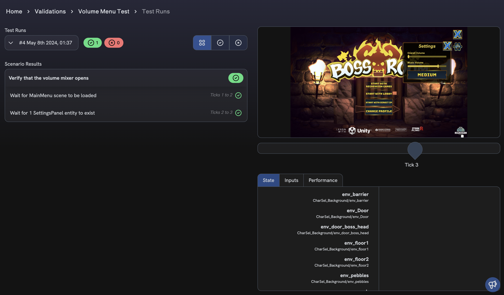
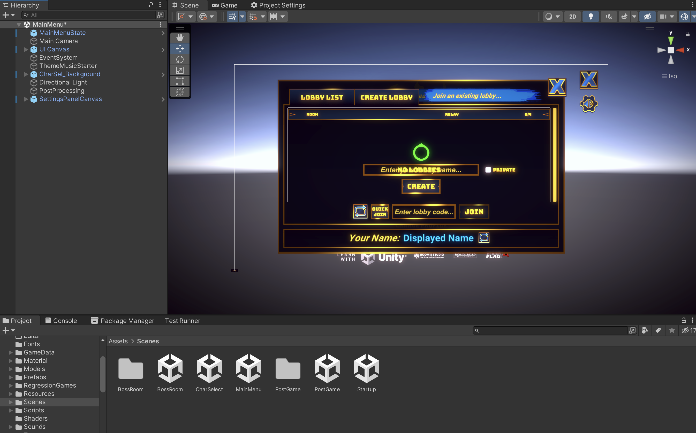
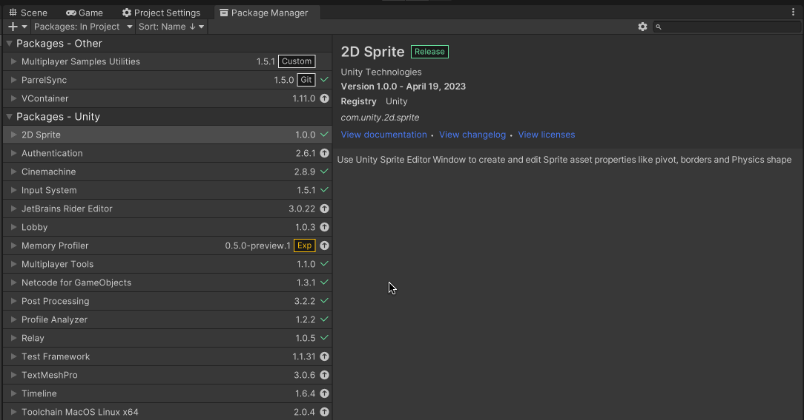
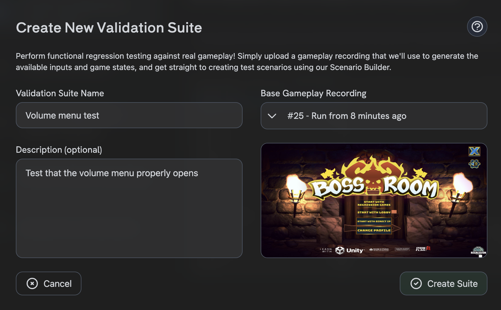

import OverlayPartial from '../partials/_add-overlay-partial.mdx';

# Writing Your First Automated Test

In this tutorial, we will get a simple automated test working in Unity using Regression Games. We will show you:

- How to integrate the RG Unity SDK into your game
- Record a [Gameplay Session](/gameplay-sessions/gameplay-sessions-getting-started) as an automated test
- Create a [Validation Suite](/validations/validations-getting-started) and run that against future test runs



## (Optional) Download a sample game

Feel free to follow this tutorial within your own game, but we recommend starting with a sample game if you do not have
a game available. Our team often uses BossRoom, a simple multiplayer game created by Unity. However, you can start
with any game of your choosing!

Download the BossRoom sample from the [official GitHub repository.](https://github.com/Unity-Technologies/com.unity.multiplayer.samples.coop)

:::info

Note that there are some limitations of the package that may not work with your game. For instance, our framework
works best with the New Unity Input System and games that use standard UI canvas elements and game objects. Learn
more about these limitations in our [Gameplay Session recording docs](/gameplay-sessions/gameplay-sessions-getting-started#known-limitations).

:::

Open it within Unity version 2022.3 (visit the [Unity archive](https://unity.com/releases/editor/whats-new/2022.3.27) if
you can't find that version from Unity Hub). Once the project is loaded, open the **MainMenu** scene within
**Assets** > **Scenes** > **MainMenu**.



## Import the Regression Games Unity Bots package

You can find [our package on GitHub](https://github.com/Regression-Games/RGUnityBots). Import the package into your Unity project by opening 
the **Package Manager** window (**Window** > **Package Manager**) and click **Add package from git URL**. Then, paste the following URL:

```
https://github.com/Regression-Games/RGUnityBots.git?path=src/gg.regression.unity.bots#v0.0.19
```

:::info

- This package utilizes TextMeshPro.  If you are prompted by Unity to add TextMeshPro assets to your project, please add them.
- This package installs a dependency of Newtonsoft Json (https://docs.unity3d.com/Packages/com.unity.nuget.newtonsoft-json@3.1/manual/index.html) for serializing/deserializing Json message payloads.
- If you get a note about Unity's new input system, click **Yes** and allow the editor to restart.

:::



After importing the package, you will be greeted by a login screen. Create an account at
[https://play.regression.gg](https://play.regression.gg) and login to Unity with your account credentials. If you need to login again in the future, 
you can enter your login info by visiting the **Regression Games** > **Getting Started** menu.


## Restart Unity and your IDE

After installing the Regression Games Unity Bots package and its dependencies into Unity, please restart Unity 
and your code editor (e.g. Rider or Visual Studio). Without this step, Unity and your code editor may not properly 
resolve the new packages even after Unity recompiles the scripts.

## Record a gameplay session

The first step in automating a test is to record a [gameplay session](/gameplay-sessions/gameplay-sessions-getting-started).
This feature allows you to record real gameplay and play it back later as an automated test. Regression Games does
offer other utilities for dynamic bots, but to get started with a simple example, we will record a click-through that
verifies the functionality of the UI in BossRoom.

### Add the RGOverlayCanvas

The RGOverlayCanvasV2 prefab provides an overlay that allows you to begin recording gameplay sessions.

<OverlayPartial />

:::info

Your scene must have an EventSystem to make interaction with the overlay possible. You can add one by
right-clicking in your scene's Hierarchy and selecting **GameObject** > **UI** > **Event System**.
If you are using the sample scene we provide, this is already included.

:::

### Record a gameplay session as an automated test

Once the overlay has been added to your scene(s), it's time to start a gameplay session recording! Our goal is to
**record gameplay that can later be used as an automated test**. More specifically, we will test the following
simple scenario (feel free to come up with your own if you are not using Boss Room):

* The game loads into the main menu
* We use the mouse to click the Volume Settings button
* We verify that the Volume Settings panel is displayed
* Finally, we close the volume settings panel

These actions are **recorded** and can be **played back** later as an automated test. As the test is run, data from the
game is collected, which will then be used within validations.

As shown in the short video below, follow these steps:

1. Click the play button in the editor to start the game.
1. Click the red record button in the bottom right to start recording.
1. Click the Volume Settings button near the top right of the main menu.
1. Click the close button on the Volume Settings panel.
1. Click the rec recording button in the bottom right to stop recording.
1. When finished recording, click the hamburger menu next to the record button to open up a dialog for loading your
   recording. You can find the recordings within [the session directory](/gameplay-sessions/gameplay-sessions-reference#folder-and-file-structure).
   Select the `data.zip` file and click **Load Replay**.
1. Click the play button under the Regression Games logo to see your recording play back!

<div style={{position: "relative", paddingBottom: "50.40485829959515%", height: 0}}><iframe src="https://www.loom.com/embed/1a88ffcad1ff49d6940473d5637e35ed?sid=336eaf3b-208c-4ea3-a0b3-c6ad3d2d2cee" frameborder="0" webkitallowfullscreen mozallowfullscreen allowfullscreen style={{position: "absolute", top: 0, left: 0, width: "100%", height: "100%"}}></iframe></div>

## Create a Validation Suite

With your first gameplay session saved, we can now write a functional test that validates the behaviour of this
scenario! Visit https://play.regression.gg/validations to begin creating a new
[validation suite](/validations/validations-getting-started) using this session.

### Creating the test scenario

Click **Create Suite**, enter a name for yor validation suite, and select the gameplay session you just recorded (if
you don't see it, try refreshing the page). You may notice that there are two or more sessions; these include both
the original test session and the sessions created through the automated playback, so make sure to select the one
lowest in the list, which is the first one created. Click **Create Suite** in the bottom right.



Once the suite is created, you'll be able to select it within the Validation Suites Dashboard. Select your suite, and
click **Create Scenario** in the bottom right to start creating your first functional test.

The editor you see here is the `Scenario Editor`. It features a screenshot scrubber to see your game in action, as well
as a state panel to see in-depth information scraped from your game, including not only position information, but also
Monobehaviour properties and fields, as well as keyboard and mouse inputs. For example, for a user interface, you can
see information such as image sources and text values.


Enter a name for your scenario (we used `Verify that the volume mixer opens`), and hover over the pane on the left to
see a list of options for validation. For this scenario, we will verify that:

1. The scene loads properly
2. The volume settings panel appears

This tools allows a wide variety of test scenarios, including mouse and key press detection, state assertions, and
storing values for comparison (learn more in the [documentation for validations](/validations/validations-scenario-builder-reference)).
For now, we will keep it simple, and the two steps listed above. See the screenshot above and the video below to see
how to add these steps (the search feature can be helpful for finding relevant elements in your scene).

<div style={{position: "relative", paddingBottom: "50.40485829959515%", height: 0}}><iframe src="https://www.loom.com/embed/3575d3ef72ae4ebc87dc4eab668d3284?sid=336eaf3b-208c-4ea3-a0b3-c6ad3d2d2cee" frameborder="0" webkitallowfullscreen mozallowfullscreen allowfullscreen style={{position: "absolute", top: 0, left: 0, width: "100%", height: "100%"}}></iframe></div>

Once you are done creating these steps, click **Create Scenario** to save it. Back on the Validation Suite page, you
can click the options menu next to the scenario you just created to run it, by selecting the **Run Scenario** option.
This will immediately run this scenario on the original gameplay session and provide you with the results.


### Run the Validation Suite on new automated runs

Now that this validation suite exists, we can run it on the other runs conducted by the automated test! In the top
right of the Validation Suite, click the **Run Suite** button, and select a more recent gameplay session to validate.
Once the test is run, you can click the result within the list of runs to see a detailed view of the passed and failed
scenarios.


## Next Steps

We now have a repeatable automated gameplay session that can be verified using the validation tool! If you got stuck
during this tutorial, or want to brainstorm how to get the most of this tool, please
[join our active Discord community.](https://discord.com/invite/925SYVse2H). We are excited to make the best automation
tools for game QA, and would love your feedback!