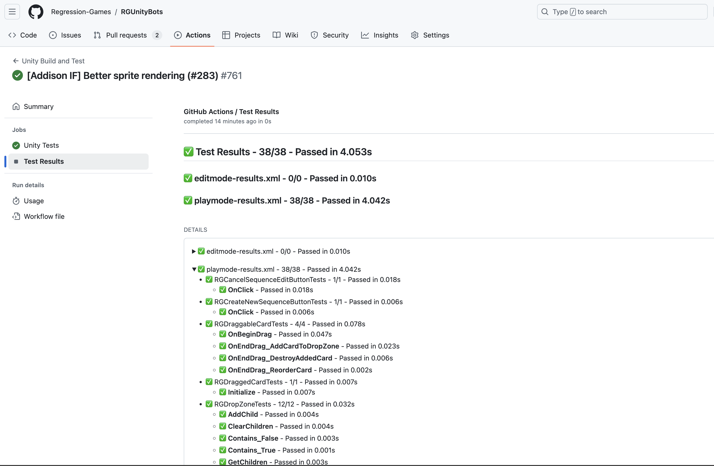
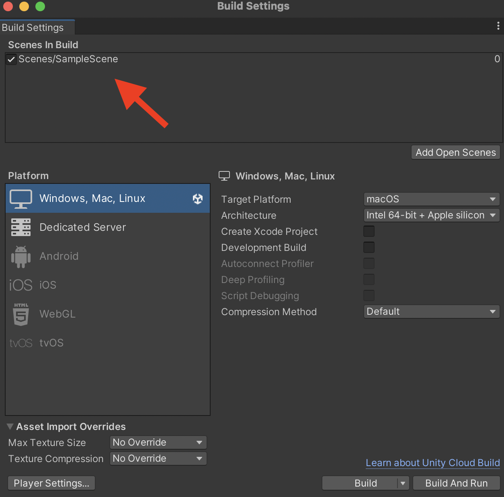
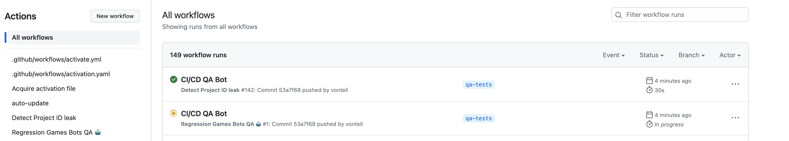
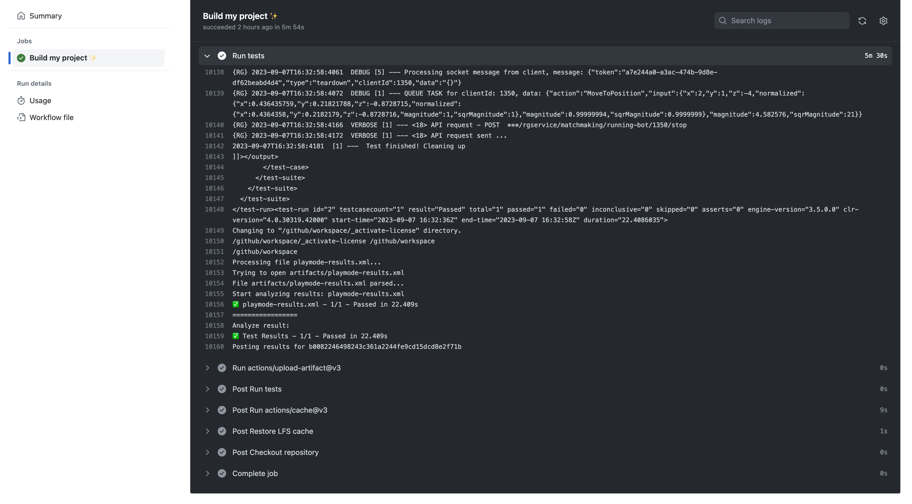

# Integrate with GitHub Actions

This tutorial will walk you through the steps to create a test workflow for your Unity project using 
[GitHub Actions](https://docs.github.com/en/actions) and [GameCI](https://game.ci). It will involve:

1. Adding a GitHub Actions workflow file to your project to enable Unity builds.
2. Configuring your repository secrets to pull your Unity License.
3. Viewing the results of your test.



This tutorial assumes you have some familiarity with GitHub Actions, and that you have a working 
Unity Test Runner test within your game (see more on this in the (INSERT PAGE HERE)).
By the end of this tutorial, every push to your GitHub repo will build your Unity project and start bots for testing.

:::tip
**You can find a complete example in (INSERT REPO HERE), which has a GitHub Action configuration and Unity Test Runner file.**
:::

:::info

This feature requires a Unity license (personal or professional), as CI/CD builds for Unity are only available to those with
a Unity license.

:::

## Add GitHub Actions Workflow Files

[GameCI](https://game.ci/) provides a collection of GitHub Actions for building Unity projects. This is our foundation 
for running GitHub CI/CD builds for Unity.

### Create a New Branch in Your Project

First, create a new branch in your project so that you can test out the GitHub Actions workflow files before committing them to your
main branch. You can name this branch anything, but we named ours `qa-tests`.

### Follow the Steps on GameCI to Activate a [Unity License](https://game.ci/docs/github/activation)

It is critical that you follow [this step](https://game.ci/docs/github/activation)! This allows the CI/CD Docker images to properly start and use Unity.
You can test that the license is configured properly by running this [GitHub Action](https://github.com/marketplace/actions/unity-activate)
in your GitHub repository.

Please note that there are **different steps** to activate a Unity license for [personal](https://game.ci/docs/github/activation/#personal-license) 
and [professional](https://game.ci/docs/github/activation/#professional-license) accounts. Make sure to follow the correct steps for your account type.

### Add the Workflow File to Your Project

The workflow file below is a GitHub Action that will build your Unity project and start a test that will run a bot. Please follow these steps:

1. Create a new file at `.github/workflows/qa-tests.yml`. This will be our workflow file that runs our tests.
2. Paste the contents below into the file. You can also download the file directly from [here](https://raw.githubusercontent.com/Regression-Games/RGUnitySample/main/.github/workflows/main.yml).

```yaml
#file: .github/workflows/qa-tests.yml

name: Automated QA Tests 🤖

on: [push]

concurrency:
  group: unity_build
  cancel-in-progress: false

# See https://game.ci/docs/github/test-runner for more info
jobs:
  build:
    name: Build and run tests ✨
    runs-on: ubuntu-latest
    permissions: write-all # This is to allow writing results into the artifacts section of GitHub Actions
    steps:
          
      # Checkout (without LFS)
      - name: Checkout repository
        uses: actions/checkout@v4
        with:
          lfs: true

      # Cache
      - name: Retrieve cached library
        uses: actions/cache@v3
        with:
          path: Library
          key: Library-${{ hashFiles('Assets/**', 'Packages/**', 'ProjectSettings/**') }}
          restore-keys: |
            Library-

      # Test
      # See https://game.ci/docs/github/test-runner for more information
      - name: Run tests
        id: run-unity-tests
        uses: game-ci/unity-test-runner@v4
        env:
          UNITY_LICENSE: ${{ secrets.UNITY_LICENSE }}
          UNITY_EMAIL: ${{ secrets.UNITY_EMAIL }}
          UNITY_PASSWORD: ${{ secrets.UNITY_PASSWORD }}
        with:
          githubToken: ${{ secrets.GITHUB_TOKEN }}
          testMode: PlayMode

      # Output
      - name: Upload Test Results
        uses: actions/upload-artifact@v3
        if: always()
        with:
          name: Test Results
          path: ${{ steps.run-unity-tests.outputs.artifactsPath }}
```

:::info

Note that this will actually run all of your Play Mode tests, not just the tests using your Regression Games Bot Sequences. To configure this workflow to only
run the bot tests, see the [Unity Test Runner Command Line docs](https://docs.unity3d.com/Packages/com.unity.test-framework@2.0/manual/reference-command-line.html),
which has filter options that can be passed within `customParameters` within the `Run tests` step above. For example,
see the `customParameters` property below:

```yaml
...
- name: Run tests
  id: run-unity-tests
  uses: game-ci/unity-test-runner@v4
  env:
    UNITY_LICENSE: ${{ secrets.UNITY_LICENSE }}
    UNITY_EMAIL: ${{ secrets.UNITY_EMAIL }}
    UNITY_PASSWORD: ${{ secrets.UNITY_PASSWORD }}
  with:
    customParameters: -testFilter "<name of method to test>"
    githubToken: ${{ secrets.GITHUB_TOKEN }}
    testMode: PlayMode
...
```

:::

## Add a Test to Your Unity Project

The bots are started via the Unity Test Runner in [Play Mode](https://docs.unity3d.com/2019.1/Documentation/Manual/PlaymodeTestFramework.html),
In this testing mode, the game starts as if you are playing it, and then terminates once the function finishes.

Complete the following steps to set up the required test - feel free to skip some of these steps if you have existing Play tests
in your Unity project.

### Add Your Scenes to Your Build

Before adding the test, make sure your desired test scenes are placed inside your build. You can add your scenes to the build
using the menu option **File** > **Build Settings**.



### Configure Test Runner for Your Project

Next, we need to configure the Unity Test Runner for your project. To do this, go to **Window** > **General** > **Test Runner**.
Then, in the pane that open, click **Play Mode** > **Create PlayMode Test Assembly Folder**. Create that tests folder with
the name `Tests`, and find that folder in your editor (e.g. Rider, Visual Studio). You should see a file called `Tests.asmdef` - 
open that file and replace it with the contents below, which will include Regression Games as a dependency:

```json
{
    "name": "Tests",
    "references": [
        "RegressionGames"
    ],
    "optionalUnityReferences": [
        "TestAssemblies"
    ]
}
```
You can learn more about the Test Runner and setup instructions [here](https://docs.unity.cn/560/Documentation/Manual/testing-editortestsrunner.html).

## Pushing Your Changes

Once you are satisfied with your local test, you can commit and push your changes to your GitHub repository. This will trigger the
GitHub Actions workflow, which will build your Unity project and start your bot. You can view the status of your workflow by going
to the **Actions** tab of your GitHub repository.



:::info

The default runners in GitHub Actions are sometimes slow, so it may take 10 minutes or more for any output to be seen once the Play Mode tests begin.

:::

Once your workflow has completed, you can view the results of your test by clicking on the **Build my project** step of your workflow.
You should see that the bot successfully started and executed!



## Viewing Test Results

