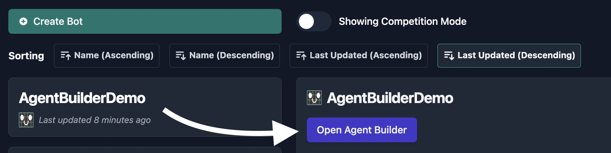
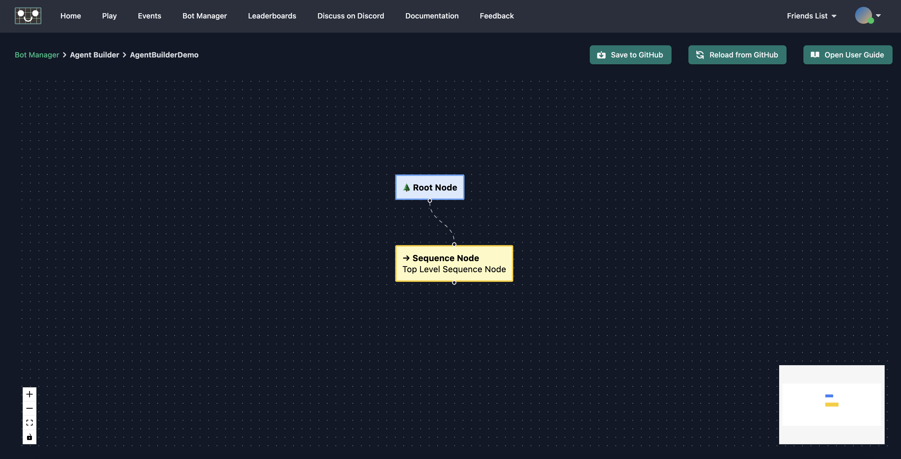
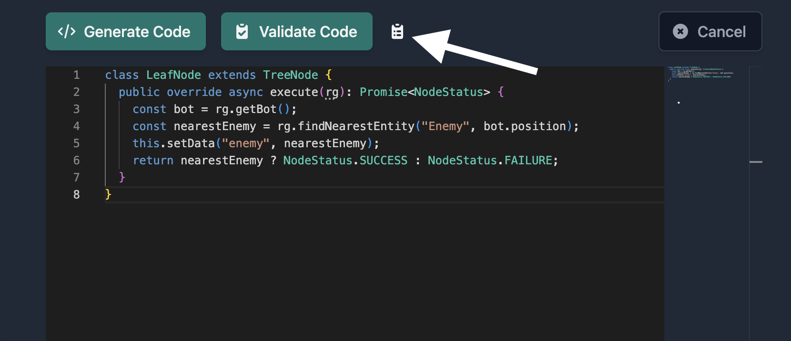

# Creating AIs Using the Agent Builder

Regression Games' Agent Builder is an easy-to-use visual editor for constructing AI behavior trees.
Agent Builder provides powerful features for bot development, including a code editor powered by our AI code assistant
(driven by [OpenAI's GPT-4](https://openai.com/blog/chatgpt)).
Our code assistant can understand your game and its APIs to write code for you and validate code that you write yourself.
This makes Agent Builder an excellent tool for creating bots as you familiarize yourself with your project's SDK integration.

:::note
We're constantly working to improve Agent Builder.
You can report issues and submit feature requests by sending an e-mail to info@regression.gg or joining our [Discord](https://discord.com/invite/925SYVse2H) server.
:::

## What Is a Behavior Tree?

A behavior tree is a decision-making model used to determine which actions an agent (such as a character in a video game) should take in different situations.
You can think of a behavior tree as a flow chart that the AI follows, choosing appropriate actions based on what it knows about itself and its environment.
A behavior tree is composed of nodes organized into a hierarchical structure which starts with a root node and branches out to form different paths.
Each path represents a line of decision-making that results in one or more actions for the AI to perform.

Each node in the tree executes logic and returns one of the following statuses as a result:

- **Running** -> The task represented by this node's branch hasn't yet completed.
- **Success** -> The node has completed its task successfully.
- **Failure** -> The node has failed its task. This doesn't necessarily mean an error occurred. For example, a heal action might fail if the character doesn't have any potions.

Different types of nodes have different responsibilities and may react differently to the statuses of other nodes.

- **Root Node**: The beginning of the tree, where the AI starts its decision-making.
Its job is simply to execute whatever node is below it in the tree and return its status.
- **Sequence Node**: This node has one or more children and acts as a logical AND.
It executes its child nodes sequentially, and if any one of them fail then the Sequence Node immediately returns a failure status, skipping execution of any remaining children.
- **Selector Node**: This node also has one or more children, but acts as a logical OR.
It executes its child nodes sequentially, and if any one of them succeed then the Selector Node immediately returns a success status, skipping execution of any remaining children.
If none succeed, then the Selector Node returns a failure status instead.
- **Action Node**: This node is a leaf node, meaning it cannot have any children of its own.
This node represents an action for the AI to perform such as moving in a certain direction or interacting with an object in its environment.
- **Condition Node**: This node is also a leaf node. It evaluates whether one or more pre-conditions have been satisfied for a specific action.
- **Decorator Node**: There are several kinds of Decorator Nodes, each of which can have only one child. These nodes modify the child's status in some way.
For example, an "Inverter" Decorator will succeed if its child fails, and vice versa.

Let's consider a practical example where we want our AI to talk to another character.
The "conversation" branch should fail if there isn't anyone to talk to.
Perhaps the character can't see anyone else from where they're standing, or perhaps everyone present is already engaged in conversation.
Returning the failure status allows our AI to evaluate other branches for potential actions.
Keep in mind that the conversation branch may fail even if it does find a valid target -
for instance, if the character we want to talk to is too far away, then the AI will need to approach them first.
If all preconditions for talking to the character are met, and we initiate conversation, then the branch will return the success status.
This indicates that the branch has accomplished its tasks and that we can evaluate other branches for things like choosing a conversation topic.

What about the running status? This status is unique in that a parent node will immediately return running if any of its children return running,
essentially short-circuiting the tree. This is useful in cases where the action an AI wants to perform isn't instantaneous.
For example, initiating conversation with another character might trigger a greeting animation which takes several seconds to play out.
Our conversation branch could check whether the AI is in the middle of a greeting animation before evaluating other preconditions,
preventing it from repeating logic from this branch.

For a deeper dive into behavior trees, their nodes, and practical examples of their usage in video games, [follow this link](https://www.gamedeveloper.com/programming/behavior-trees-for-ai-how-they-work).

## Creating a Bot

Create a new AI from the Bot Manager and select `Agent Builder` from the list of creation options,
give your new bot a name, and then finalize. It's that easy!


## Loading Your Tree

If you've used the Agent Builder to create a bot before, then you can locate that bot in the Bot Manager and open the Agent Builder interface.



At any time, you can click the "Reload from Server" button at the top of the page to revert to your most recently-saved version
(this will discard any unsaved changes). Don't forget to save when you're done!


## Getting Started with the Agent Builder

### Agent Builder and Your Game Integration

At its core, our Unity SDK revolves around defining actions that your bot can perform and defining
information about your game state that the bot can analyze to make decisions. Actions and game state information will be different
for every game, so Agent Builder requires some simple setup for your unique integration.

:::info
The Agent Builder is designed for the creation of [Adaptive bots](./adaptive-bots), which form decisions every tick.
This means your Agent Builder tree will be executed once per game tick.

To avoid interrupting previously-queued actions, it's a good idea to include flags in your state to indicate whether the bot is ready for new instructions.
:::

### Adding Nodes

New Agent Builder projects start with a root node and a sequence node to form the basis of your tree.



To begin building your tree, click the connector at the bottom of the sequence node and drag.
When you release, you'll be presented with different types of nodes that can be added to this sequence.
For this demonstration, we'll create an action node.
You can repeat this process for any node that is allowed to have children.


Clicking on a node opens a panel to the right side of your screen.
This panel contains information about the selected node including a description of the node's type and a label, as well as a button to delete the node from the tree.
It's a good idea to set labels to keep track of what you want each node or branch to do.
If the selected node is a leaf node, such as an action or condition, then the panel will also contain fields used for defining the node's behavior via code.


### Generating Code

:::note
All samples in this section are written in C#.

We're constantly evaluating support for other languages.
Feel free to request others by sending an e-mail to info@regression.gg or joining our [Discord](https://discord.com/invite/925SYVse2H) server.
:::

The nodes in your tree won't be useful until you give them some logic to execute.
Click on a leaf node to open the side-panel. You'll see the following stub provided in the code editor:

```csharp
public class LeafNode: BehaviorTreeNode
{
    public override NodeStatus Execute(GameObject rgObject)
    {
        return NodeStatus.SUCCESS;
    }
}
```

:::info
All of your node's code must be defined within the `LeafNode` class, and the `execute` method must be defined as your entrypoint into the node.
You may encounter errors loading your AI into a game if these are not properly defined when you save your tree.
:::

You can either manually type code into the editor (see the [Adaptive Bots API](./adaptive-bots)),
or you can have our AI code assistant do the heavy lifting for you.
To generate code using the assistant, describe what you want this node to do in the "GPT Prompt" field then click the "Generate Code" button.
The editor will be disabled as code appears, and you can modify the output once it's finished.

:::caution
Generating Code will overwrite anything currently in the editor. It's a good idea to save your tree before trying out new prompts.
:::

:::caution
Generated code does NOT add appropriate `using` statements to the code.  You will need to edit the generated code to add appropriate `using` statements after syncing the bot to your project.
:::

You may have many decision-making points and available actions depending on the complexity of your game,
so let's start with something simple.
Let's assume that an "Enemy" ObjectType is defined within our game and that the bot's character has the
"ApproachEntity" and "AttackEntity" actions.

If we enter the following prompt:
```text
If there is an Enemy within 10 square meters then store a reference to them
```

then AI code assistant should output code similar to this:
```csharp
public class LeafNode: BehaviorTreeNode
{
    public override NodeStatus Execute(GameObject rgObject)
    {
        var botTransform = rgObject.transform;

        var enemies = GameObject.FindObjectsByType<RGEnemyState>(FindObjectsSortMode.None).Select(a => a.gameObject);
        var enemy = FindNearestEntity(enemies, botTransform.position);

        if (enemy != null)
        {
            var enemyState = enemy.GetComponent<RGEnemyState>();
            this.setData("enemy", enemyState);
            return NodeStatus.SUCCESS;
        }

        return NodeStatus.FAILURE;
    }
}

protected GameObject FindNearestEntity(List<GameObject> enemies, Vector3 fromPosition)
{
    GameObject closest = null;
    var dist = float.MaxValue;
    foreach (var enemy in enemies)
    {
        var nDist = Vector3.Distance(enemy.transform.position, fromPosition);
        if (nDist < 10 && nDist < dist)
        {
            dist = nDist;
            closest = enemy;
        }
    }
    return closest;
}
```

We can then enter another prompt in a separate node to complete our goal:
```text
Attack the stored enemy
```
```csharp
public class LeafNode: BehaviorTreeNode
{
    public override NodeStatus Execute(GameObject rgObject)
    {
        const enemyState = this.getData<RGEnemyState>("enemy");
        if (enemyState == null) {
            return NodeStatus.FAILURE;
        }
        // TODO: Add code to attack the enemy
        return NodeStatus.SUCCESS;
    }
}
```

The above outputs are good examples of how properly-formatted code should look when you're finished generating or writing it.

You may notice that these examples invoke the `getData` and `setData` methods.
These can be used to share data between nodes and across ticks during the bot's runtime.

:::info
We recommend you specify a data type whenever you call `getData` to take advantage of type hints in the editor.
:::

:::note
Data types to represent your available actions and state variables for different entities are under development.
:::

For instance:

```typescript
// you can define and retrieve your own key-value pairs
this.setData("myString", "Hello World");
const myString = this.getData<string>("myString");

this.setData("myBool", true);
const myBool = this.getData<boolean>("myBool");
```

Whenever you submit a prompt to our AI code assistant, we supplement it with context about your game's available actions and state attributes as well as our bot API.
However, large language models are still in their infancy and may output code that doesn't follow our expected format, or code that functions differently in-game than your prompt intends.
You may need to alter your prompt and re-submit it for new output when this happens, or you can fix the output manually.

### Validating Code

The embedded code editor offers standard syntax highlighting and intelligent code completion features for Regressions Games APIs.
To take this a step further, our AI code assistant can analyze code from the editor and provide suggestions for fixing syntax errors, bugs, and inefficiencies.
Clicking the "Validate Code" button will cause a text box to appear with the assistant's analysis results.

Let's give this a try with some code that doesn't properly await one of our async APIs.

```typescript
class LeafNode extends TreeNode {
  public override async execute(rg): Promise<NodeStatus> {
    const bot = rg.getBot();
    const nearestEnemy = rg.findNearestEntity("Enemy", bot.position);
    this.setData("enemy", nearestEnemy);
    return nearestEnemy ? NodeStatus.SUCCESS : NodeStatus.FAILURE;
  }
}
```

Clicking the "Validate Code" button should result in a warning that `findNearestEntity` should be awaited if we want to capture the actual "Enemy" entity.


You can close validation results at any time and reopen them by clicking the clipboard icon.



## Saving Your Tree

Save your tree early and often! Any changes made to your AI will be lost if you leave the Agent Builder without saving.

