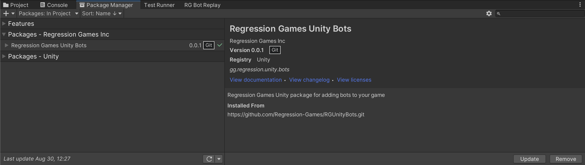

# Quickstart - Sample Scene and Bot

**_Time to complete: 10 minutes_**

This quick walk-through will show you an example scene and bot using the Regression Games Unity SDK. Within a few minutes,
you will have your first bot running in Unity!


## Step 1: Create or open a 3D URP scene

To try out the sample scene, you will need to open or create a project that uses Unity's Universal Render Pipeline (URP).
Within your Unity Hub, search for a template called **3D (URP)**, download it if you haven't already, and create a new
project from that template.


## Step 2: Import the Regression Games Unity Bots SDK

[Our package is available via GitHub](https://github.com/Regression-Games/RGUnityBots). Import the repository by
clicking **Add package from git URL** in the **Package Manager** window (this window can be opened
in the **Window > Package Manager** menu) and pasting in the following URL.

```
https://github.com/Regression-Games/RGUnityBots.git?path=src/gg.regression.unity.bots#v0.0.27
```

- Note that this package uses the new Unity Input System, and will likely ask you to restart the editor - **please select yes to restart**.
- Note that this package utilizes TextMeshPro. If you are prompted by Unity to add TextMeshPro assets to your project, please add them.
- Note that this package installs a dependency of [Newtonsoft Json](https://docs.unity3d.com/Packages/com.unity.nuget.newtonsoft-json@3.1/manual/index.html) for serializing/deserializing Json message payloads.
- If your game utilizes Unity's ECS, we now have an extension package available to support it. Install this package after installing the core RGUnityBots package:

```
https://github.com/Regression-Games/RGUnityBots/tree/main/src/gg.regression.unity.bots.ecs#v0.0.27
```




## Step 3: Login (optional) and load the scene

Once the package is imported, a welcome pane will open with the ability to login to Regression Games. Create
an account to sync your bot and get access to other [ready-to-go bots](pre-made-bots) and our
[Agent Builder tool](creating-bots/csharp/agent-builder), or skip the login (you can access this later from the
**Regression Games** > **Getting Started** menu).


Once you click continue, you will see a screen that links to documentation and has an option to load a sample scene. Click
that button, which will import the sample scene into a new folder within your Assets directory. Once imported, the scene
will automatically open!


## Step 4: Run the bot!

Once the scene is open, run the scene by clicking play. Once running, click the Regression Games logo in the bottom right,
and click "Start Bot" button to start the `QuickstartBot` that is provided with the scene.


You should see the bot move around the platform and attack the enemy!

<div style={{position: "relative", paddingBottom: "50.40485829959515%", height: 0}}><iframe src="https://www.loom.com/embed/c4a31389df6742ba9320bf7dc0e91739?sid=336eaf3b-208c-4ea3-a0b3-c6ad3d2d2cee" frameborder="0" webkitallowfullscreen mozallowfullscreen allowfullscreen style={{position: "absolute", top: 0, left: 0, width: "100%", height: "100%"}}></iframe></div>

## Next steps

Now that you see a bot in action, you can start building your own! In the next tutorial, you will learn more about the
integration patterns and approaches to building bots in Unity using the Regression Games Unity Bots SDK.
