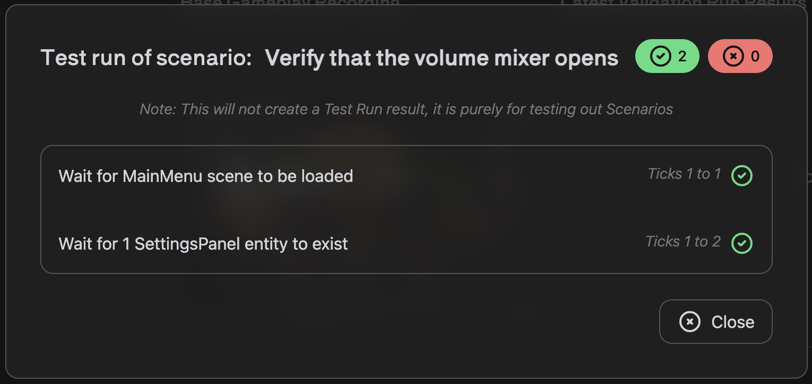

# Validations

**Validations** are used to assert states within you game. You can create the scenarios you want to verify using our Scenario Builder,
and can run collections of scenarios in Unity.

## Validation Suites

**Validation Suites** are a collection of scenarios that you want to run together. You can create a Suite starting with a name and description. At the core of a Suite is its Base Gameplay Recording. This recording is a gameplay session recording used to create the scenarios that will be run, and the inputs used during the recording will be used when running the scenarios.

### Sharing Suites

Validation Suites can be shared with other Regression Games users, in a read-only mode. If a Suite is shared with you, you can view the Suite and its scenarios, but you cannot edit the Suite or its scenarios.

## Scenario Builder

**Scenarios** are composed of steps that can be asserted throughout a gameplay recording. You can wait for specific mouse or keyboard events, check for specific game objects, or even check for specific values in the game state. The available options when creating Scenarios are drawn from the Base Gameplay Recording associated with a Suite.

Along with Scenario steps, you can also view the state, and view a screenshot, at each tick during the recording. This can help you understand the state of the game at each point in time, and can also help create the scenarios you want to run.

Check out the [full Scenario Builder reference](./validations-scenario-builder-reference) for more details 

## Running Validations

You can either run **all** of the Scenarios within a Suite, or an individual Scenario. To run a Suite, click the "Run Suite" button, and select a Gameplay Session to test against. When the Suite is finished running, you can view the results of each Scenario within the Suite on the Test Runs page.

To run an individual Scenario, click the "Run Scenario" button within the Scenario's menu. The Scenario's results will be shown in a dialog.

## Viewing Results

To access the results of your Suite or Scenario, navigate to the Test Runs page. Here you can see the results of each Scenario within a Suite. You can also view the results of a Scenario's steps, and the state of the game at each tick during the Scenario.

